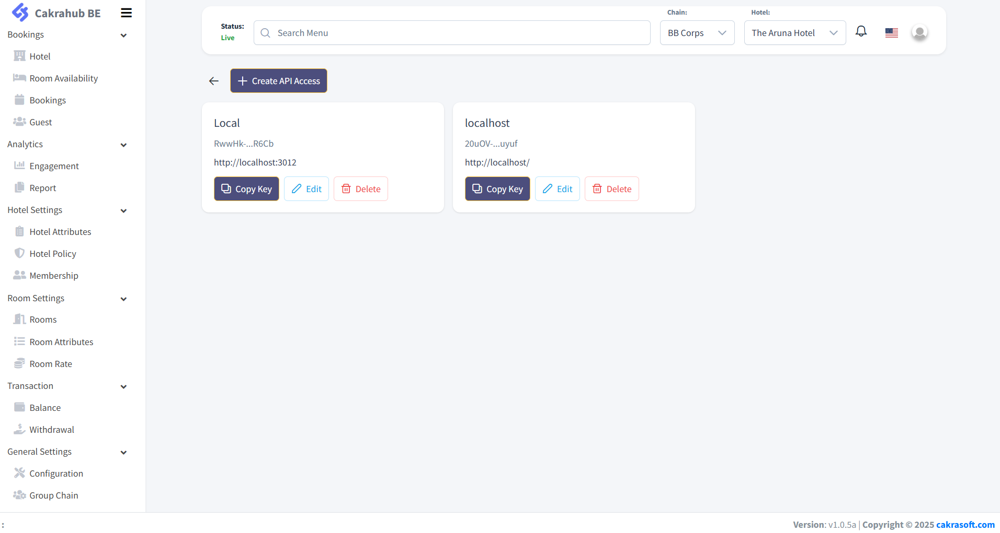

# Generate API Keys



To connect to the Cakrahub Booking Engine API, you need to generate API keys. Follow these steps:

## 1. Go to the Configuration Menu
- On the left sidebar, expand **General Settings**.
- Click on **Configuration**.
- Then select the **API** tab.

## 2. Create API Access
- Click the **+ Create API Access** button at the top of the API page.

## 3. Fill in the API Access Form
- **Remark**: Enter a remark or note to help you remember what this API key is for.
- The input form is disabled by default, as users are not allowed to create API keys by themselves. If you have the required permissions, you will see a **Generate** button at the bottom of the form.
- Click **Generate** to create your API key.

## 4. Set Allowed Website
- In the **Allowed Website** field, enter the domain(s) that are permitted to use this API key.
- For example: `https://example.com`
- To allow all domains, enter a single asterisk: `*`

## 5. Copy and Use Your API Key
- After generating, your new API key will appear in the list.
- Click **Copy Key** to copy it to your clipboard.
Use this key in your API requests as required.

> **Note:** If you do not see the option to generate an API key, please contact your administrator for access.
```
