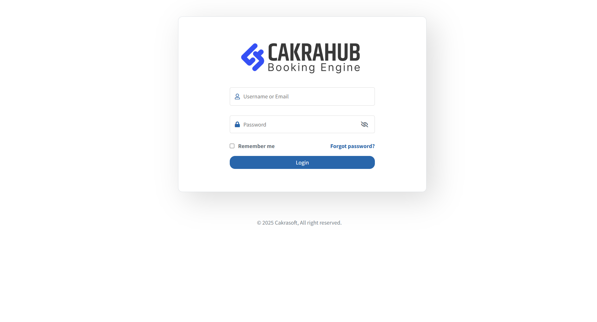

# Login to Booking Engine

This tutorial will guide you through the process of logging in to the Booking Engine at [https://chsres.com](https://chsres.com).

## Steps to Login

1. **Open your browser** and go to [https://chsres.com](https://chsres.com).
2. Click on the **Login** button at the top right corner of the homepage.
3. Enter your **username** and **password** in the login form.
4. Click the **Sign In** button.
5. If your credentials are correct, you will be redirected to your dashboard.

> **Tip:** If you forgot your password, click on the "Forgot Password?" link and follow the instructions to reset it.

You are now logged in and can start using the Booking Engine features!