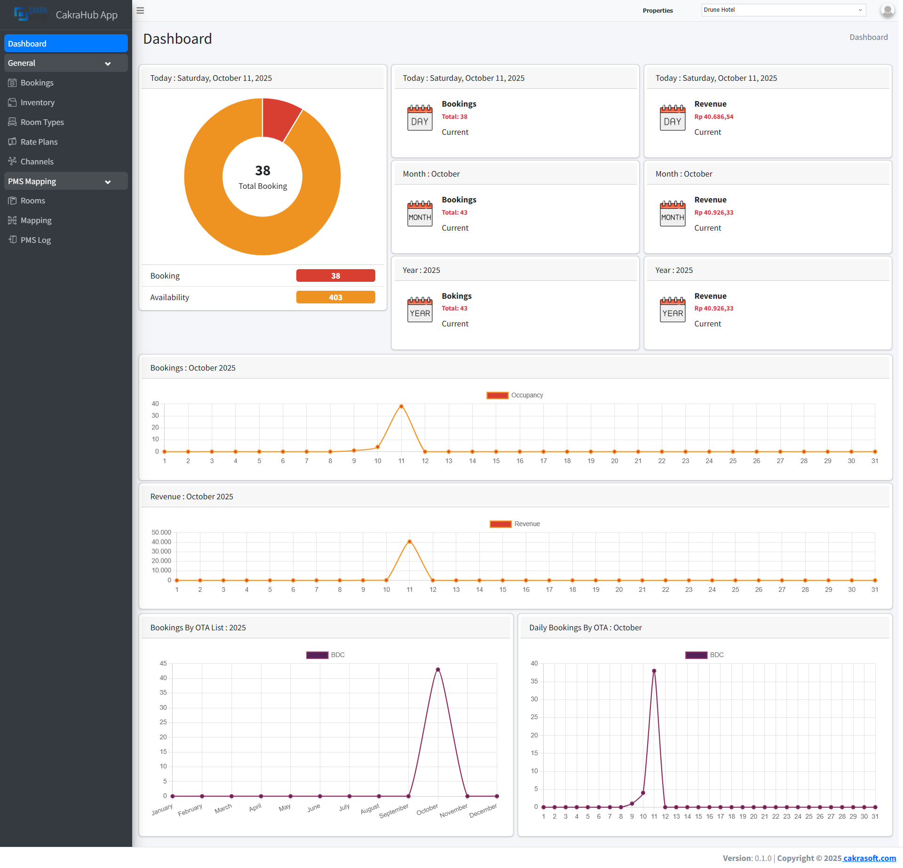

# Dashboard

The dashboard page is used to view booking and revenue data. It displays daily, monthly, and yearly data.
It displays booking and revenue charts from OTAs registered in the channel manager.
This can be viewed in the booking menu or at: [https://cm.cakrasoft.net/dashboard](https://cm.cakrasoft.net/dashboard).

