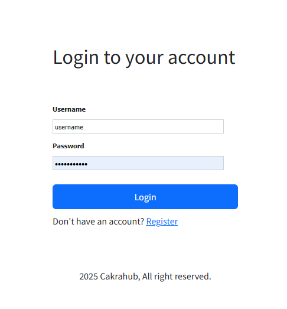

# Login to Channel Manager

This tutorial will guide you through the process of logging in to the Channel Manager at [https://cm.cakrasoft.net](https://cm.cakrasoft.net).

## Steps to Login

1. **Open your browser** and go to [https://cm.cakrasoft.net](https://cm.cakrasoft.net).
2. Click on the **Login** button at the top right corner of the homepage.
3. Enter your **username** and **password** in the login form.
4. Click the **Login** button.
5. If your credentials are correct, you will be redirected to your dashboard.

> **Tip:** If you forget your access password, you can contact our customer service directly and we will send a password reset form to the email address you registered with.

You are now logged in and can start using the Channel Manager features!