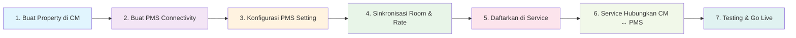
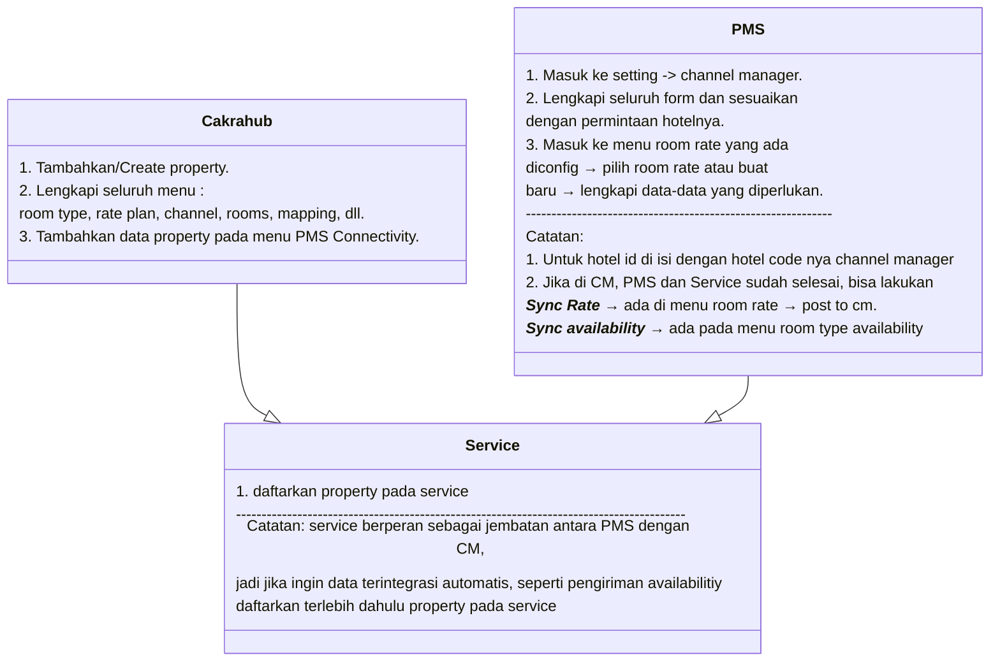

# Integrasi Channel Manager - PMS - Service

## Ringkasan Singkat

Dokumentasi ini menjelaskan alur lengkap integrasi antara **Channel Manager (CM)**, **Property Management System (PMS)**, dan **Service** sebagai middleware. Integrasi ini memungkinkan sinkronisasi real-time data property, room type, rate plan, inventory, dan booking antara sistem internal hotel dengan berbagai Online Travel Agent (OTA).

**Tujuan Integrasi:**

- Sinkronisasi data property, room, rate, dan inventory secara otomatis
- Centralized booking management dari multiple OTA
- Real-time availability dan pricing update
- Streamlined operation workflow antara CM dan PMS

---

## Diagram Alur Integrasi

### 1. High-Level Flowchart



### 2. Swimlane Diagram dengan Aktor


### 3. Standard flow integration



---

## Langkah-Langkah Detil Integrasi

### 1. Channel Manager (CM) - Setup Property & Connectivity

#### Langkah A: Setup PMS Connectivity

1. **Login ke Channel Manager** → Menu PMS Connectivity → Create New Connection
2. **Isi Field Wajib:**
   - `Hotel Code`: Pilih property yang akan di integrasikan (misal: "Hotel ABC - PMS Cakra") _(akan digunakan Service)_
   - `username`: Username untuk akses CM _(akan digunakan Service)_
   - `password`: Password untuk akses CM _(akan digunakan Service)_

**Contoh Data:**

```
hotel_code : CM_HTL_001
hotel_name: Hotel Grand Plaza
username: hotel_grand_api
password: P@ssw0rd123!
```

---

### 2. PMS System - Konfigurasi Channel Manager

#### Langkah A: Setting Koneksi CM

1. **Login PMS** → Setting → Channel Manager
2. **Isi Kredensial dari CM:**
   - Username: `hotel_grand_api` _(dari CM → PMS Connectivity)_
   - Password: `P@ssw0rd123!` _(dari CM → PMS Connectivity)_
   - Hotel ID: `CM_HTL_001` _(dari CM → PMS Connectivity)_
   - WSDL/Endpoint: `[URL dari CM]`

#### Langkah B: Sinkronisasi Room & Rate

1. **Menu Room & Rate Sync** → Setup Mapping
2. **Untuk setiap Room Rate, isi:**
   - **Inv Code**: Kode inventory internal PMS (misal: `STD`, `DLX`, `STE`) jika menggunakan bed type        **Inv Code** menjadi (`STD#DBL`, `DLX#SGL`, `STE#TWN`)
   - **Room Type Code**: ⚠️ **WAJIB UNIK** - hanya 1 kode per mapping
   - **Dynamic Rate**: Pilih opsi rate yang akan disinkron
     - `Base Occ`: Rate berdasarkan okupansi
     - `Base Session`: Rate berdasarkan session
   - **Start Date**: Tanggal mulai rate di aktifkan (format: YYYY-MM-DD)
   - **End Date**: Tanggal akhir rate dimatikan (format: YYYY-MM-DD)
   - **Online**: Type Checkbox, jangan lupa di centang
3. **Room Type:**
    - _tidak ada yang perlu di tambahkan disini, untuk room type akan mengikuti data dari pms_

**Contoh Mapping:**

```
Room Type Name: Standard Room
inv_code: STD
room_type_code: STD001  // ⚠️ Harus unik, jangan duplikasi!
dynamic_rate: Base Sessions
start_date: 2024-01-01
end_date: 2024-12-31
```

#### ⚠️ Validasi Wajib:

- `room_type_code` harus **TUNGGAL** per mapping (tidak boleh multiple)
- `start_date` `<=` `end_date`
- Timezone harus konsisten dengan CM
- Pastikan semua room type yang akan dijual online sudah dimapping // ⚠️**_ini dilakukan di channel manager_**

---

### 3. Service Layer - Developer Task

#### Langkah Developer: Register Property ke Service

1. **Akses Service Admin Panel** atau API endpoint
2. **Daftarkan Property Baru:**
   ```bash
   POST http://exp_lane/properties
   {
     "hotel_id": "CM_HTL_001",
     "hotel_code": "[KODE_DARI_PMS]",  // TODO: Ambil dari PMS
     "unit_code": "[KODE_DARI_PMS]",  // TODO: Ambil dari PMS → bisa string kosong
     "hotel_name": "[BEBAS]",  // TODO: Bisa ambil dari pms atau dari CM
     "username": "hotel_grand_api",      // Dari CM → PMS Connectivity
     "password": "P@ssw0rd123!",         // Dari CM → PMS Connectivity
     "WSDL": "http://exp_lane/cakra",
     "vendor": "CKHU", // Dari PMS
     "type_code": "CM", // Default CM
     "is_active": 1, // Default 1
     "interval": 20, // Berapa detik request di jalankan, set ke 20 detik untuk interval terbaiknya
   }
   ```

#### Mapping Data yang Diperlukan:

- **Dari CM PMS Connectivity:**
  - `username` → Service `username`
  - `password` → Service `password`
  - `hotel_code` → Service `hotel_id`
  - `CM Endpoint` → Service `WSDL`

- **Dari PMS:**
  - Hotel Code → Service `hotel_code`
  - Unit Code → Service `unit_code` → bisa string kosong

#### Sync Avail & Rate
_jika sudah terdaftar di cm, service dan pms, sync avail dan rate dapat dilakukan dengan cara:_
- **Sync Avail**
    - Login Ke PMS → Room Type Availability
    - Klik button `Sync Availability`
    - Pilih Room Type yang akan di sync kan
    - Pilih Start Date dan End Date // Beerfungsi untuk mengirim Availability dari tanggal berapa sampai tanggal berapa Availability mau dikirimkan(misal: `11-10-2025` sampai `11-10-2026`) maka Avail yang dikirim ke cm dari tanggla `11-10-2025` sampai ``11-10-2026``

#### Tugas Teknis Developer:

- **Enkripsi Kredensial:** Simpan username/password
- **Retry Logic:** Implementasi retry untuk API call yang gagal
- **Logging:** Log semua aktivitas sinkronisasi
- **Monitoring:** Setup alert untuk connection failure

---

## Checklist Validasi Pre Go-Live

### ☐ Channel Manager Validation

- [ ] Property data lengkap dan valid
- [ ] PMS Connectivity tersimpan dengan benar
- [ ] Username/password dapat diakses Service
- [ ] Hotel ID unik dan konsisten
- [ ] Room Rate dan Room Type sudah termapping

### ☐ PMS System Validation

- [ ] Koneksi CM berhasil established
- [ ] Room type mapping komplet (semua room type yang dijual)
- [ ] Rate mapping sesuai strategi pricing
- [ ] Date range valid (start_date `<=` end_date)
- [ ] Dynamic rate option sudah dipilih

### ☐ Service Integration Validation

- [ ] Property terdaftar di Service database
- [ ] CM credentials tersimpan
- [ ] CM endpoint dapat diakses
- [ ] Retry logic dan error handling aktif
- [ ] Monitoring dan logging berjalan
- [ ] Test sync CM → Service → PMS berhasil

### ☐ End-to-End Testing

- [ ] Test create/update inventory dari PMS → CM
- [ ] Test booking notification CM → PMS
- [ ] Test rate update PMS → OTA (via CM)
- [ ] Test availability update real-time
- [ ] Verify timezone consistency
- [ ] Load testing untuk high-volume sync

---

## Template Komunikasi untuk Developer

### Email Template: Request Property Registration

```
Subject: [URGENT] Registrasi Property Baru ke Service - Hotel [NAMA]

Hi Tim Developer,

Mohon bantuan untuk mendaftarkan property baru ke Service dengan data berikut:

**Property Information:**
- Hotel Name: [NAMA_HOTEL]
- Hotel Code (PMS): [HOTEL_CODE]  // TODO: Koordinasi dengan PMS team

**CM PMS Connectivity Data:**
- Username: [USERNAME_FROM_CM]
- Password: [PASSWORD_FROM_CM]  // Akan dishare via secure channel
- Hotel ID: [HOTEL_CODE]
- WSDL/Endpoint: [ENDPOINT_URL]
- Vendor: [VENDOR_CM] // Cakrahub

**Request:**
1. Tambahkan property ke Service database
2. Setup credential mapping (CM ↔ PMS)
3. Enable sync service
4. Lakukan testing end-to-end

**Timeline:** Go-live target: [TANGGAL_TARGET]

Please confirm receipt dan estimasi completion time.

Thanks,
[EXP_LANE CAKRA]
```

---

## Catatan Teknis & Best Practices

### Security

- **API Access:** Gunakan HTTPS untuk semua komunikasi antar service
- **API Key:** Simpan api key dengan aman untuk memudahkan anda mengelola kedepannya
- **Audit Trail:** Log semua perubahan data untuk audit

### Error Handling

- **Cek Log:** Setiap komunikasi antara cm dan pms, log aliran data nya sudah tercatat di dalam service, anda bisa melakukan tracking data disini untuk menemukan error nya dimana

---

**💡 Tips:** Selalu lakukan testing di staging environment sebelum production deployment. Koordinasikan dengan semua stakeholder (Hotel Ops, PMS Team, Developer) untuk memastikan integrasi berjalan smooth.   