# Channel Manager - PMS - Service Integration

## Brief Summary

This documentation explains the complete integration flow between **Channel Manager (CM)**, **Property Management System (PMS)**, and **Service** as middleware. This integration enables real-time synchronization of property data, room types, rate plans, inventory, and bookings between hotel internal systems and various Online Travel Agents (OTAs).

**Integration Objectives:**

- Automatic synchronization of property, room, rate, and inventory data
- Centralized booking management from multiple OTAs
- Real-time availability and pricing updates
- Streamlined operation workflow between CM and PMS

---

## Integration Flow Diagrams

### 1. High-Level Flowchart

```mermaid
flowchart TD
  A[1. Create Property in CM] --> B[2. Create PMS Connectivity]
  B --> C[3. Configure PMS Settings]
  C --> D[4. Synchronize Room & Rate]
  D --> E[5. Register in Service]
  E --> F[6. Service Connect CM ↔ PMS]
  F --> G[7. Testing & Go Live]

  style A fill:#e1f5fe
  style B fill:#f3e5f5
  style C fill:#fff3e0
  style D fill:#e8f5e8
  style E fill:#fce4ec
  style F fill:#f1f8e9
  style G fill:#e0f2f1
```



### 2. Swimlane Diagram with Actors


### 3. Standard Integration Flow

```mermaid
classDiagram

    class Cakrahub{
        1. Add/Create property.
        2. Complete all menus:
           room type, rate plan, channel, rooms, mapping, etc.
        3. Add property data in PMS Connectivity menu.
    }

    class PMS{
        1. Go to settings → channel manager.
        2. Complete all forms and adjust
           according to hotel requirements.
        3. Go to room rate menu in
        config → select room rate or create
        new → complete required data.
        ------------------------------------------------------------
        Notes:
        1. For hotel id, fill with channel manager hotel code
        2. If CM, PMS and Service are complete, you can do
        _**Sync Rate**_ → available in room rate menu → post to cm.
         **_Sync availability_** → available in room type availability menu
    }
    class Service{
        1. register property in service
----------------------------------------------------------------------------------------
        Notes: service acts as a bridge between PMS and CM,
        so if you want data to be automatically integrated, such as sending availability
        register the property in service first
    }

    Cakrahub --|> Service
    PMS --|> Service
```



---

## Detailed Integration Steps

### 1. Channel Manager (CM) - Setup Property & Connectivity

#### Step A: Setup PMS Connectivity

1. **Login to Channel Manager** → Menu PMS Connectivity → Create New Connection
2. **Fill Mandatory Fields:**
   - `Hotel Code`: Select property to be integrated (e.g.: "Hotel ABC - PMS Cakra") _(will be used by Service)_
   - `username`: Username for CM access _(will be used by Service)_
   - `password`: Password for CM access _(will be used by Service)_

**Example Data:**

```
hotel_code : CM_HTL_001
hotel_name: Hotel Grand Plaza
username: hotel_grand_api
password: P@ssw0rd123!
```

---

### 2. PMS System - Channel Manager Configuration

#### Step A: CM Connection Settings

1. **Login PMS** → Settings → Channel Manager
2. **Fill Credentials from CM:**
   - Username: `hotel_grand_api` _(from CM → PMS Connectivity)_
   - Password: `P@ssw0rd123!` _(from CM → PMS Connectivity)_
   - Hotel ID: `CM_HTL_001` _(from CM → PMS Connectivity)_
   - WSDL/Endpoint: `[URL from CM]`

#### Step B: Room & Rate Synchronization

1. **Menu Room & Rate Sync** → Setup Mapping
2. **For each Room Rate, fill:**
   - **Inv Code**: PMS internal inventory code (e.g.: `STD`, `DLX`, `STE`) if using bed type **Inv Code** becomes (`STD#DBL`, `DLX#SGL`, `STE#TWN`)
   - **Room Type Code**: ⚠️ **MUST BE UNIQUE** - only 1 code per mapping
   - **Dynamic Rate**: Select rate option to be synchronized
     - `Base Occ`: Rate based on occupancy
     - `Base Session`: Rate based on session
   - **Start Date**: Rate activation start date (format: YYYY-MM-DD)
   - **End Date**: Rate deactivation end date (format: YYYY-MM-DD)
   - **Online**: Checkbox type, don't forget to check
3. **Room Type:**
   - _nothing needs to be added here, room type will follow PMS data_

**Example Mapping:**

```
Room Type Name: Standard Room
inv_code: STD
room_type_code: STD001  // ⚠️ Must be unique, no duplication!
dynamic_rate: Base Sessions
start_date: 2024-01-01
end_date: 2024-12-31
```

#### ⚠️ Mandatory Validation:

- `room_type_code` must be **SINGULAR** per mapping (no multiple allowed)
- `start_date` `<=` `end_date`
- Timezone must be consistent with CM
- Make sure all room types to be sold online are mapped // ⚠️**_this is done in channel manager_**

---

### 3. Service Layer - Developer Task

#### Langkah Developer: Register Property ke Service

1. **Access the Service Admin Panel** or API endpoint
2. **Register a New Property:**
   ```bash
   POST http://exp_lane/properties
   {
     "hotel_id": "CM_HTL_001",
     "hotel_code": "[CODE_FROM_PMS]",  // TODO: Get from PMS
     "unit_code": "[CODE_FROM_PMS]",  // TODO: Get from PMS → can be an empty string
     "hotel_name": "[ANY]",  // TODO: Can get from PMS or CM
     "username": "hotel_grand_api",      // From CM → PMS Connectivity
     "password": "P@ssw0rd123!",         // From CM → PMS Connectivity
     "WSDL": "http://exp_lane/cakra",
     "vendor": "CKHU", // From PMS
     "type_code": "CM", // Default CM
     "is_active": 1, // Default 1
     "interval": 20, // How many seconds the request runs, set to 20 seconds for best interval
   }
   ```

#### Required Data Mapping:

- **From CM PMS Connectivity:**

  - `username` → Service `username`
  - `password` → Service `password`
  - `hotel_code` → Service `hotel_id`
  - `CM Endpoint` → Service `WSDL`

- **From PMS:**
  - Hotel Code → Service `hotel_code`
  - Unit Code → Service `unit_code` → can be an empty string

#### Sync Avail & Rate

_Once registered in CM, Service, and PMS, sync availability and rate can be performed as follows:_

- **Sync Availability**
  - Login to PMS → Room Type Availability
  - Click the `Sync Availability` button
  - Select the Room Type to be synced
  - Select Start Date and End Date // Used to send Availability for the desired date range (e.g.: `11-10-2025` to `11-10-2026`), so the availability sent to CM will be from `11-10-2025` to `11-10-2026`

#### Tugas Teknis Developer:

#### Developer Technical Tasks:

- **Credential Encryption:** Store username/password securely
- **Retry Logic:** Implement retry for failed API calls
- **Logging:** Log all synchronization activities
- **Monitoring:** Set up alerts for connection failures

---

## Checklist Validasi Pre Go-Live

## Pre Go-Live Validation Checklist

### ☐ Channel Manager Validation

- [ ] Property data is complete and valid
- [ ] PMS Connectivity is properly saved
- [ ] Username/password can be accessed by Service
- [ ] Hotel ID is unique and consistent
- [ ] Room Rate and Room Type are mapped

### ☐ PMS System Validation

- [ ] CM connection successfully established
- [ ] Room type mapping is complete (all room types being sold)
- [ ] Rate mapping matches pricing strategy
- [ ] Date range is valid (start_date `<=` end_date)
- [ ] Dynamic rate option is selected

### ☐ Service Integration Validation

- [ ] Property is registered in Service database
- [ ] CM credentials are stored
- [ ] CM endpoint is accessible
- [ ] Retry logic and error handling are active
- [ ] Monitoring and logging are running
- [ ] Test sync CM → Service → PMS is successful

### ☐ End-to-End Testing

- [ ] Test create/update inventory from PMS → CM
- [ ] Test booking notification CM → PMS
- [ ] Test rate update PMS → OTA (via CM)
- [ ] Test real-time availability update
- [ ] Verify timezone consistency
- [ ] Load testing for high-volume sync

---

## Communication Template for Defvelopers

### Email Template: Request Property Registration

```
Subject: [URGENT] New Property Registration to Service - Hotel [NAME]

Hi Developer Team,

Please help to register a new property to the Service with the following data:

**Property Information:**
- Hotel Name: [HOTEL_NAME]
- Hotel Code (PMS): [HOTEL_CODE]  // TODO: Coordinate with PMS team

**CM PMS Connectivity Data:**
- Username: [USERNAME_FROM_CM]
- Password: [PASSWORD_FROM_CM]  // Will be shared via secure channel
- Hotel ID: [HOTEL_CODE]
- WSDL/Endpoint: [ENDPOINT_URL]
- Vendor: [VENDOR_CM] // Cakrahub

**Request:**
1. Add property to Service database
2. Setup credential mapping (CM ↔ PMS)
3. Enable sync service
4. Perform end-to-end testing

**Timeline:** Go-live target: [TARGET_DATE]

Please confirm receipt and estimated completion time.

Thanks,
[EXP_LANE CAKRA]
```

---

## Technical Notes & Best Practices

### Security

- **API Access:** Use HTTPS for all communication between services
- **API Key:** Store API keys securely to make future management easier
- **Audit Trail:** Log all data changes for auditing

### Error Handling

- **Check Logs:** Every communication between CM and PMS, the data flow log is recorded in the service. You can track data here to find where the error occurred

---

**💡 Tips:** Always perform testing in the staging environment before production deployment. Coordinate with all stakeholders (Hotel Ops, PMS Team, Developer) to ensure smooth integration.
