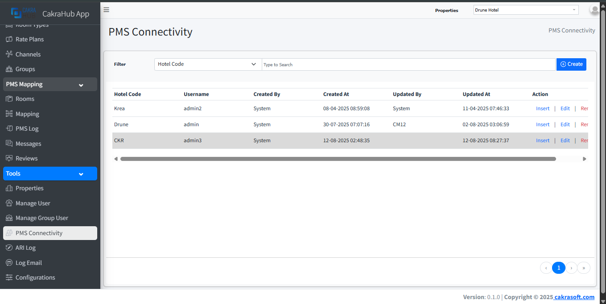
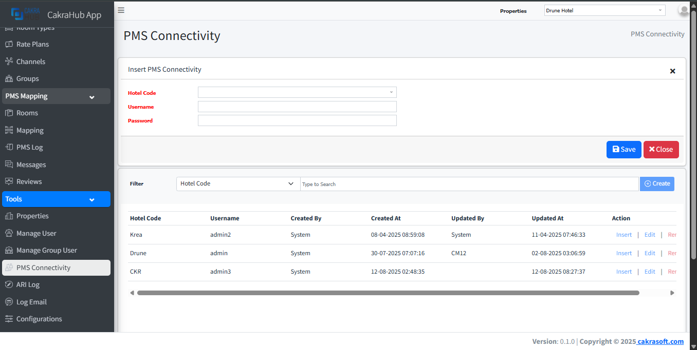
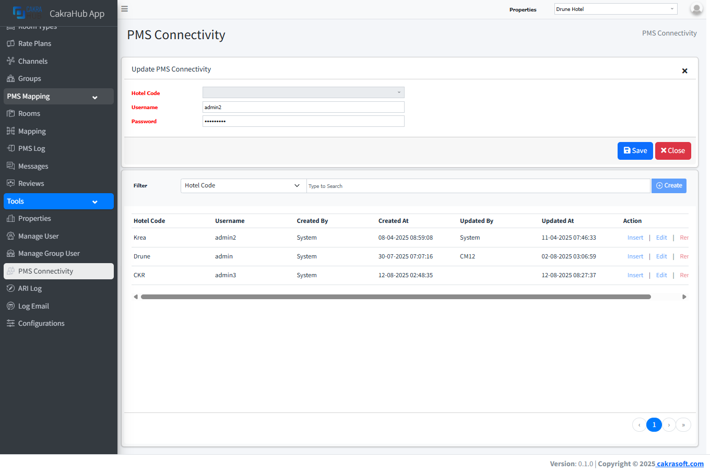
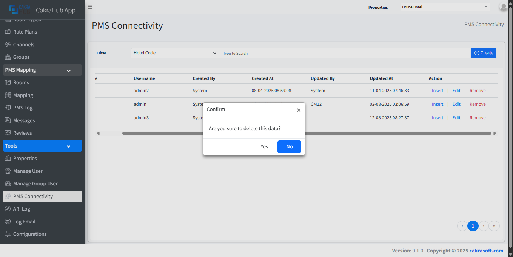

# PMS Connectivity

This menu is used to create, edit, or delete communications or connections between cakrahub and PMS.

import Tabs from '@theme/Tabs';
import TabItem from '@theme/TabItem';

## Create, Update, Remove PMS Connectivity

<Tabs className="unique-tabs">
	<TabItem value="create" label="Create" default>
		To add new data, you can click the create button in the upper right corner. After clicking, an input form will appear to add the new data.

		
	</TabItem>
	<TabItem value="update" label="Update">
		This form appears when you press the edit button in the action column _(on the far right of the table)_.

		
	</TabItem>
	<TabItem value="remove" label="Remove">
		When you press the remove button in the action column _(on the far right of the table)_, a notification/information will appear to confirm whether you are sure you want to delete this data.
		
		
	</TabItem>
</Tabs>

## Details Form Input
- **Hotel Code**: select type, choose which property you want to create a username and password for integration with pms. `required`
- **Username Name**: adding a username for pms. `required`
- **Password**: adding a password for pms. `required`

:::info

:::