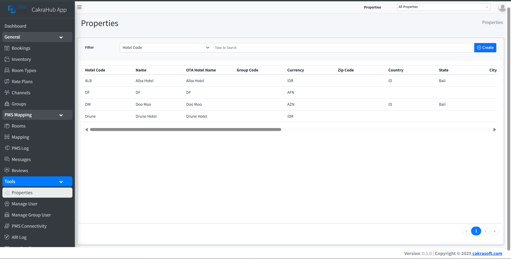
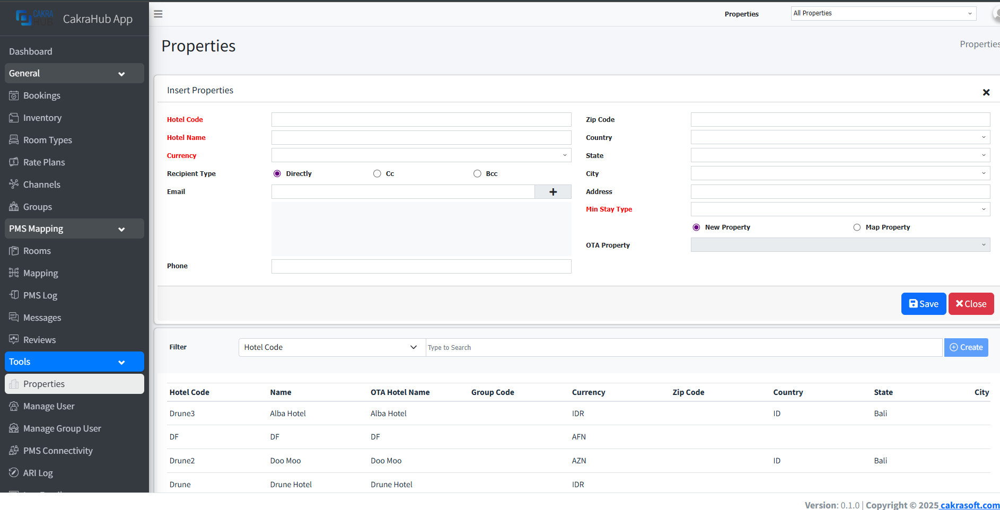
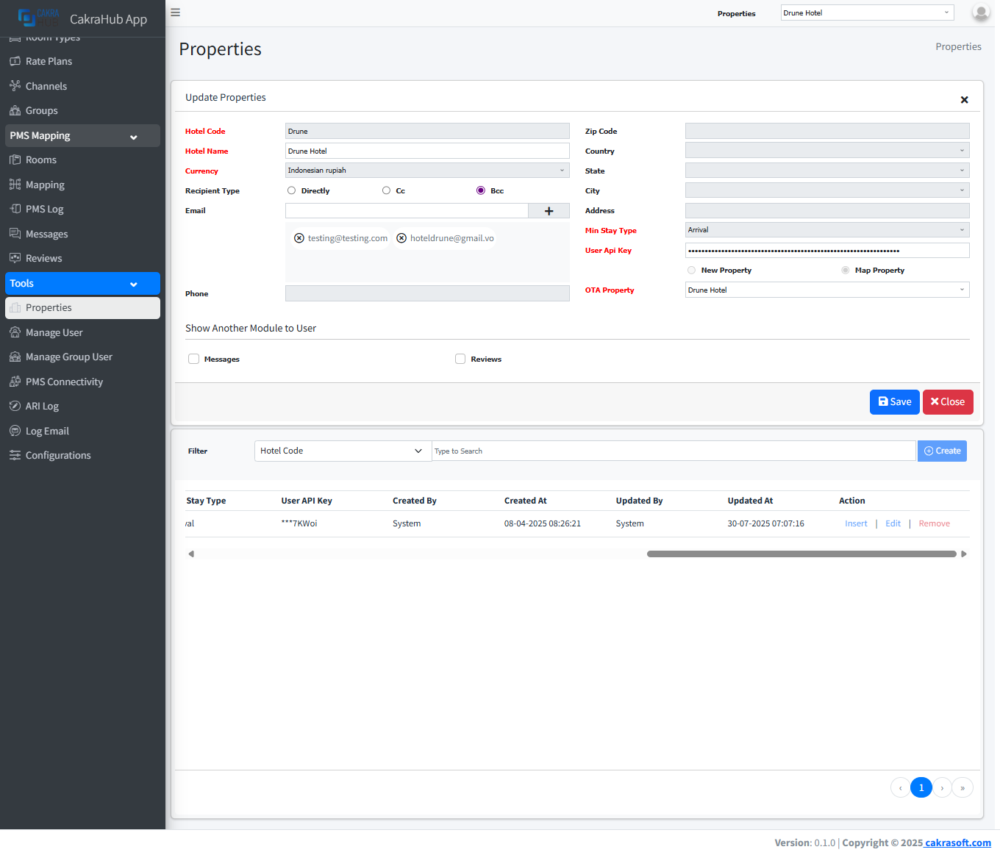
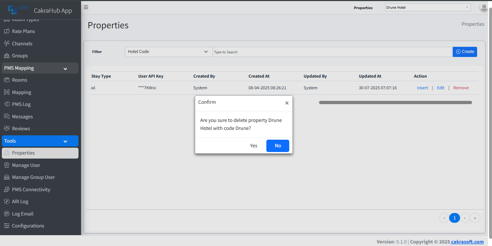

# Properties

The Properties menu is used to display a list of properties, add, edit, or delete property data.

import Tabs from '@theme/Tabs';
import TabItem from '@theme/TabItem';

## Create, Update, Delete Properties

<Tabs className="unique-tabs">
	<TabItem value="create" label="Create" default>
		To add a property, you can press the create button in the upper right corner to bring up the form for entering the required property data.

		
	</TabItem>
	<TabItem value="update" label="Update">
		This form appears when you press the edit button in the action column _(on the far right of the table)_.

		
	</TabItem>
	<TabItem value="remove" label="Remove">
		When you press the remove button in the action column _(on the far right of the table)_, a notification/information will appear to confirm whether you are sure you want to delete the property.

		
	</TabItem>
</Tabs>

## Details Form Input
- **Hotel Code**: code for property. `required`
- **Hotel Name**: Property Name. `required`
- **Currency**: Select a compatible currency for that property. `required`
- **Recipient Type**: There are three options for email delivery settings: directly, Cc, and Bcc, depending on the property requirements. 
- **Email**: Email to send notifications to hotels if there are bookings (new, modified, canceled). Any number of emails can be added, depending on the property's needs. 
- **Phone**: Property phone 
- **Zip Code**: property zip code or postal code, maximum length of 32 symbols.
- **Country**: Select Country.
- **State**: Maximum length of 255 symbols. 
- **City**: Maximum length of 255 symbols. 
- **Address**: Maximum length of 255 symbols. 
- **Min Stay Type**: To control simplified Min Stay restrictions. Can be useful for situation when your system support only one of Min Stay Types _(Arrival or Through)_.
If your system work only with Min Stay **Arrival** or only with Min Stay **Through** you can setup that setting into arrival or through mode, as result we will simplify ARI updates and allow provide min stay changes under min_stay key and automatically setup correct selection for Min Stay type at Channel mappings. Possible values: **arrival**, **through**. default: **arrival** `required`
- **OTA Property**: This select form has two functions. If the property is being created for the first time, you can select **New Property** in the radio button.
If the property has already been created and you want to use the previous data, you can select **Map Property** in the radio button and select the property in the OTA Property select section. The property list will automatically appear. This is commonly used for Omni connections with PMS Cakra. 

:::info edit form input

- **Messages**: checkbox type, check if you want to add a Messages menu to the property.  
- **Reviews**: checkbox type, check if you want to add a Reviews menu to the property. 

When you click the edit action, an input form will appear with additional check boxes for **Messages** and **Reviews**.

These check boxes are used to add new menus, specifically the **Messages** and **Reviews** menus, which are used to receive messages directly from guests and also to view reviews of the property from guests who have stayed there. _Of course, there is an additional fee if the property wants to add these menus_.

:::