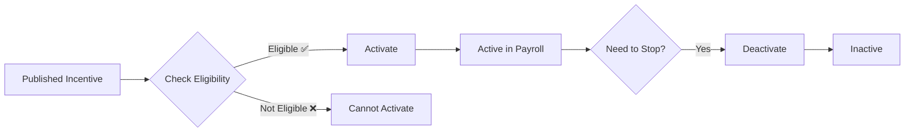

# Tax Incentive Activation

Activate published tax incentives for your company and specific employee groups.

**Purpose:**

- Enable tax incentive programs at company level
- Control which incentives apply to your organization
- Verify eligibility before activation
- Track activation/deactivation history

**Fields:**

| Field                  | Type             | Description                        |
| ---------------------- | ---------------- | ---------------------------------- |
| **Tax Incentive Code** | Text (Read-only) | Code from published incentive      |
| **Tax Incentive Name** | Text (Read-only) | Name from published incentive      |
| **Eligible Code**      | Dropdown         | Specific eligible code to activate |
| **Active**             | Toggle           | Activation status                  |
| **Activated At**       | Timestamp        | When incentive was activated       |
| **Activated By**       | Text             | User who activated                 |
| **Deactivated At**     | Timestamp        | When incentive was deactivated     |
| **Deactivated By**     | Text             | User who deactivated               |

**Available Actions:**

| Action                | When Available    | Purpose                                |
| --------------------- | ----------------- | -------------------------------------- |
| **Check Eligibility** | Before activation | Verify company qualifies for incentive |
| **Activate**          | Not yet active    | Enable incentive for company           |
| **Deactivate**        | Currently active  | Disable incentive for company          |

**How to Use:**

**1. Check Eligibility:**

1. Navigate to **Tax Adjustment > Configuration > Tax Incentive Activation**
2. Find published incentive in grid
3. Right-click → **Activate**
4. Modal opens with incentive details
5. Select **Eligible Code** (your company's category)
6. Click **Check Eligibility** button
7. System validates:
   - Company registered in eligible category
   - Required documentation complete
   - Effective date range valid
8. Result shows: ✅ Eligible or ❌ Not Eligible

**2. Activate Incentive:**

1. After passing eligibility check
2. Confirm activation
3. Click **Save**
4. Incentive becomes active
5. System applies automatically in payroll for matching employees

**3. Deactivate Incentive:**

1. Right-click active incentive
2. Select **Deactivate**
3. Confirm action
4. Incentive stops applying in payroll

**Activation Flow:**

**Best Practices:**

- Always run eligibility check before activation
- Document eligibility verification in company records
- Activate only incentives your company qualifies for
- Monitor program end dates and deactivate expired incentives
- Keep supporting documents for tax audits

**Important Notes:**

- Only one eligible code can be activated per incentive at a time
- Activation affects all employees matching the eligible code
- System automatically applies incentive in tax calculation
- Deactivation does not affect historical payroll (already processed)
- Activation/deactivation tracked for audit purposes

**Eligibility Verification:**
System checks:

- Company registration matches eligible code
- Company has required certifications/licenses
- Effective period is current
- No conflicting active incentives
- Regulatory requirements met

**Common Scenarios:**

Scenario 1: New Government Program

1. Tax incentive published by admin → Appears in list
2. Check eligibility for your company
3. If eligible → Activate for specific employee group
4. Applied automatically in next payroll

Scenario 2: Program Expired

1. End date reached
2. Deactivate incentive
3. System stops applying in payroll
4. Historical data preserved

Scenario 3: Mid-Year Participation

1. Company qualifies mid-year
2. Activate incentive
3. Applied from activation month forward
4. No retroactive application (unless manually adjusted)
