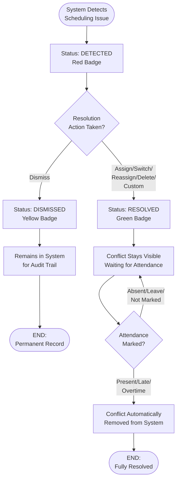

# Schedule Conflict

Schedule Conflict is the intelligent conflict detection system that automatically identifies staffing issues—overstaffing, understaffing, and leave overlaps—and provides guided resolution workflows to maintain optimal workforce coverage.

## Overview

On this page you can:

- View automatically detected scheduling conflicts in real-time
- Filter conflicts by type (Overstaffed, Understaffed, Leave Conflict)
- Prioritize by urgency (Critical, High, Medium, Low)
- Resolve conflicts with suggested solutions (Assign, Switch, Reassign, Delete)
- Track resolution status through complete lifecycle
- Document custom resolutions for non-standard cases
- Monitor resolved conflicts until attendance verification

**Key Capabilities:**

- Automatic conflict detection across all shifts and employees
- Three conflict types: Overstaffed, Understaffed, Leave Conflict
- Four-tier priority classification for urgency management
- Integrated resolution actions (Assign, Switch, Reassign, Delete, Custom)
- Two-phase resolution: Action + Attendance verification
- Audit trail with complete conflict lifecycle tracking
- Status-based filtering (Detected, In Progress, Resolved, Dismissed)
- Date range analysis for historical and future conflicts

:::info
**Two-Step Conflict Resolution:**
Conflicts marked "Resolved" remain visible until attendance is updated. This ensures scheduled changes are executed and employees actually attend. Conflicts automatically disappear when attendance is marked Present, Late, or Overtime.
:::

<hr/>

## Key Features

### 🔍 Automatic Conflict Detection

Real-time monitoring that identifies scheduling issues instantly.

**Business Value:**

- System automatically detects overstaffing, understaffing, and leave conflicts
- No manual checking required—conflicts surface immediately
- Detects issues when schedules are created, changed, or leave is approved
- Zero human error in conflict identification
- Proactive issue discovery before operational impact
- 100% coverage across all shifts and employees
- Reduces manual schedule review time by 95%

**Perfect for:** HR teams managing complex multi-shift operations with frequent schedule changes

---

### ⚡ Priority-Based Classification

Automatic urgency assignment for focused action.

**Business Value:**

- Four priority levels: Critical, High, Medium, Low
- Color-coded badges (Red, Yellow) for instant recognition
- Critical conflicts highlighted for immediate attention
- Response time targets: Critical (1hr), High (4hrs), Medium (24hrs), Low (48hrs)
- Focus resources on highest-impact issues first
- Prevent operational disruptions through prioritization
- Clear escalation paths based on priority

**Perfect for:** Operations managers balancing multiple urgent issues and needing clear priorities

---

### 🎯 Guided Resolution Workflows

Smart solution suggestions based on conflict type.

**Business Value:**

- System suggests appropriate actions: Assign, Switch, Reassign, Delete, Custom
- One-click resolution for standard conflicts
- Integrated with Work Schedule for seamless fixing
- Context-aware solutions (e.g., "Assign" for Understaffed, "Delete" for Overstaffed)
- Reduce resolution time from 30 minutes to under 2 minutes
- Eliminate guesswork—system tells you exactly what to do
- 90% of conflicts resolved with suggested standard actions

**Perfect for:** Supervisors without deep scheduling expertise needing clear guidance

---

### 📊 Complete Lifecycle Tracking

End-to-end visibility from detection to resolution verification.

**Business Value:**

- Four status stages: Detected → In Progress → Resolved → Automatically Removed
- Two-phase resolution: Scheduling Action + Attendance Verification
- Conflicts don't close prematurely—wait for actual attendance
- Complete audit trail of who did what when
- Track resolution time and performance
- Ensure conflicts are truly fixed, not just dismissed
- Compliance-ready documentation

**Perfect for:** Quality-focused organizations requiring verified resolution and audit trails

---

### 🔄 Flexible Resolution Options

Multiple pathways to fix conflicts based on situation.

**Business Value:**

- **Standard Solutions**: Pre-defined actions for common conflicts
- **Custom Solutions**: Document non-standard resolutions with full context
- **Dismiss**: Mark false positives or intentional situations
- **Delete**: Remove incorrect conflict records or schedules
- Accommodate unique organizational needs
- Handle edge cases without forcing wrong solution
- Maintain complete documentation even for custom fixes

**Perfect for:** Complex organizations with unique operational requirements beyond standard workflows

---

### 📈 Status-Based Filtering

Focus on relevant conflicts through intelligent filtering.

**Business Value:**

- Filter by status: Detected (action needed), Resolved (waiting verification), Dismissed (non-issues)
- Status counts show volume at each stage
- Focus on "Detected" for immediate work
- Monitor "Resolved" for attendance follow-up
- Review "Dismissed" for pattern analysis
- Reduce information overload by 80%
- Efficient workflow management

**Perfect for:** Busy HR coordinators handling high volumes of conflicts daily

---

### 🛡️ Leave Conflict Prevention

Automatic detection of schedule vs leave overlaps.

**Business Value:**

- Detects when employee has both work schedule AND approved leave same day
- Prevents employees being scheduled during vacation/sick leave
- Triggers when leave approved after scheduling or vice versa
- Suggests delete work schedule or reassign to different employee
- Protects employee rights and work-life balance
- Prevents compliance violations
- Reduces employee dissatisfaction by 70%

**Perfect for:** Organizations with frequent leave requests needing protection against accidental violations

---

## Key Concepts

### Conflict Types

Three automatic detection categories:

| Type               | Description                                   | Detection Trigger                          | Common Causes                                                  | Suggested Solutions      |
| ------------------ | --------------------------------------------- | ------------------------------------------ | -------------------------------------------------------------- | ------------------------ |
| **Overstaffed**    | Scheduled employees > maximum allowed         | Schedule assignments exceed shift max      | Duplicate assignments, incorrect max settings, over-assignment | Delete, Reassign         |
| **Understaffed**   | Scheduled employees < minimum required        | Schedule assignments below shift min       | Insufficient assignments, absences, leaves                     | Assign, Switch           |
| **Leave Conflict** | Employee scheduled + approved leave same date | Work schedule overlaps with approved leave | Schedule created before leave approval, missed leave check     | Delete, Reassign, Switch |

### Priority Levels

Four-tier urgency classification:

| Priority     | Badge Color      | Criteria                                                    | Response Time | Action Required                      |
| ------------ | ---------------- | ----------------------------------------------------------- | ------------- | ------------------------------------ |
| **Critical** | 🔴 Red           | Immediate operational impact, safety risk, legal violation  | 1 hour        | Drop everything, resolve immediately |
| **High**     | 🔴 Red           | Significant impact, customer service affected, understaffed | 4 hours       | Prioritize, resolve same shift       |
| **Medium**   | 🟡 Yellow/Orange | Moderate impact, manageable with adjustment                 | 24 hours      | Resolve by next day                  |
| **Low**      | 🟡 Yellow/Orange | Minor impact, no immediate action needed                    | 48 hours      | Resolve when convenient              |

**Priority Assignment Factors:**

- Conflict type (Understaffed usually higher than Overstaffed)
- Shift criticality (night security = higher, day admin = lower)
- Time to shift start (closer = higher priority)
- Department importance (customer-facing = higher)
- Minimum staffing gap size (larger gap = higher priority)

### Conflict Status

Four lifecycle stages:

| Status          | Badge Color      | Description                          | Meaning                             | Next Action                          |
| --------------- | ---------------- | ------------------------------------ | ----------------------------------- | ------------------------------------ |
| **Detected**    | 🔴 Red           | Conflict identified, no action taken | Awaiting resolution                 | Take scheduling action               |
| **In Progress** | 🔵 Blue          | Resolution initiated, not completed  | Pending approval or completion      | Complete action or wait for approval |
| **Resolved**    | 🟢 Green         | Scheduling action completed          | Waiting for attendance verification | Mark attendance when shift occurs    |
| **Dismissed**   | 🟡 Yellow/Orange | Marked as non-issue                  | No resolution needed, audit only    | None - stays for records             |

**Status Flow:**

```
Detected → (Take Action) → Resolved → (Mark Attendance) → Automatically Removed

Detected → (Dismiss) → Dismissed → (Stays Permanently)
```

**Key Status Behaviors:**

**Detected:**

- Initial status when conflict created
- Action buttons enabled
- Requires immediate attention
- Most common status for active conflicts

**In Progress:**

- Temporary status during multi-step actions
- Example: Switch request pending approval
- Cannot take additional actions
- Automatically progresses once complete

**Resolved:**

- Scheduling action completed (Assign, Switch, Reassign, Delete)
- **Conflict still visible** in the list
- Waiting for attendance confirmation
- **Does not disappear** until attendance marked Present/Late/Overtime

**Dismissed:**

- Conflict acknowledged but no action taken
- Used for false positives or intentional situations
- Remains permanently for audit trail
- **Does not require** attendance update

### Available Solutions

Action suggestions based on conflict type:

| Solution     | Description                        | Used For                     | Action Performed                                              |
| ------------ | ---------------------------------- | ---------------------------- | ------------------------------------------------------------- |
| **Assign**   | Assign employee to empty shift     | Understaffed                 | Opens Assign Schedule dialog, adds employee to shift          |
| **Switch**   | Swap shifts between two employees  | Understaffed, Leave Conflict | Opens Switch Schedule dialog, exchanges assignments           |
| **Reassign** | Change employee's shift assignment | Overstaffed, Leave Conflict  | Opens Reassign dialog, moves employee to different shift/date |
| **Delete**   | Remove conflicting schedule        | Overstaffed, Leave Conflict  | Deletes work schedule entry, frees up slot                    |
| **Custom**   | Document non-standard resolution   | Any conflict                 | Opens custom solution form, records manual actions            |

**Solution Logic by Conflict Type:**

**Overstaffed:**

- Available: Delete, Reassign
- Best: Delete (remove excess schedule)
- Alternative: Reassign (move to understaffed shift)

**Understaffed:**

- Available: Assign, Switch
- Best: Assign (add new employee)
- Alternative: Switch (move from another date/shift)

**Leave Conflict:**

- Available: Delete, Reassign, Switch
- Best: Delete (remove work schedule, honor leave)
- Alternative: Reassign or Switch (assign different employee instead)

### Conflict Lifecycle Workflow

Complete journey from detection to removal:

**Phase 1: Detection**

1. System monitors schedules continuously
2. Detects violation (overstaffed, understaffed, leave conflict)
3. Creates conflict record with status = **Detected** (Red)
4. Assigns priority based on impact
5. Suggests appropriate solutions

**Phase 2: Resolution**

**Option A - Take Action:**

1. User selects conflict
2. Chooses solution (Assign, Switch, Reassign, Delete, or Custom)
3. Completes scheduling action
4. Conflict status changes to **Resolved** (Green)
5. **Conflict remains visible** in list

**Option B - Dismiss:**

1. User marks conflict as non-issue
2. Provides justification in remarks
3. Conflict status changes to **Dismissed** (Yellow)
4. **Conflict stays permanently** for audit

**Phase 3: Verification (Resolved conflicts only)**

1. Conflict waits for shift date to occur
2. Remains visible with "Resolved" status
3. Monitors for attendance update
4. Employee must attend shift as scheduled

**Phase 4: Completion**

**If Attendance = Present/Late/Overtime:**

- System verifies resolution success
- Conflict **automatically disappears** from system
- Process complete

**If Attendance = Absent/Leave/Not Marked:**

- Conflict **continues waiting**
- Remains visible indefinitely
- May trigger **new conflict** if issue persists
- Requires follow-up action

**Why Two-Phase Resolution?**

The two-step process (Action + Attendance) ensures:

- Scheduled changes are actually executed
- Employees show up as expected
- Conflicts aren't closed prematurely
- Complete verification of resolution
- Audit trail of both action and outcome

### Grid Fields

Complete information displayed for each conflict:

| Field                   | Type     | Description                                        | Purpose                     |
| ----------------------- | -------- | -------------------------------------------------- | --------------------------- |
| **Date**                | Date     | When conflict occurs                               | Identify timing             |
| **Code**                | Text     | Unique identifier (CF-YYYYMMDD-###)                | Reference and tracking      |
| **Title**               | Text     | Brief description                                  | Quick understanding         |
| **Type**                | Badge    | Conflict category (Overstaffed/Understaffed/Leave) | Identify issue type         |
| **Priority**            | Badge    | Urgency level (Critical/High/Medium/Low)           | Determine action urgency    |
| **Shift**               | Text     | Shift code and name                                | Identify affected shift     |
| **Department**          | Text     | Department code and name                           | Scope to department         |
| **Placement**           | Text     | Placement code and name                            | Location context            |
| **First Employee**      | Text     | Primary employee involved (ID, name, shift, date)  | Main affected person        |
| **Second Employee**     | Text     | Secondary employee (if applicable)                 | Additional involved person  |
| **Available Solutions** | List     | Suggested resolution actions                       | Guidance for fixing         |
| **Chosen Solution**     | Text     | Selected resolution method                         | Track what was done         |
| **Custom Solution**     | Text     | Detailed custom resolution description             | Document non-standard fixes |
| **Remark**              | Text     | Additional notes                                   | Context and justification   |
| **Status**              | Badge    | Current lifecycle stage                            | Track progress              |
| **Assigned To**         | Text     | User responsible for resolving                     | Ownership                   |
| **Assigned At**         | DateTime | When conflict was assigned                         | Timeline tracking           |
| **Resolved At**         | DateTime | When action was completed                          | Resolution timing           |

### Permission Levels

Role-based access control:

| Role                   | View Conflicts | Resolve     | Delete Schedule | Assign/Switch/Reassign | Custom Solution | Dismiss     | Mark Attendance |
| ---------------------- | -------------- | ----------- | --------------- | ---------------------- | --------------- | ----------- | --------------- |
| **Employee**           | ❌ No          | ❌ No       | ❌ No           | ❌ No                  | ❌ No           | ❌ No       | ❌ No           |
| **Supervisor**         | ✅ Own team    | ✅ Own team | ❌ No           | ✅ Own team            | ✅ Own team     | ❌ No       | ✅ Own team     |
| **Department Manager** | ✅ Own dept    | ✅ Own dept | ✅ Own dept     | ✅ Own dept            | ✅ Own dept     | ✅ Own dept | ✅ Own dept     |
| **HR Manager**         | ✅ All depts   | ✅ All      | ✅ All          | ✅ All                 | ✅ All          | ✅ All      | ✅ All          |
| **Super Admin**        | ✅ All         | ✅ All      | ✅ All          | ✅ All                 | ✅ All          | ✅ All      | ✅ All          |

**Access Scope:**

- **Own team**: Conflicts involving supervised employees only
- **Own dept**: All conflicts within department
- **All depts**: Organization-wide conflicts
- **All**: Complete system access

---

## Workflow Diagram

### Conflict Resolution Lifecycle



**Key Points:**

1. Detection: Automatic when overstaffed/understaffed/leave conflict occurs
2. Action Choice: Dismiss (audit only) or Resolve (fix + verify)
3. Resolved Path: Two-step process (action + attendance)
4. Dismissed Path: One-step, permanent record, no attendance needed
5. Automatic Removal: Only after attendance = Present/Late/Overtime
6. Waiting Loop: Resolved conflicts loop until proper attendance

---

## Best Practices

### Priority-Based Resolution

- **Critical/High First**: Resolve red-badge conflicts immediately before shift starts
- **Sort by Priority**: Filter "Detected" + sort Critical → High → Medium → Low
- **Set Time Limits**: Critical within 1 hour, High within 4 hours
- **Escalate Stuck Issues**: If conflict unresolved past time limit, escalate to manager

### Resolution by Conflict Type

**Understaffed:**

- Assign from same department first (familiar with work)
- Use emergency switch from overstaffed shifts
- Verify assigned employee shows up—mark attendance immediately

**Overstaffed:**

- Delete duplicate/error schedules first
- Reassign excess to understaffed shifts when possible
- Don't just delete—redistribute to optimize staffing

**Leave Conflict:**

- Always honor leave—delete work schedule or reassign to different employee
- Never cancel approved leave to resolve conflict
- Verify replacement shows up if using reassignment

### Attendance Follow-Up

- **Mark Same Day**: Update attendance the day shift occurs
- **Resolved = Not Done**: Green "Resolved" badge means waiting for attendance, not finished
- **Check Daily**: Filter by "Resolved" to see which need attendance
- **Clear Backlog**: Old resolved conflicts indicate attendance tracking issues

### Prevention

- **Check Leave First**: Review leave calendar before generating schedules
- **Use Coverage Module**: Monitor staffing proactively, don't wait for conflicts
- **Review Before Publish**: Check conflicts before finalizing schedules
- **Timely Attendance**: Mark attendance promptly to keep conflict list clean

---

## How to Use

<details>
<summary><strong>How to View and Filter Conflicts</strong></summary>

**View Conflicts:**

1. Navigate to **Attendance** → **Schedule Conflict**
2. Set **Start Date** and **End Date** → Click **Search**
3. Review grid: Priority (Red = urgent, Yellow = less urgent), Status, Type, Employees

**Filter by Status:**

- **Detected** (Red): Need action now—your to-do list
- **Resolved** (Green): Fixed, waiting for attendance
- **Dismissed** (Yellow): Not issues, audit only
- **In Progress** (Blue): Being worked on

**Filter Workflow:**

- Morning: Filter "Detected" → Resolve Critical/High
- Throughout day: Check "In Progress" for stuck items
- End of day: Filter "Resolved" → Mark attendance if shifts occurred

:::tip
Resolved conflicts stay visible until attendance marked Present/Late/Overtime. This is normal—not a bug.
:::

</details>

<details>
<summary><strong>How to Resolve Understaffed (Assign Employee)</strong></summary>

1. **Select** understaffed conflict (Type = "Understaffed")
2. Click **Assign Schedule** button
3. **Select employee** for the shift (date, shift auto-filled)
4. Add remark → Click **Assign**
5. **Status changes to Resolved** (conflict still visible)
6. **When shift occurs**: Mark employee attendance Present/Late/Overtime
7. **Conflict automatically disappears**

**Quick Check:** After assigning, verify employee notified and will attend.

</details>

<details>
<summary><strong>How to Resolve Overstaffed (Delete/Reassign)</strong></summary>

**Option 1 - Delete (if schedule is error):**

1. Select overstaffed conflict
2. Click **Delete Schedule** → **Confirm**
3. Status → Resolved (conflict stays visible until date passes)

**Option 2 - Reassign (if employee can cover another shift):**

1. Select conflict → Click **Reassign Schedule**
2. Change to different shift (preferably understaffed)
3. Click **Reassign**
4. When new shift occurs, mark attendance → Conflict disappears

**Choose Delete when:** Schedule was mistake, truly unnecessary
**Choose Reassign when:** Employee can fill gap elsewhere (more efficient)

</details>

<details>
<summary><strong>How to Resolve Leave Conflicts</strong></summary>

**Leave takes priority—remove work schedule or assign someone else.**

**Option 1 - Delete Work Schedule (most common):**

1. Select leave conflict
2. Click **Delete Schedule** → **Confirm**
3. Work schedule removed, leave honored
4. Conflict disappears when date passes

**Option 2 - Reassign to Different Employee:**

1. Click **Reassign Schedule**
2. Change to available employee
3. Original employee's schedule deleted, replacement assigned
4. When shift occurs, mark replacement's attendance → Conflict cleared

**Never:** Cancel approved leave to resolve conflict.

</details>

<details>
<summary><strong>How to Use Custom Solutions</strong></summary>

**When standard actions don't fit:**

1. Select conflict → Click **Custom Solution**
2. **Document in detail:**
   - What happened and why
   - Actions taken step-by-step
   - Who was involved
   - How resolved
   - When to mark attendance
3. Select status: **Resolved** (if fixed) or **In Progress** (if pending)
4. Click **Save**
5. Mark attendance when shift occurs → Conflict disappears

**Example:**

```
Employee sick day overlapped with shift. No backup available from
dept. Contacted Jane from different dept, she agreed to cover with
2hr overtime. Jane worked 7AM-5PM. Mark Jane's attendance as
Overtime to clear.
```

**When to use:** Multiple actions taken, coordination outside system, special circumstances.

</details>

<details>
<summary><strong>How to Dismiss Non-Issues</strong></summary>

**For false positives or intentional situations:**

1. Select conflict → Right-click → **Dismiss**
2. **Provide justification** in Remark:
   - Why not actually a problem
   - What special circumstance applies
   - Who approved
3. Click **Save**
4. Status → Dismissed (stays permanently for audit)

**Examples to dismiss:**

- "Approved extra coverage for training event—Manager John approved overstaffing"
- "False positive—Max capacity temporarily increased for holiday rush"
- "Employee cancelled leave, will work as scheduled"

**Don't dismiss:** Real problems that need fixing (use Resolve instead).

</details>

<details>
<summary><strong>How to Complete Resolution (Mark Attendance)</strong></summary>

**Final step to clear Resolved conflicts:**

1. **Check** conflict is Resolved (Green badge)
2. **Wait** for shift to occur
3. Navigate to **Attendance** → **Daily Attendance**
4. **Mark attendance** for involved employees:
   - ✅ **Present** / **Late** / **Overtime** = Clears conflict
   - ❌ **Absent** / **Leave** = Does NOT clear
5. Return to Schedule Conflict → **Conflict gone**

**If conflict doesn't disappear:**

- Check all involved employees have attendance marked
- Verify attendance is Present/Late/Overtime (not Absent/Leave)
- Confirm conflict status was Resolved (not Detected)

:::info
Only Present, Late, or Overtime clear conflicts. Absent/Leave means issue not truly resolved.
:::

</details>

---

## FAQ

<details>
<summary><strong>Why does conflict stay after I assigned an employee?</strong></summary>

**Normal behavior**—two-step resolution:

1. **Step 1**: Assign employee → Status = Resolved (still visible)
2. **Step 2**: Mark attendance → Conflict disappears

System waits to verify employee actually shows up. Prevents premature closure if assigned employee doesn't attend.

</details>

<details>
<summary><strong>What's the difference between Resolved and Dismissed?</strong></summary>

**Resolved:**

- Real problem that was fixed
- Requires attendance update
- Automatically disappears after attendance marked

**Dismissed:**

- Not actually a problem
- No attendance needed
- Stays permanently for audit

**Example:**

- Resolved: Understaffed → Assigned employee → Marked attendance → Gone
- Dismissed: False overstaffing alert → Dismissed as approved exception → Stays for record

</details>

<details>
<summary><strong>Can I manually delete Resolved conflicts?</strong></summary>

Yes (right-click → Delete), but **not recommended**.

**Why avoid:**

- Bypasses attendance verification
- Loses audit trail
- Can't confirm employee attended

**Better:** Mark attendance properly → Conflict auto-deletes with verification.

**When OK to delete:** Old past conflicts that will never have attendance marked, duplicate records, data cleanup.

</details>

<details>
<summary><strong>Why can't I see Assign/Switch buttons?</strong></summary>

Buttons only enable when:

1. ✅ Exactly one conflict selected
2. ✅ Status = "Detected" (not Resolved/Dismissed)
3. ✅ Action in "Available Solutions" for that conflict
4. ✅ You have permission

**Common issues:**

- Conflict already Resolved → No action needed, wait for attendance
- Multiple/no conflicts selected → Select exactly one
- No permission → Contact admin

</details>

<details>
<summary><strong>What if I mark Absent for Resolved conflict?</strong></summary>

**Conflict does NOT clear** and may create new conflict.

**Why:** Only Present/Late/Overtime clear conflicts. Absent means employee didn't work—issue not truly resolved.

**Proper handling:**

1. Don't mark absent yet
2. First assign replacement employee
3. Then mark original as Absent, replacement as Present
4. Conflict clears when replacement's attendance marked

</details>

<details>
<summary><strong>How to prevent conflicts?</strong></summary>

**Understaffed:**

- Use Coverage module to monitor proactively
- Maintain backup employee lists
- Assign employees early

**Overstaffed:**

- Check max capacity before assigning
- Avoid duplicate assignments
- Verify shift settings correct

**Leave Conflict:**

- **Check Leave Calendar** before generating schedules
- Set leave deadlines before schedule publication
- Generate schedules AFTER leave approval window

**General:**

- Publish schedules early
- Review Schedule Conflict daily
- Fix Detected conflicts before shift dates

</details>

<details>
<summary><strong>Can I change Resolved back to Detected?</strong></summary>

**No**—system doesn't support backward status changes.

**If Resolved was wrong:**

- System may auto-create new Detected conflict (if issue persists)
- Or make new schedule adjustment in Work Schedule
- Original stays for audit trail

**Forward-only:** Detected → Resolved → Removed (or Detected → Dismissed → Permanent)

</details>

<details>
<summary><strong>Delete Schedule vs Delete Conflict—what's the difference?</strong></summary>

**Delete Schedule:**

- Removes work schedule assignment
- Fixes staffing issue
- Conflict → Resolved (stays until attendance/date passes)
- **Use to fix problems**

**Delete Conflict:**

- Removes conflict record only
- Schedules unchanged
- Conflict disappears immediately
- **Use only for incorrect conflict records**

**Example:** Overstaffed with 5 employees, max is 4

- Delete Schedule: Removes 1 assignment → 4 employees (fixed) ✅
- Delete Conflict: Removes conflict record → Still 5 employees (not fixed) ❌

**99% of time:** Use Delete Schedule, not Delete Conflict.

</details>

<details>
<summary><strong>How long do Resolved conflicts stay visible?</strong></summary>

**Until attendance marked** Present/Late/Overtime.

**Timeline:**

- Today's shift: Resolve → Mark attendance same day → Cleared within hours
- Future shift: Resolve → Wait until shift occurs → Mark attendance → Cleared
- No attendance: Stays indefinitely

**Best practice:** Mark attendance same day shift occurs to keep list clean.

</details>

<details>
<summary><strong>What if multiple conflicts for same shift?</strong></summary>

**Resolve individually:**

1. Select first conflict → Resolve → Conflict becomes Resolved
2. Select second conflict → Resolve → Becomes Resolved
3. Mark attendance once → All related Resolved conflicts clear

**Common scenario:** Understaffed conflict + Leave conflict for same shift

- Resolve understaffed: Assign employee A
- Resolve leave conflict: Delete employee B's schedule (who is on leave)
- Mark employee A's attendance → Both conflicts disappear

Each conflict tracks separately but clears based on same attendance updates.

</details>
