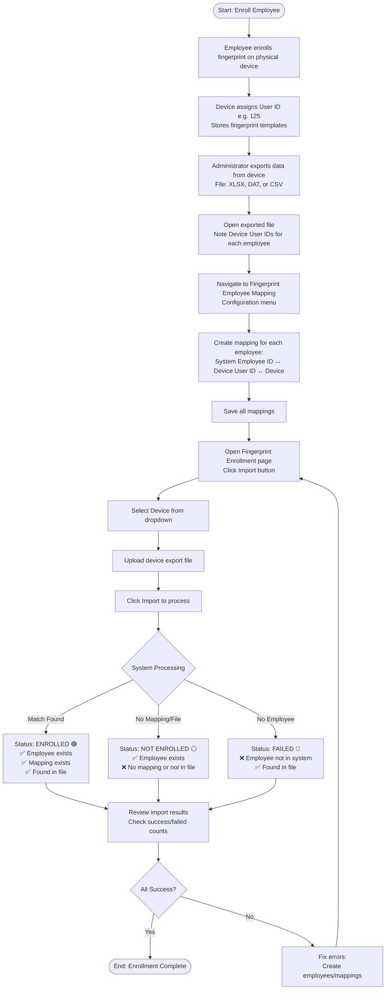

# Fingerprint Enrollment

Fingerprint Enrollment manages employee biometric registration by importing fingerprint data from physical devices, enabling accurate attendance tracking through employee-device mapping.

## Overview

On this page you can:

- Import employee fingerprint data from physical devices
- Map system employee IDs to device user IDs
- Track enrollment status (Enrolled, Not Enrolled, Failed)
- View enrollment statistics and device assignments
- Delete outdated or incorrect enrollment records
- Monitor which employees are enrolled on which devices

**Key Capabilities:**

- Import-based enrollment from device export files
- Three-way mapping: System Employee ID ↔ Device User ID ↔ Device
- Status tracking with color indicators (Green/Grey/Red)
- Multi-device enrollment support per employee
- Bulk import processing for efficient enrollment
- Enrollment verification and error reporting
- Template count tracking (typically 2-3 per employee)
- Device connectivity monitoring

:::warning
**Import-Only System:**
Employees must enroll fingerprints directly on physical devices first. The system imports enrollment data afterward—real-time direct enrollment from the application is not supported.
:::

---

## Key Features

### 📥 Device Import Integration

Seamless data import from fingerprint devices eliminates manual data entry.

**Business Value:**

- Import enrollment data directly from device export files
- Support for standard device formats (XLSX, DAT, CSV)
- Bulk processing of hundreds of employees at once
- Automatic status assignment based on import results
- Reduce enrollment setup time by 90%
- Eliminate manual data entry errors
- Compatible with most fingerprint device brands

**Perfect for:** Organizations with existing fingerprint devices needing centralized enrollment management

---

### 🔗 Smart Employee-Device Mapping

Three-way mapping system ensures accurate identification across different systems.

**Business Value:**

- Connect System Employee ID → Device User ID → Physical Device
- One employee can map to multiple devices (multi-location support)
- Mapping validation before import prevents errors
- Centralized mapping management via configuration
- Clear visibility of employee-device relationships
- Support for device replacement without data loss
- Flexible mapping for organizational changes

**Perfect for:** Multi-location businesses where employees use different devices at various sites

---

### 🎯 Intelligent Status Tracking

Three-tier status system provides instant visibility into enrollment health.

**Business Value:**

- **Enrolled (Green)**: Successfully registered and ready for attendance
- **Not Enrolled (Grey)**: Employee exists but missing mapping/device data
- **Failed (Red)**: Import error - employee not found in system
- Instant identification of enrollment gaps
- Proactive problem detection before attendance issues
- Color-coded visual indicators for quick scanning
- Reduce attendance discrepancies by 80%

**Perfect for:** HR teams managing large workforces needing enrollment oversight

---

### 📊 Comprehensive Enrollment Details

Complete enrollment information for audit and troubleshooting.

**Business Value:**

- Track enrollment date, template count, last verification
- View which devices each employee is enrolled on
- Monitor template quality (2-3 templates standard)
- Audit trail with created/updated timestamps and users
- Department and position context for workforce analysis
- Placement tracking for multi-site employees
- Remark field for troubleshooting notes

**Perfect for:** Compliance-focused organizations requiring detailed enrollment records

---

### 🔄 Multi-Device Support

Single employee can enroll on multiple devices for flexible attendance tracking.

**Business Value:**

- Enroll once per device for multi-location access
- Employee works at multiple sites without re-enrollment
- Backup enrollment for device redundancy
- Different devices for different purposes (entrance, exit, department)
- Seamless attendance across locations
- Reduce employee frustration from access issues
- Support for 24/7 operations with multiple shift locations

**Perfect for:** Companies with multiple branches or locations requiring cross-site attendance

---

### 🔍 Enrollment Verification

Import result reporting helps identify and fix enrollment issues quickly.

**Business Value:**

- Detailed import summary (total, success, failed, duplicates)
- Specific error messages for failed imports
- Mapping error identification with Device User IDs
- Duplicate detection prevents redundant enrollments
- Re-import capability after fixing errors
- Clear guidance for issue resolution
- Reduce troubleshooting time by 70%

**Perfect for:** IT and HR teams managing enrollment across large employee populations

---

## Key Concepts

### Enrollment Fields

Complete data structure for each enrollment record:

| Field                   | Type      | Description                        | Example                        |
| ----------------------- | --------- | ---------------------------------- | ------------------------------ |
| **Employee ID**         | Text      | System employee identifier         | EMP001                         |
| **Employee Name**       | Text      | Full name                          | John Doe                       |
| **Department**          | Text      | Employee department                | Sales                          |
| **Position**            | Text      | Job title                          | Sales Manager                  |
| **Placement**           | Text      | Work location(s) - can be multiple | Jakarta HQ, Surabaya Branch    |
| **Fingerprint Devices** | Text      | Device(s) where enrolled           | Main Scanner - Entrance        |
| **Enrollment Date**     | Date      | When enrollment was imported       | 2025-01-15                     |
| **Template Count**      | Number    | Number of fingerprint templates    | 2-3 (standard)                 |
| **Status**              | Enum      | Current enrollment status          | Enrolled, Not Enrolled, Failed |
| **Last Verified**       | Timestamp | Last successful fingerprint scan   | 2025-01-15 08:45:23            |
| **Remark**              | Text      | Additional notes or error messages | "Imported from Main Scanner"   |
| **Created At**          | Timestamp | Record creation time               | 2025-01-15 10:00:00            |
| **Created By**          | Text      | User who created record            | admin                          |
| **Updated At**          | Timestamp | Last modification time             | 2025-01-16 14:30:00            |
| **Updated By**          | Text      | User who last updated              | hr_manager                     |

### Enrollment Status

Three status levels indicate enrollment health:

| Status           | Badge    | Meaning                 | System Conditions                                                                         |
| ---------------- | -------- | ----------------------- | ----------------------------------------------------------------------------------------- |
| **ENROLLED**     | 🟢 Green | Successfully registered | ✅ Employee exists in system<br/>✅ Mapping configured<br/>✅ Found in device export file |
| **NOT ENROLLED** | ⚪ Grey  | Registration incomplete | ✅ Employee exists in system<br/>❌ Not mapped OR not in device file                      |
| **FAILED**       | 🔴 Red   | Import error            | ❌ Employee not in system<br/>✅ Found in device export file                              |

**Status Logic:**

**ENROLLED:**

- All three components match: System has employee → Mapping exists → Device has enrollment
- Employee ready for attendance tracking
- Can successfully scan fingerprint on device

**NOT ENROLLED:**

- System has employee record
- Either: No mapping created OR employee not enrolled on device yet
- Needs: Create mapping and/or enroll on device

**FAILED:**

- Device has enrollment data but system doesn't recognize employee
- Either: Wrong employee ID in mapping OR employee not created in system
- Needs: Create employee record and mapping, then re-import

### ID Mapping System

Three-way mapping connects different identification systems:

**System Employee ID:**

- Your HR/Payroll system identifier
- Format: EMP001, EMP002, JOHN001, etc.
- Unique across entire organization
- Human-readable, meaningful

**Device User ID:**

- Assigned by fingerprint device hardware
- Format: Sequential numbers (1, 2, 3, 4...)
- Unique within specific device only
- Cannot be customized on most devices
- Auto-assigned during enrollment on device

**Device ID:**

- Identifies physical fingerprint scanner
- Format: DEVICE001, MAIN_ENTRANCE, etc.
- Links to device configuration

**Mapping Structure:**

```
System Employee ID: EMP001
↓
Device User ID: 125
↓
Device: Main Scanner - Entrance

Result: When User ID 125 scans on Main Scanner,
system records attendance for EMP001
```

**Why Mapping Required:**

Devices don't understand your Employee ID system. They assign sequential numbers. Mapping tells the system "Device User 125 = Employee EMP001" so attendance records correctly.

### Import Process

Step-by-step import workflow:

**Prerequisites:**

1. Employees enrolled on physical device
2. Device export file obtained
3. Mappings configured in system

**Import Steps:**

**Step 1: Device Enrollment**

- Employee physically enrolls fingerprint on device
- Device assigns User ID (e.g., 125)
- Device stores fingerprint templates
- Device shows "User 125 Enrolled Successfully"

**Step 2: Export from Device**

- Administrator accesses device admin panel
- Export enrolled users to file
- File format: XLSX, DAT, CSV (device-specific)
- File contains: User IDs, template data, enrollment dates

**Step 3: Create Mapping**

- Open Fingerprint Employee Mapping configuration
- Create mapping for each employee:
  - System Employee ID: EMP001
  - Device User ID: 125
  - Device: Main Scanner
- Save all mappings

**Step 4: Import to System**

- Open Fingerprint Enrollment
- Click Import button
- Select device
- Upload export file
- Execute import

**Step 5: System Processing**

- System reads Device User IDs from file
- Looks up each User ID in mapping table
- Finds corresponding System Employee ID
- Creates/updates enrollment record
- Assigns status (Enrolled/Not Enrolled/Failed)

**Step 6: Review Results**

- Check import summary
- Verify Enrolled count
- Fix Failed imports
- Re-import if needed

### Template Count

Fingerprint templates per enrollment:

**Standard Count: 2-3 templates**

**What are Templates:**

- Digital representation of fingerprint
- Multiple templates increase accuracy
- Different finger angles/positions
- Stored on device and system

**Typical Setup:**

- Template 1: Right thumb, normal position
- Template 2: Right thumb, slight angle
- Template 3: Left thumb (backup)

**Quality Indicators:**

- 1 template: Minimum, low accuracy
- 2-3 templates: Standard, good accuracy
- 4+ templates: Redundant, no benefit

**During Import:**

- Template count imported from device
- Shows in enrollment record
- Helps verify enrollment quality
- Low count may indicate poor enrollment

### Multi-Device Enrollment

One employee, multiple devices:

**Scenario:**
Employee works at multiple locations

**Setup:**

1. Enroll on Device A at Location 1 → Gets User ID 125
2. Enroll on Device B at Location 2 → Gets User ID 50

**Mappings:**

```
Mapping 1: EMP001 ↔ Device A User ID 125
Mapping 2: EMP001 ↔ Device B User ID 50
```

**Import:**

1. Import from Device A → EMP001 enrolled on Device A
2. Import from Device B → EMP001 enrolled on Device B

**Result:**

- EMP001 can use either device for attendance
- Attendance records link to same employee
- Seamless cross-location tracking

**Use Cases:**

- Multi-branch employees
- Backup enrollment for redundancy
- Different entrance/exit devices
- Department-specific devices

---

## Workflow Diagram

Complete enrollment process from device to system:



**Key Decision Points:**

**Import Processing Logic:**

| Condition                                         | Status          | Action Required                               |
| ------------------------------------------------- | --------------- | --------------------------------------------- |
| Employee Exists + Mapping Exists + In Export File | ✅ ENROLLED     | None - Ready for attendance                   |
| Employee Exists + No Mapping OR Not in File       | ⚠️ NOT ENROLLED | Create mapping or re-enroll on device         |
| Employee Not Exists + In Export File              | ❌ FAILED       | Create employee record and mapping, re-import |

---

## Configuration

Before operate import enrollment, configure these master data settings that define enrollment.

1. **[Fingerprint Device](../../configuration/config-payroll/fingerprint-device.md)**
2. **[Fingerprint-Employee Mapping](../../configuration/config-payroll/fingerprint-employee-mapping.md)**

## Best Practices

### Before Import

- **Document IDs:** Keep spreadsheet of Employee ID, Name, Device User ID during enrollment
- **Create Mappings First:** Complete all mappings before importing
- **Test Connection:** Verify device online before export

### During Import

- **One Device at a Time:** Import each device separately
- **Check File:** Verify file format matches expected structure
- **Review Summary:** Check success vs failed counts immediately

### After Import

- **Verify Status:** All should be "Enrolled" (green)
- **Check Templates:** Count should be 2-3 per employee
- **Test Scanning:** Sample employees scan to verify

### Maintenance

- **Weekly Import:** Capture new enrollments regularly
- **Clean Terminated:** Delete enrollments for ex-employees monthly
- **Review Failed:** Check "Not Enrolled" status weekly
- **Update Mappings:** When devices replaced or IDs change

---

## How to Use

<details>
<summary><strong>Create Employee-Device Mapping</strong></summary>

**Must be done before import.**

**Steps:**

1. **Access:** Configuration → **Fingerprint Employee Mapping**
2. **Click Insert**
3. **Select Employee:** Choose from dropdown
4. **Select Device:** Choose fingerprint scanner
5. **Enter Device User ID:**
   - Number from device (e.g., 125)
   - Find from: Device LCD menu, export file column 1, or enrollment session notes
6. **Optional:** Add enrollment date and remark
7. **Click Save**

**Example:**

```
Employee: EMP001 - John Doe
Device: MAIN_ENTRANCE
Device User ID: 125
```

:::tip
Check device LCD → User Management → User List to find User IDs, or open export file and check first column.
:::

</details>

<details>
<summary><strong>Import Enrollment Data</strong></summary>

**Prerequisites:**

- Employees enrolled on device
- Mappings created
- Export file ready

**Steps:**

1. **Open:** Fingerprint Enrollment → **Import**
2. **Select Device:** Choose device containing enrollment
3. **Upload File:** Select device export (.xlsx, .dat, .csv)
4. **Click Import:** System processes
5. **Review Results:**
   - Total Records, Success, Failed, Duplicates, Mapping Errors
6. **Check Status:**
   - Green (Enrolled) = Success
   - Grey (Not Enrolled) = Fix mapping or device enrollment
   - Red (Failed) = Create employee + mapping, re-import
7. **Verify:** All employees show "Enrolled", template count = 2-3

**If Errors:**

- **"Mapping Not Found"** → Create mapping, re-import
- **"Employee Not Found"** → Create employee, create mapping, re-import
- **"Duplicate"** → Delete old enrollment, re-import

</details>

<details>
<summary><strong>Delete Enrollment</strong></summary>

**When:** Re-enrollment, incorrect data, transferred device, terminated employee

**Steps:**

1. Find employee in list
2. **Right-click** → **Delete**
3. **Confirm** deletion
4. Status changes to "Not Enrolled"
5. Mapping remains (can re-import)

:::danger
**Device Templates:** Deletion removes system record only. Clear device templates via device admin panel separately.
:::

</details>

---

## FAQ

<details>
<summary><strong>Why can't I enroll directly from the system?</strong></summary>

**Import-based architecture** - not real-time enrollment.

**Process:**

1. Employee enrolls on physical device
2. Device stores templates
3. Export from device
4. Import to system

**Why:**

- Works with all device brands
- No live connection dependency
- Bulk processing efficient
- Supports offline devices

</details>

<details>
<summary><strong>What's the difference between Employee ID and Device User ID?</strong></summary>

**System Employee ID:**

- HR/Payroll identifier (e.g., EMP001)
- Unique across organization
- Meaningful, human-readable

**Device User ID:**

- Device-assigned number (e.g., 125)
- Sequential, auto-assigned
- Unique per device only

**Why Different:** Devices don't understand Employee IDs—they assign sequential numbers.

**Mapping Links Them:**

```
EMP001 → Device User ID 125 → Main Scanner
When User 125 scans, attendance records for EMP001
```

</details>

<details>
<summary><strong>How do I find Device User ID?</strong></summary>

**Method 1: During Enrollment**

- Device shows: "User 125 Enrolled Successfully"

**Method 2: Device LCD**

- Menu → User Management → User List

**Method 3: Export File**

- First column = Device User ID

**Best Practice:**
Keep enrollment log:

```
Date: 2025-01-15
EMP001 | John Doe | User ID 125
EMP002 | Jane Smith | User ID 126
```

</details>

<details>
<summary><strong>What if import fails?</strong></summary>

**Common Errors:**

| Error                | Cause                  | Solution                                   |
| -------------------- | ---------------------- | ------------------------------------------ |
| "Mapping Not Found"  | No mapping for User ID | Create mapping, re-import                  |
| "Employee Not Found" | Employee doesn't exist | Create employee, create mapping, re-import |
| "Duplicate"          | Already enrolled       | Delete old record, re-import               |
| "Invalid User ID"    | Wrong ID in mapping    | Update mapping, re-import                  |

**Recovery:** Fix issue → Re-import

</details>

<details>
<summary><strong>Can employees enroll on multiple devices?</strong></summary>

**Yes.**

**Setup:**

1. Enroll on Device A → User ID 125
2. Enroll on Device B → User ID 50
3. Create two mappings:
   - EMP001 ↔ Device A User ID 125
   - EMP001 ↔ Device B User ID 50
4. Import from both devices

**Result:** Employee can use either device for attendance.

**Use Cases:** Multi-branch, backup, entrance/exit, department-specific.

</details>

<details>
<summary><strong>What to do when employee leaves?</strong></summary>

**Cleanup:**

1. **Delete Enrollment:** Right-click → Delete
2. **Delete Mapping:** Configuration → Delete mapping
3. **Update Employee:** Set to Inactive/Terminated
4. **Clear Device (Optional):** Device admin → Delete User ID

**Why:** Prevent access, free storage, maintain accuracy, security.

</details>

<details>
<summary><strong>Why "Not Enrolled" after import?</strong></summary>

**Causes:**

1. **No Mapping** → Create mapping, re-import
2. **Not in Export File** → Enroll on device, export, import
3. **Wrong Device** → Import from correct device
4. **Inactive Mapping** → Activate mapping, re-import

**Check:**

- Mapping exists? → Fingerprint Employee Mapping
- Mapping active? → Check Active checkbox
- In export file? → Open file, search User ID

</details>

<details>
<summary><strong>What does Template Count mean?</strong></summary>

**Template Count** = Number of fingerprint templates stored

**Standard: 2-3 templates**

**Template Setup:**

- Template 1: Right thumb, normal
- Template 2: Right thumb, angled
- Template 3: Left thumb (backup)

**Quality:**

- 1 template: Low accuracy ❌
- 2-3 templates: Good accuracy ✅
- 4+ templates: No added benefit

**Low count (1):** May cause scan failures—re-enroll with more templates.

</details>

<details>
<summary><strong>Can I edit enrollment records?</strong></summary>

**No manual edit**—import-only system.

**Why:** Prevents desync between system and device.

**What You Can Do:**

- **Delete and re-import:** Fix device/mapping, then import
- **Update mapping:** Change Device User ID, re-import
- **Add remarks:** Document notes/issues

**Protected:** Employee ID, Device User ID, Template count, Enrollment date, Status

</details>

<details>
<summary><strong>How often should I import?</strong></summary>

**Recommended:**

| Frequency                     | Use Case                                 |
| ----------------------------- | ---------------------------------------- |
| **Weekly**                    | Regular operations, new hires            |
| **After Enrollment Sessions** | Same-day import for immediate sync       |
| **Monthly (Minimum)**         | Maintenance sync                         |
| **Event-Based**               | After 5+ enrollments, device maintenance |

**Best Practice:**

- Weekly scheduled import (e.g., every Friday)
- Immediate import after bulk enrollment
- Monthly verification for all devices
- Review "Not Enrolled" weekly

</details>
