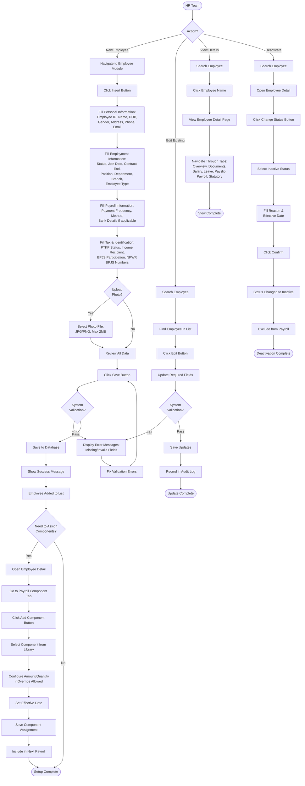

import Tabs from "@theme/Tabs";
import TabItem from "@theme/TabItem";

# Employee

Employee module is the central hub for managing complete employee data, from personal information and employment details to payroll configuration and compliance.

## Overview

On this page you can:

- Manage complete employee lifecycle from onboarding to exit
- Configure payroll components and statutory requirements
- Track salary history and leave balances
- Store and organize employee documents securely
- Maintain tax and labor compliance
- Generate employee reports for various purposes

**Key Capabilities:**

- Centralized employee database with search and filtering
- Direct integration with payroll processing
- Comprehensive history tracking and audit trail
- Tax and BPJS configuration per Indonesian regulations
- Document management system
- Real-time data validation

---

## Key Features

### 👥 Centralized Employee Database

Single source of truth for all employee information with powerful search capabilities.

**Business Value:**

- Eliminate scattered spreadsheets and find any employee data in seconds
- Reduce data entry errors by 80% with validation rules
- Save 10+ hours per week on employee data management

**Perfect for:** Growing companies tired of managing employee data in Excel

---

### 💰 Integrated Payroll Setup

Connect employee data directly to payroll processing.

**Business Value:**

- Automatic salary calculations based on employee configuration
- Bank details ready for disbursement
- Tax and BPJS calculations flow automatically

**Perfect for:** Companies wanting seamless payroll processing without manual work

---

### 📊 Complete History Tracking

Track every change, adjustment, and milestone with audit trail.

**Business Value:**

- Salary adjustment history for performance reviews
- Complete compliance documentation
- Document storage with instant retrieval

**Perfect for:** HR teams needing comprehensive employee records for audits

---

### 🔒 Tax & Compliance Ready

Built-in Indonesian tax and statutory configuration ensures automatic compliance.

**Business Value:**

- NPWP validation prevents tax errors
- BPJS registration tracking
- PTKP status management for accurate withholding

**Perfect for:** Companies requiring strict compliance with government regulations

---

### 📄 Document Management

Store all employee documents securely in one organized location.

**Business Value:**

- No more searching email attachments or file servers
- Quick retrieval during audits
- Secure access control

**Perfect for:** HR teams drowning in physical documents and scattered files

---

### 🔄 Flexible Status Management

Manage employee lifecycle with clear status tracking and historical data preservation.

**Business Value:**

- Active/Inactive status controls payroll inclusion
- Contract expiration tracking
- Easy reactivation if needed

**Perfect for:** Companies with contract workers, seasonal staff, or frequent turnover

---

## Key Concepts

### Employee Data Fields

Employee information structured into four main sections with specific field requirements and validations.

#### Personal Information Fields

Core identity and contact information for each employee.

| Field             | Type     | Required | Validation                           | Description                              |
| ----------------- | -------- | -------- | ------------------------------------ | ---------------------------------------- |
| **Employee ID**   | Text     | Yes      | Unique, alphanumeric                 | Unique identifier for employee in system |
| **First Name**    | Text     | Yes      | Min 2 characters                     | Employee's first name                    |
| **Last Name**     | Text     | Yes      | Min 2 characters                     | Employee's last name or family name      |
| **Date of Birth** | Date     | Yes      | Must be past date                    | Employee's birth date                    |
| **Gender**        | Dropdown | Yes      | Male/Female                          | Employee's gender                        |
| **Full Address**  | Text     | Yes      | Complete address required            | Employee's complete residential address  |
| **Phone Number**  | Text     | Yes      | Numeric, 10-15 digits                | Employee's contact phone number          |
| **Email**         | Text     | Yes      | Valid email format with @ and domain | Employee's email address                 |
| **Profile Photo** | File     | No       | JPG/PNG, max 2MB, 300x300px          | Employee's photo for identification      |

**Field Behavior:**

- **Employee ID**: System checks uniqueness across all employees (active + inactive). Cannot be changed after creation.
- **Name fields**: Combined to display "First Name Last Name" throughout system.
- **Date of Birth**: Used to calculate age and validate employment eligibility.
- **Email & Phone**: Used for system notifications and communications.
- **Profile Photo**: Displayed in employee lists and detail pages for quick identification.

---

#### Employment Information Fields

Job-related details defining employee's role and organizational placement.

| Field                 | Type     | Required    | Validation                   | Description                                     |
| --------------------- | -------- | ----------- | ---------------------------- | ----------------------------------------------- |
| **Employment Status** | Dropdown | Yes         | Permanent/Contract/Probation | Type of employment contract                     |
| **Join Date**         | Date     | Yes         | Cannot be future date        | Official start date of employment               |
| **Contract End Date** | Date     | Conditional | Must be after Join Date      | Contract expiration date (required if Contract) |
| **Position**          | Dropdown | Yes         | From Position master         | Employee's job position or title                |
| **Department**        | Dropdown | Yes         | From Department master       | Department where employee works                 |
| **Branch/Placement**  | Dropdown | Yes         | From Placement master        | Office branch or work location                  |
| **Employee Type**     | Dropdown | Yes         | From Employee Type master    | Employment type (Full-time, Part-time, etc.)    |
| **Direct Supervisor** | Dropdown | No          | Select from active employees | Employee's immediate manager                    |
| **Employee Status**   | Toggle   | Yes         | Active/Inactive              | Current employment status                       |

**Field Behavior:**

- **Employment Status**: Determines if Contract End Date is mandatory. System alerts when contract nearing expiration.
- **Join Date**: Used to calculate length of service and probation period end date.
- **Contract End Date**: System can trigger alerts before expiration for renewal reminders.
- **Position, Department, Branch, Employee Type**: Must be configured in master data before employee creation.
- **Employee Status**: Controls inclusion in payroll and active employee lists.

---

#### Payroll Information Fields

Bank and payment configuration for salary disbursement.

| Field                        | Type     | Required    | Validation                | Description                                           |
| ---------------------------- | -------- | ----------- | ------------------------- | ----------------------------------------------------- |
| **Payment Frequency**        | Dropdown | Yes         | Monthly/Bi-weekly/Weekly  | How often salary is paid                              |
| **Payment Method**           | Dropdown | Yes         | Bank Transfer/Cash        | Method of salary payment                              |
| **Bank Name**                | Dropdown | Conditional | Required if Bank Transfer | Name of bank for salary transfer                      |
| **Bank Account Number**      | Text     | Conditional | Required if Bank Transfer | Employee's bank account number                        |
| **Bank Account Holder Name** | Text     | Conditional | Required if Bank Transfer | Name registered on bank account (must match employee) |

**Field Behavior:**

- **Payment Frequency**: Determines payroll calculation period and payment schedule.
- **Payment Method = Bank Transfer**: Bank Name, Account Number, and Holder Name become mandatory.
- **Payment Method = Cash**: Bank fields optional, salary paid in cash.
- **Bank Account Number**: No specific format validation (varies by bank), but system validates not empty if Bank Transfer selected.
- **Account Holder Name**: Best practice to match employee name for successful transfers.

---

#### Tax & Identification Information Fields

Tax compliance and statutory registration numbers.

| Field                       | Type     | Required    | Validation                             | Description                                       |
| --------------------------- | -------- | ----------- | -------------------------------------- | ------------------------------------------------- |
| **PTKP Status**             | Dropdown | Yes         | TK/0, K/0, K/1, K/2, K/3               | Tax status based on marital status and dependents |
| **Income Recipient**        | Dropdown | Yes         | Employee/Board Member/etc.             | Category of income recipient for tax purposes     |
| **BPJS Participation**      | Toggle   | Yes         | Yes/No                                 | Employee's participation status in BPJS programs  |
| **Tax Number (NPWP)**       | Text     | Conditional | 15 digits, format XX.XXX.XXX.X-XXX.XXX | Indonesian Tax Identification Number              |
| **Health Insurance Number** | Text     | Conditional | Required if BPJS Participation = Yes   | BPJS Health Insurance registration number         |
| **Social Insurance Number** | Text     | Conditional | Required if BPJS Participation = Yes   | BPJS Employment Insurance registration number     |

**Field Behavior:**

- **PTKP Status**: Directly affects income tax calculation. TK = Not Married (Tidak Kawin), K = Married (Kawin), number = dependents.
- **Income Recipient**: Determines tax calculation method and rates applicable.
- **BPJS Participation = Yes**: Health and Social Insurance Numbers become mandatory.
- **NPWP**: Highly recommended for permanent employees. Without NPWP, 120% tax rate applies per Indonesian tax law.
- **BPJS Numbers**: Used for statutory contribution calculations and reporting to BPJS.

---

### Employee Status Logic

Employee status controls payroll inclusion and visibility throughout system.

**Active Status:**

- **Payroll Inclusion**: Included in current and future payroll periods
- **Leave Management**: Can submit and approve leave requests
- **Attendance**: Expected to clock in/out daily
- **Reports**: Appears in active employee reports
- **Visibility**: Visible in all employee dropdowns and lists

**Inactive Status:**

- **Payroll Exclusion**: Excluded from current and future payroll periods
- **Leave Management**: Cannot submit new leave requests (historical data preserved)
- **Attendance**: Not expected to clock in/out
- **Reports**: Only appears in inactive/all employee reports
- **Visibility**: Hidden from dropdowns by default (visible with "Show Inactive" filter)

**Status Change Triggers:**

- **Hire → Active**: New employee onboarding
- **Active → Inactive**: Resignation, termination, long-term leave
- **Inactive → Active**: Return from leave, rehire, status correction

**System Behavior:**

- Status changes recorded in audit log with timestamp and user
- Inactive employees retain all historical data (payslips, leave history, documents)
- Can filter employee lists by status
- Status displayed with color indicator (green = Active, red = Inactive)

---

### Employee Detail Tabs

Complete employee information accessed through organized tabs for efficient navigation.

**Tab Organization:**

| Tab                     | Purpose                             | Key Features                                                |
| ----------------------- | ----------------------------------- | ----------------------------------------------------------- |
| **Overview**            | Summary of all employee information | Personal, employment, identity data + quick stats           |
| **Documents**           | Employee file storage               | Upload, view, preview, download, delete documents           |
| **Salary History**      | Base salary tracking over time      | View history, add adjustments with effective dates          |
| **Leave Balance**       | Leave entitlement management        | View balances, add/update allocations per leave type        |
| **Payslip**             | Historical payroll records          | View and download payslips per period                       |
| **Payroll Component**   | Earnings and deductions assignment  | Assign allowances, bonuses, deductions specific to employee |
| **Statutory Component** | Mandatory contributions             | Assign BPJS and pension components                          |

**Tab Access:**

- All tabs accessible from employee detail page
- Tab content loads on-demand for performance
- Changes in one tab automatically reflected in Overview
- Breadcrumb navigation shows current location

---

### Data Validation Rules

System enforces validation rules to ensure data integrity and prevent errors.

**Format Validations:**

- **Email**: Must contain @ symbol and valid domain (e.g., user@company.com)
- **Phone**: Numeric only, 10-15 digits
- **NPWP**: 15 digits in format XX.XXX.XXX.X-XXX.XXX
- **Date of Birth**: Must be at least 17 years ago (minimum working age)
- **Join Date**: Cannot be future date
- **Contract End Date**: Must be after Join Date

**Business Rule Validations:**

- **Employee ID**: Unique across all employees (system checks before save)
- **Required Fields**: All mandatory fields must be filled before save
- **Conditional Requirements**: Bank details required if Payment Method = Bank Transfer
- **Supervisor Hierarchy**: Cannot select self as supervisor
- **Contract End Date**: Mandatory if Employment Status = Contract

**Real-Time Validation:**

- Field-level validation on blur (when user leaves field)
- Form-level validation on submit
- Inline error messages displayed immediately
- Save button disabled until all validations pass
- Error summary displayed at top of form

**Validation Error Handling:**

- Clear error messages indicating what's wrong
- Field highlighted in red if validation fails
- Focus moves to first error field
- Cannot proceed until all errors resolved

---

## Workflow Diagram

---

## Configuration

Before adding employees, configure these master data settings that define organizational structure and employment types.

1. **[Employee Type](../../configuration/config-payroll/employe-type.md)**
2. **[Placement](../../configuration/config-payroll/placement.md)**
3. **[Department](../../configuration/config-payroll/department.md)**
4. **[Position](../../configuration/config-payroll/position.md)**

### Configuration Dependencies

Master data must be configured in proper sequence:

**Sequence:**

1. **Department** - Must exist before adding employees
2. **Employee Type** - Must exist before adding employees
3. **Placement** - Must exist before adding employees
4. **Position** - Must exist before adding employees
5. **Employee** - Can be added after all above configured

**Why Sequence Matters:**

- Employee form requires selecting from these masters
- Dropdowns will be empty if masters not configured
- Cannot save employee without valid selections
- Data integrity maintained through referential relationships

**Initial Setup Checklist:**

- [ ] Create all departments
- [ ] Create all employee types
- [ ] Create all placements/branches
- [ ] Create all positions
- [ ] Verify all masters active
- [ ] Test by adding sample employee

---

## Best Practices

### Data Entry

- **Complete Required Fields**: Ensure all mandatory information filled before saving
- **Verify Bank Details**: Double-check account numbers to prevent payment failures
- **Validate NPWP**: Confirm tax number is valid (15 digits) for correct tax calculations
- **Unique Employee ID**: Use consistent ID format across organization (e.g., EMP001, EMP002)
- **Accurate Contact Info**: Maintain current phone and email for communications

### Documentation

- **Upload Contracts**: Store signed employment contracts in Documents tab immediately
- **Certificate Storage**: Keep educational and training certificates on file for verification
- **Regular Updates**: Update documents when renewed (e.g., new contracts, updated IDs)
- **Organized Naming**: Use descriptive file names (e.g., "Contract_2024_JohnDoe.pdf")

### Maintenance

- **Regular Data Review**: Audit employee data quarterly for accuracy and completeness
- **Update Contact Info**: Ensure phone and email current for system notifications
- **Contract Tracking**: Monitor contract end dates and plan renewals in advance
- **Status Management**: Use Inactive status instead of deleting to preserve history

### Compliance

- **BPJS Registration**: Register employees in BPJS within 30 days of hire per regulation
- **Tax Documentation**: Maintain NPWP for accurate tax withholding and reporting
- **Labor Law Compliance**: Follow Indonesian employment regulations for contracts
- **Data Privacy**: Restrict access to sensitive employee information based on roles

---

## How to Use

<strong>How to Add New Employee</strong>

**Steps:**

1. Navigate to **Employee** module
2. Click **Insert** button
3. **Fill Personal Information:**

   - Employee ID (unique identifier)
   - First Name, Last Name
   - Date of Birth, Gender
   - Full Address
   - Phone Number, Email
   - Upload Photo (optional)

4. **Fill Employment Information:**

   - Employment Status (Permanent, Contract, Probation)
   - Join Date
   - Contract End Date (if Contract type)
   - Position, Department, Branch/Placement
   - Employee Type
   - Direct Supervisor (optional)
   - Employee Status = Active

5. **Fill Payroll Information:**

   - Payment Frequency (Monthly, Bi-weekly, Weekly)
   - Payment Method (Bank Transfer or Cash)
   - If Bank Transfer:
     - Bank Name
     - Bank Account Number
     - Account Holder Name

6. **Fill Tax & Identification:**

   - PTKP Status (TK/0, K/0, K/1, K/2, K/3)
   - Income Recipient category
   - BPJS Participation (Yes/No)
   - Tax Number/NPWP (15 digits, recommended)
   - If BPJS Participation = Yes:
     - Health Insurance Number
     - Social Insurance Number

7. **Review** all data for accuracy
8. **Click** "Save" button

**Result:** Employee added to database and visible in employee list.

**Validation:** System validates required fields and formats. Error messages displayed if validation fails.

<strong>How to Edit Employee Data</strong>

**Steps:**

1. **Search** for employee using search box

   - Enter: Employee ID, name, email, or phone
   - Results filter automatically

2. **Click** on employee name or Edit button

3. **Update** required information:

   - Modify any field in Personal, Employment, Payroll, or Tax sections
   - Cannot change Employee ID (immutable)

4. **Review** changes carefully

5. **Click** "Save Changes" button

**Result:**

- Employee data updated immediately
- Changes recorded in audit log with timestamp and user
- Updated information reflected throughout system

**Note:** Changes to Department, Position, or Payment details take effect immediately.

<strong>How to View Employee Details</strong>

**Steps:**

1. **Find** employee in list

   - Use search box or scroll through list
   - Apply filters if needed (department, status, etc.)

2. **Click** on employee name

3. **Navigate through tabs:**

   - **Overview**: Personal + employment + identity summary
   - **Documents**: View/upload/delete files
   - **Salary History**: Track base salary changes
   - **Leave Balance**: View leave allocations and usage
   - **Payslip**: Access historical payslips per period
   - **Payroll Component**: View assigned earnings and deductions
   - **Statutory Component**: View BPJS and mandatory contributions

4. **Switch tabs** by clicking tab headers

**Result:** Complete view of employee information organized by category.

**Tip:** Use breadcrumb navigation to return to employee list.

<strong>How to Deactivate Employee</strong>

**Steps:**

1. **Open** employee detail page
2. **Click** "Change Status" button
3. **Select** "Inactive" status
4. **Fill** reason for deactivation (e.g., Resignation, Termination)
5. **Enter** effective date (date when status becomes inactive)
6. **Click** "Confirm" button

**Result:**

- Employee status changed to Inactive
- Removed from active employee lists
- Excluded from current and future payroll processing
- Historical data preserved (payslips, documents, history)
- Can still be viewed by filtering for Inactive employees

**Use Cases:**

- Employee resignation
- Contract termination
- Long-term unpaid leave
- Retirement

**Reactivation:** Status can be changed back to Active if employee returns.

<strong>How to Assign Payroll Components</strong>

**Steps:**

1. **Open** employee detail page
2. **Go to** "Payroll Component" tab
3. **Click** "Add Component" button
4. **Select** component from dropdown
   - Earnings: Allowances, bonuses, incentives
   - Deductions: Loans, penalties
5. **Configure** component:
   - Amount (if override allowed, otherwise uses default)
   - Quantity (if applicable)
   - Effective Date (when component starts)
6. **Click** "Save" button

**Result:**

- Component assigned to employee
- Will be included in next payroll period
- Displayed in Payroll Component tab
- Automatically calculated during payroll processing

**Examples:**

- Transport Allowance: Rp 500,000/month
- Housing Allowance: Rp 1,000,000/month
- Loan Repayment: Rp 300,000/month × 10 months

**Note:**

- Can assign multiple components per employee
- Can update or delete components anytime
- Component must be Active in component library

<strong>How to Assign Statutory Components</strong>

**Steps:**

1. **Open** employee detail page
2. **Go to** "Statutory Component" tab
3. **Click** "Add Component" button
4. **Select** statutory component from dropdown:
   - BPJS Health (Employee portion)
   - BPJS Health (Employer portion)
   - BPJS JHT, JKK, JKM, JP
   - Pension contributions
   - Zakat
5. **Configure** if needed (usually uses default rates)
6. **Set** effective date
7. **Click** "Save" button

**Result:**

- Statutory component assigned
- Automatically calculated based on salary and regulations
- Included in payroll processing
- Used for compliance reporting

**Best Practice:**

- Assign all required BPJS components for compliant employees
- Use default rates (updated per regulation)
- Verify BPJS numbers entered in Tax & Identification section

<strong>How to Upload Employee Documents</strong>

**Steps:**

1. **Open** employee detail page
2. **Go to** "Documents" tab
3. **Click** "Upload Document" button
4. **Select** document type:
   - Contract Agreement
   - ID Card (KTP)
   - Educational Certificate
   - Training Certificate
   - Performance Review
   - Other
5. **Choose** file from computer
   - Supported: PDF, JPG, PNG, DOC, DOCX
   - Maximum: 5MB per file
6. **Add** description (optional but recommended)
7. **Click** "Upload" button

**Result:**

- Document stored in employee's document list
- Can be viewed, downloaded, or deleted
- Preview available for supported formats

**Document Management:**

- **View**: Click document name to preview
- **Download**: Click download icon to save locally
- **Delete**: Click delete icon (requires permission)

**Best Practice:** Use descriptive file names like "Contract_2024_JohnDoe.pdf"

<strong>How to Track Salary History</strong>

**Steps:**

1. **Open** employee detail page
2. **Go to** "Salary History" tab

**To Add Salary Adjustment:** 3. **Click** "Add Adjustment" button 4. **Fill** adjustment details:

- Previous Salary (auto-filled from current)
- New Salary (enter new amount)
- Effective Date (when change takes effect)
- Reason (e.g., Annual Increase, Promotion)

5. **Click** "Save" button

**Result:**

- Salary history updated with new record
- All changes displayed chronologically
- Base salary updated in employee profile
- New salary used in next payroll period

**View History:**

- All historical salary changes displayed in table
- Shows: Previous salary, new salary, effective date, reason, updated by, date updated

**Use Cases:**

- Annual salary increases
- Promotion adjustments
- Cost of living adjustments
- Error corrections

<strong>How to Search and Filter Employees</strong>

**Quick Search:**

1. Use **search box** at top of employee list
2. Enter search term:
   - Employee ID
   - Name (first or last)
   - Email
   - Phone number
3. Results filter automatically as you type
4. Click on employee to view details

**Advanced Filtering:**

1. Click **filter icon** on column headers
2. Apply filters:
   - **Department**: Select specific department(s)
   - **Branch/Placement**: Filter by location
   - **Employee Status**: Active, Inactive, or All
   - **Employment Status**: Permanent, Contract, Probation
   - **Employee Type**: Full-time, Part-time, etc.
   - **Payment Frequency**: Monthly, Bi-weekly, Weekly
3. **Combine** multiple filters
4. View filtered results

**Clear Filters:**

- Click "Clear Filters" button to reset
- Shows all employees again

**Result:** List displays only employees matching search/filter criteria.

**Export Filtered Data:**

- Apply desired filters
- Click "Export" button
- Download includes only filtered employees

<strong>How to Export Employee Data</strong>

**Steps:**

1. **Apply filters** (optional)

   - Filter by department, status, type, etc.
   - Only filtered employees will be exported

2. **Click** "Export" button

3. **Choose format:**

   - **Excel (XLSX)**: For data analysis, editing
   - **CSV**: For importing to other systems
   - **PDF**: For printing, reports

4. **File downloads** automatically to device

**Export Includes:**

- All visible columns in current view
- All employees matching current filters
- Current data snapshot

**Use Cases:**

- HR reports for management
- Backup employee database
- Data analysis in Excel
- Sharing with external auditors
- Importing to other systems

**Tip:** Apply specific filters before export to get only the data you need.

---

## FAQ

<strong>What happens if I enter a duplicate Employee ID?</strong>

The system will reject the entry and display an error message: **"Employee ID already exists."**

Employee IDs must be unique across all employees (both active and inactive).

**Solution:**

- Choose a different unique ID
- Check existing employee list to avoid duplicates
- Use consistent ID format (e.g., EMP001, EMP002, etc.)

**Prevention:** System validates uniqueness in real-time before saving.

<strong>Is NPWP (Tax Number) mandatory for all employees?</strong>

NPWP is **not mandatory** in the system, but **highly recommended** especially for permanent employees.

**Without NPWP:**

- Higher tax rate applies (120% of normal rate per Indonesian tax regulation)
- Less accurate tax withholding
- Employee may face issues during annual tax filing (SPT)
- Company may face compliance questions

**With NPWP:**

- Correct tax withholding at standard rates
- Full tax compliance
- Easier year-end tax reconciliation (SPT)
- Employee can claim tax deductions properly

**Best Practice:**

- Encourage all permanent employees to obtain NPWP
- For employees without NPWP, clearly document reason
- Apply 120% tax rate per regulation

**Note:** NPWP format is 15 digits (XX.XXX.XXX.X-XXX.XXX).

<strong>What's the difference between Inactive and deleting an employee?</strong>

**Inactive Status (Recommended):**

- ✅ Employee data preserved in system
- ✅ Not included in payroll processing
- ✅ Hidden from active lists (visible with filter)
- ✅ Can be reactivated anytime
- ✅ Historical data maintained (payslips, documents, leave)
- ✅ Audit trail preserved for compliance
- ✅ Reversible action

**Delete (Not Recommended):**

- ❌ Permanently removes all employee data
- ❌ Cannot be recovered
- ❌ Breaks historical payroll references
- ❌ May cause errors in reports
- ❌ Loses all historical data
- ❌ Violates data retention requirements
- ❌ Irreversible action

**Best Practice:** Always use **Inactive** status instead of deleting to:

- Maintain data integrity
- Comply with labor regulations (data retention)
- Preserve audit trail
- Enable future analysis and reporting

**When to Delete:** Only if employee added by mistake and never processed in payroll.

<strong>Can I change an employee's department or position?</strong>

**Yes**, you can update department and position through the Edit function.

**Steps:**

1. Edit employee data
2. Update **Position** and/or **Department** fields
3. Changes take effect immediately
4. Save changes

**Result:**

- Changes recorded in audit log with timestamp
- Updated information reflected throughout system
- Employee appears under new department/position in reports
- Historical data preserved with previous department/position

**Use Cases:**

- Promotions
- Department transfers
- Organizational restructures
- Job role changes

**Best Practice:**

- Update salary if promotion includes salary increase (via Salary History tab)
- Notify employee and managers of change
- Update job description if needed
- Consider reassigning payroll components if role change affects allowances

<strong>How do I handle contract extensions?</strong>

**Steps:**

1. Open employee details
2. Click **Edit** button
3. Update **Contract End Date** with new expiration date
4. **Save** changes

**Result:**

- System automatically updates contract status
- Extended date reflected throughout system
- Alerts/reminders adjusted to new date

**Best Practices:**

- Update **before** current contract expires
- Upload new signed contract to **Documents** tab
- Consider if employment status should change (Contract → Permanent)
- Document reason for extension if applicable
- Notify payroll team of extension

**Tip:** Set up reminders 1-2 months before contract expiration to plan renewals.

<strong>What if an employee's bank account changes?</strong>

**Steps:**

1. Edit employee data
2. Navigate to **Payroll Information** section
3. Update:
   - Bank Name
   - Bank Account Number
   - Account Holder Name
4. **Double-check** all details for accuracy
5. **Save** changes

**Critical:** Verify account number is correct to ensure successful salary transfers.

**Verification Steps:**

1. Ask employee to confirm account details in writing
2. Verify account holder name matches employee name
3. Consider testing with small transfer first if possible
4. Document change in employee notes

**Impact:**

- Next salary will be transferred to new account
- Previous account no longer used
- Change recorded in audit log

**Best Practice:** Update immediately when employee notifies HR to prevent payment delays.

<strong>Can I restore an inactive employee to active status?</strong>

**Yes**, inactive employees can be reactivated.

**Steps:**

1. **Filter** employee list to show Inactive employees
2. **Open** inactive employee details
3. **Click** "Change Status" button
4. **Select** "Active" status
5. **Confirm** change

**Result:**

- Employee status changed to Active
- Visible in active employee lists again
- Included in payroll processing
- All components and configurations remain intact

**Use Cases:**

- Employee returns from long-term leave
- Seasonal workers returning
- Rehiring former employee
- Correction of accidental deactivation

**Note:** All historical data (salary history, documents, payslips) preserved and accessible.

**Best Practice:** Review and update employee data before reactivation (contact info, bank details, etc.)

<strong>What photo format is accepted for profile photos?</strong>

**Accepted Formats:**

- JPG / JPEG
- PNG

**File Requirements:**

- **Maximum Size**: 2MB per file
- **Recommended Dimensions**: 300×300 pixels (square ratio)
- **Minimum Dimensions**: 100×100 pixels
- **Aspect Ratio**: Square (1:1) preferred

**Photo Guidelines:**

- Use clear, professional headshots
- Face should be clearly visible
- Neutral background preferred
- Recent photo (within last year)
- No group photos
- Proper lighting

**Tips:**

- Compress large files before uploading to meet 2MB limit
- Use square crop for best display
- Avoid overly large files (slows page loading)
- Update photos periodically (every 1-2 years)

**Upload Location:** Personal Information section when adding/editing employee.

<strong>How do payroll components affect employee salary?</strong>

Payroll components assigned to employees are automatically included in salary calculations during payroll processing.

**Earnings Components (Additions):**

- Allowances (transport, meal, housing)
- Bonuses (performance, annual)
- Incentives (sales commission)
- Overtime pay
- **Effect**: Increase gross salary

**Deductions Components (Subtractions):**

- Loan repayments (employee loans, advances)
- Penalties (late arrival, absence fines)
- Unpaid leave deductions
- **Effect**: Decrease net salary

**Statutory Components (Mandatory):**

- BPJS Health (employee + employer portions)
- BPJS Employment (JHT, JKK, JKM, JP)
- Pension contributions
- Zakat
- **Effect**: Calculated automatically per regulations

**Process Flow:**

1. Assign components in **Payroll Component** or **Statutory Component** tabs
2. Configure amounts (or use defaults from component library)
3. Set effective date
4. Components included in next payroll period
5. Automatically calculated during payroll processing
6. Results displayed on payslip

**Component Status:**

- Must be **Active** to be included in calculations
- Can be temporarily disabled without deleting
- Effective dates control when component starts/stops

**Example Calculation:**

- Base Salary: Rp 8,000,000
- Transport Allowance: Rp 500,000 (Earnings)
- Meal Allowance: Rp 300,000 (Earnings)
- Loan Repayment: Rp 300,000 (Deductions)
- BPJS Health (1%): Rp 80,000 (Deductions)
- **Gross**: Rp 8,800,000
- **Total Deductions**: Rp 380,000
- **Net Salary**: Rp 8,420,000 (before tax)

<strong>Can I add multiple employees at once (bulk import)?</strong>

**Current System:** Employees are added individually through the form interface.

**For Bulk Import:**

- Check if your system version includes bulk import feature
- Contact system administrator to enable bulk import
- Request Excel template for bulk employee data
- Prepare data in required format
- Import through designated import function (if available)

**Alternative Approach:**

1. Prepare employee data in Excel using consistent format
2. Use Excel as reference for quick data entry
3. Add employees one-by-one through system form
4. Copy-paste data from Excel to speed up entry

**Future Feature:** Bulk import may be available in future system updates.

**Best Practice:**

- For new company setup, request administrator assistance for bulk import
- For ongoing operations, individual entry ensures data accuracy and validation
- Keep Excel file as backup record

**Note:** Individual entry provides real-time validation and error checking, reducing data quality issues.

