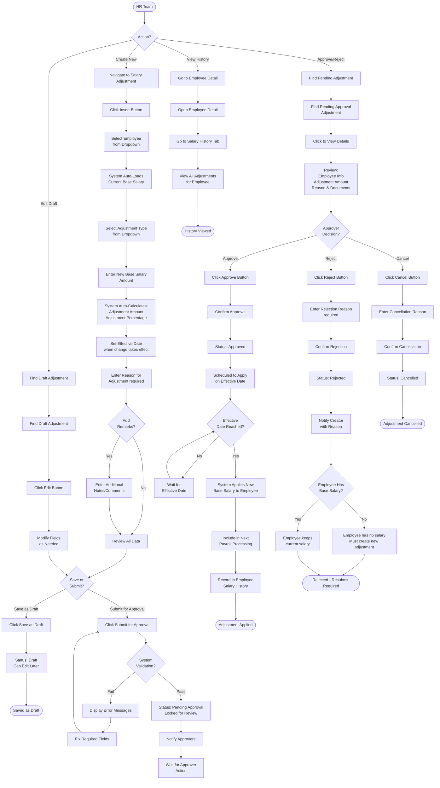

# Salary Adjustment

Salary Adjustment module manages employee base salary changes with proper documentation and approval workflow. This module handles base/basic salary only - not allowances, bonuses, or other components.

## Overview

The Salary Adjustment module enables HR teams to:

- Create and track base salary adjustments
- Submit adjustments for approval workflow
- Document reasons for salary changes
- Track adjustment history per employee
- Generate salary adjustment reports
- Maintain audit trail for compliance

**Key Capabilities:**

- Structured approval workflow (Draft → Pending → Approved/Rejected)
- Automatic calculation of adjustment amount and percentage
- Effective date management for future salary changes
- Integration with employee salary history
- Support for various adjustment types (promotion, performance, etc.)
- Rejection handling with reason documentation

:::info
**Important:** This module is specifically for base salary adjustments. For allowances, bonuses, and other components, use the Payroll Component module.
:::

---

## Key Features

### 📊 Comprehensive Adjustment Tracking

Track all salary changes with complete history and audit trail.

**Business Value:**

- Maintain complete salary change history for audits
- Track adjustment patterns across organization
- Support performance review processes
- Demonstrate fair and consistent salary practices

### ✅ Structured Approval Workflow

Multi-stage approval process ensures proper authorization before salary changes.

**Business Value:**

- Prevent unauthorized salary changes
- Ensure proper budget oversight
- Support compliance requirements
- Clear audit trail for every adjustment

### 🧮 Automatic Calculations

System calculates adjustment amounts and percentages automatically.

**Business Value:**

- Eliminate calculation errors
- Save time during adjustment processing
- Standardize adjustment calculations
- Clear visibility of salary increase percentages

### 📅 Effective Date Management

Schedule salary changes to take effect on specific dates.

**Business Value:**

- Plan salary changes in advance
- Align with promotion dates or review cycles
- Automatic application on effective date
- Support retroactive adjustments when approved late

### 📝 Documented Reasons

Require clear documentation for every salary adjustment.

**Business Value:**

- Justify salary decisions for legal compliance
- Support performance management documentation
- Reduce disputes and questions
- Build transparent salary change process

### 🔍 Flexible Search and Filtering

Find and review adjustments quickly with powerful search capabilities.

**Business Value:**

- Generate reports by department, status, or date range
- Review pending approvals efficiently
- Track adjustment trends over time
- Export data for analysis

---

## Key Concepts

### Adjustment Data Fields

Salary adjustment information captured in structured fields with automatic calculations.

#### Core Adjustment Fields

| Field                     | Type     | Required | Auto-Calculated | Description                                                 |
| ------------------------- | -------- | -------- | --------------- | ----------------------------------------------------------- |
| **Employee**              | Dropdown | Yes      | No              | Select employee for salary adjustment                       |
| **Adjustment Type**       | Dropdown | Yes      | No              | Reason category (Initial, Promotion, Performance, etc.)     |
| **Current Base Salary**   | Number   | Auto     | Yes             | Employee's current base salary (from employee record)       |
| **New Base Salary**       | Number   | Yes      | No              | Proposed new base salary amount                             |
| **Adjustment Amount**     | Number   | Auto     | Yes             | Calculated: New Base Salary - Current Base Salary           |
| **Adjustment Percentage** | Number   | Auto     | Yes             | Calculated: (Adjustment Amount / Current Base Salary) × 100 |
| **Effective Date**        | Date     | Yes      | No              | Date when adjustment becomes active                         |
| **Reason**                | Text     | Yes      | No              | Detailed explanation for adjustment                         |
| **Remark**                | Text     | No       | No              | Additional notes or comments                                |
| **Status**                | Auto     | Auto     | Yes             | Current workflow status (system-managed)                    |

**Field Behavior:**

**Employee Selection:**

- Dropdown shows all active employees
- Once selected, system loads current base salary automatically
- Cannot be changed after submission (create new adjustment instead)

**Current Base Salary:**

- Auto-filled from employee's current base salary record
- Read-only field (cannot be edited)
- If employee has no salary yet, shows 0 or blank
- Used as baseline for calculation

**New Base Salary:**

- Enter desired new base salary amount
- Must be positive number
- Can be higher or lower than current (increase or decrease)
- System validates format and minimum value

**Adjustment Amount:**

- Automatically calculated when New Base Salary entered
- Formula: New Base Salary - Current Base Salary
- Positive = salary increase
- Negative = salary decrease
- Updates in real-time as you type new salary

**Adjustment Percentage:**

- Automatically calculated from adjustment amount
- Formula: (Adjustment Amount ÷ Current Base Salary) × 100
- Shows percentage increase or decrease
- Updates in real-time
- Example: Current Rp 5,000,000 → New Rp 5,500,000 = 10% increase

**Effective Date:**

- Date when salary change takes effect
- Can be current date or future date
- Cannot be past date
- Adjustment applied in payroll period containing effective date
- If approved after effective date, applied retroactively in next payroll

**Reason:**

- Required text field explaining why adjustment needed
- Should be clear and specific
- Examples: "Annual performance increase", "Promotion to Senior Manager"
- Stored permanently for audit purposes

---

### Adjustment Status Workflow

Every salary adjustment follows structured approval workflow with clear status progression.

#### Status Definitions

| Status               | Description                                  | Actions Available           | Who Can Act            |
| -------------------- | -------------------------------------------- | --------------------------- | ---------------------- |
| **Draft**            | Created but not submitted                    | Edit, Submit, Cancel        | Creator                |
| **Pending Approval** | Submitted, awaiting approver review          | Approve, Reject, Cancel     | Approver               |
| **Approved**         | Approved, will take effect on effective date | View only                   | System applies on date |
| **Rejected**         | Not approved by reviewer                     | View, Create new adjustment | Creator                |
| **Cancelled**        | Cancelled before approval                    | View only                   | -                      |

**Status Progression:**

```
Draft → Pending Approval → Approved (applied on effective date)
                         ↘ Rejected
```

**Status Behavior:**

**Draft:**

- Initial status when adjustment created
- Can be edited freely
- Can be saved multiple times
- Must submit to move to next status
- Can be cancelled without approval

**Pending Approval:**

- Status after submission
- Cannot be edited (locked for review)
- Waiting for approver action
- Can be cancelled by creator or approver
- System may send notification to approvers

**Approved:**

- Final approved status
- Cannot be edited or cancelled
- Will take effect on specified effective date
- System automatically updates employee base salary on effective date
- If approved after effective date, applied retroactively in next payroll
- Appears in employee salary history

**Rejected:**

- Adjustment not approved
- Rejection reason documented
- Cannot be edited (create new adjustment instead)
- Employee keeps current salary unchanged
- Creator notified of rejection

**Cancelled:**

- Adjustment cancelled before approval completed
- Requires cancellation reason
- Cannot be reactivated
- Does not affect employee salary
- Preserved for audit trail

---

### Automatic Calculations

System performs salary calculations automatically to prevent errors.

**Calculation Logic:**

**Adjustment Amount:**

```
Adjustment Amount = New Base Salary - Current Base Salary
```

**Examples:**

- Current: Rp 5,000,000 | New: Rp 5,500,000 → Adjustment: Rp 500,000 (increase)
- Current: Rp 8,000,000 | New: Rp 7,500,000 → Adjustment: -Rp 500,000 (decrease)
- Current: Rp 0 | New: Rp 6,000,000 → Adjustment: Rp 6,000,000 (initial salary)

**Adjustment Percentage:**

```
Adjustment Percentage = (Adjustment Amount ÷ Current Base Salary) × 100%
```

**Examples:**

- Current: Rp 5,000,000 | Adjustment: Rp 500,000 → 10% increase
- Current: Rp 8,000,000 | Adjustment: Rp 1,000,000 → 12.5% increase
- Current: Rp 10,000,000 | Adjustment: -Rp 1,000,000 → -10% decrease

**Special Cases:**

- If Current Base Salary = 0 (no salary yet), percentage shows as "-" or "N/A"
- Percentage rounded to 2 decimal places
- Negative adjustment amount shows as negative percentage

**Real-Time Updates:**

- Calculations update instantly as New Base Salary entered
- No need to click calculate button
- All fields update automatically

---

### Adjustment Types

Categorize adjustments by reason for reporting and tracking.

**Common Adjustment Types:**

| Type                  | Description                                | Typical Use Case               |
| --------------------- | ------------------------------------------ | ------------------------------ |
| **Initial Salary**    | First salary assignment for new employee   | New hire salary setup          |
| **Promotion**         | Salary increase due to position change     | Promoted to higher position    |
| **Performance**       | Merit increase based on performance review | Annual performance-based raise |
| **Cost of Living**    | Adjustment for inflation or market changes | Annual COLA increase           |
| **Market Adjustment** | Correction to match market rates           | Retention adjustment           |
| **Correction**        | Fix error in previous salary setting       | Correcting data entry mistake  |
| **Demotion**          | Salary decrease due to position change     | Moved to lower position        |
| **Other**             | Other reasons not covered above            | Special circumstances          |

**Type Usage:**

- Select appropriate type when creating adjustment
- Types configured in Adjustment Reason configuration
- Used for reporting and analysis
- Helps track patterns across organization

---

### Effective Date Logic

Effective date controls when salary change applies to payroll.

**Date Rules:**

- **Current Date**: Adjustment takes effect immediately in next payroll
- **Future Date**: Adjustment scheduled, takes effect on that date
- **Cannot be Past Date**: System prevents backdating adjustments
- **Payroll Period Integration**: Applied in payroll period containing effective date

**Application Scenarios:**

**Scenario 1: Approved Before Effective Date**

- Adjustment approved: Jan 10
- Effective date: Feb 1
- Result: Salary change applied in February payroll

**Scenario 2: Approved After Effective Date**

- Adjustment approved: Feb 15
- Effective date: Feb 1
- Result: Salary change applied in next payroll (March), may include retroactive calculation for February

**Scenario 3: Multiple Adjustments**

- If multiple adjustments for same employee:
  - System uses adjustment with most recent effective date ≤ payroll period
  - Future adjustments wait for their effective date

**Best Practice:**

- Submit adjustments before effective date to avoid delays
- Allow 1-2 weeks for approval process
- For urgent adjustments, coordinate with approvers
- Set effective date to 1st of month for clean payroll periods

---

### Rejection Handling

Clear process for handling rejected adjustments based on employee salary status.

**Rejection Scenarios:**

**Scenario 1: Employee Has No Base Salary Yet**

- Adjustment was for initial salary setup
- Rejection means employee still has no salary
- **Action Required**: Create new adjustment with corrections
- **Impact**: Employee cannot be included in payroll until approved adjustment exists

**Scenario 2: Employee Already Has Base Salary**

- Adjustment was for salary increase/decrease
- Rejection means adjustment not applied
- **Action Required**: Optional - create new adjustment if still needed
- **Impact**: Employee keeps existing base salary, no change

**Rejection Workflow:**

1. Approver clicks Reject button
2. Approver provides rejection reason (required)
3. System changes status to Rejected
4. Creator notified with rejection reason
5. Creator reviews reason and decides next steps
6. If needed, creator submits new adjustment addressing concerns

**Rejection Reasons (Examples):**

- Insufficient budget approval
- Amount exceeds policy limits
- Missing supporting documentation
- Incorrect effective date
- Should be handled as component, not base salary

---

## Workflow Diagram



## Configuration

Before creating salary adjustments, configure adjustment reasons that categorize salary changes.

1. **[Adjustment Reason](../../configuration/config-payroll/adjustment-reason.md)**

---

### Adjustment Reason Usage

**In Salary Adjustment Form:**

- Adjustment Type dropdown populated from active adjustment reasons
- Select appropriate reason for each adjustment
- Reason selection required - cannot submit without selecting
- Selected reason stored with adjustment for reporting

**For Reporting:**

- Generate reports by adjustment reason
- Track patterns (e.g., how many promotions per quarter)
- Analyze salary increase trends by category
- Support budget planning and forecasting

**Deactivating Reasons:**

- Set Active = No to hide reason from dropdown
- Existing adjustments with that reason unaffected
- Still visible in historical data and reports
- Can reactivate later if needed

---

## Best Practices

### Documentation

- **Clear Reasons**: Write specific, detailed reasons for each adjustment (not just "increase" or "raise")
- **Supporting Documents**: Attach performance reviews, promotion letters, or market analysis when applicable
- **Consistent Language**: Use standard terminology across adjustments for easier reporting
- **Complete Information**: Fill all required fields before submitting

### Timing

- **Plan Ahead**: Submit adjustments 1-2 weeks before effective date to allow approval time
- **Align with Reviews**: Schedule adjustments to align with performance review cycles
- **Month Start**: Set effective dates to 1st of month for cleaner payroll processing
- **Batch Processing**: Group similar adjustments (e.g., annual COLAs) for efficient approval

### Approval Process

- **Timely Reviews**: Approvers should review pending adjustments within 2-3 business days
- **Clear Rejections**: Provide specific, actionable feedback when rejecting adjustments
- **Escalation Path**: Define escalation process for adjustments requiring additional approval
- **Budget Alignment**: Ensure adjustments align with approved budget before approval

### Data Quality

- **Verify Amounts**: Double-check new salary amounts before submitting
- **Check Calculations**: Review auto-calculated percentage to ensure reasonable
- **Employee Verification**: Confirm correct employee selected before submission
- **Effective Date**: Verify effective date is correct and not past date

### Compliance

- **Policy Limits**: Follow organization policies for maximum increase percentages
- **Documentation**: Maintain complete audit trail for labor law compliance
- **Fair Practices**: Ensure adjustments applied consistently across similar roles
- **Regular Audits**: Review adjustment patterns quarterly for consistency and fairness

---

## How to Use

<details>
<summary><strong>How to Create New Salary Adjustment</strong></summary>

**Steps:**

1. Navigate to **Salary Adjustment** module
2. Click **Insert** or **New Adjustment** button
3. **Select Employee:**
   - Choose employee from dropdown
   - System auto-loads current base salary
4. **Select Adjustment Type:**
   - Choose reason from dropdown (e.g., Promotion, Performance)
5. **Enter New Base Salary:**
   - Type new base salary amount
   - System automatically calculates:
     - Adjustment Amount (difference)
     - Adjustment Percentage (% change)
6. **Set Effective Date:**
   - Select date when adjustment should take effect
   - Can be today or future date (not past date)
7. **Enter Reason:**
   - Write clear, specific explanation for adjustment
   - Example: "Annual performance increase based on excellent rating"
8. **Add Remarks** (optional):
   - Additional notes or context
9. **Review all information**
10. **Choose action:**
    - **Save as Draft**: Save for later review/editing
    - **Submit for Approval**: Send to approver immediately

**Result:**

- **Draft**: Status = Draft, can edit anytime
- **Submitted**: Status = Pending Approval, locked for review

**Tips:**

- Use Draft when need to review with manager first
- Submit directly when ready and urgent
- Verify employee and amounts before submitting

</details>

<details>
<summary><strong>How to Edit Draft Adjustment</strong></summary>

**Prerequisites:** Adjustment must be in **Draft** status.

**Steps:**

1. Find draft adjustment in list
   - Filter by Status = Draft if needed
2. Click **Edit** button or click on adjustment row
3. **Modify fields** as needed:
   - Change employee (if needed)
   - Update adjustment type
   - Change new base salary amount
   - Update effective date
   - Revise reason or remarks
4. **Review changes**
5. **Choose action:**
   - **Save Changes**: Update draft, keep in Draft status
   - **Submit for Approval**: Update and submit immediately

**Result:** Adjustment updated with your changes.

**Limitations:**

- Can only edit Draft status adjustments
- Cannot edit Pending Approval, Approved, or Rejected adjustments
- To change submitted adjustment, must cancel and create new one

</details>

<details>
<summary><strong>How to Submit Adjustment for Approval</strong></summary>

**From Draft:**

1. Find draft adjustment in list
2. Click **Edit** button
3. Review all information
4. Click **Submit for Approval** button
5. Confirm submission

**Direct Submission:**

- When creating new adjustment
- Click "Submit for Approval" instead of "Save as Draft"

**Result:**

- Status changes to **Pending Approval**
- Adjustment locked (cannot edit)
- Notification sent to approvers
- Appears in approver's pending list

**What Happens Next:**

- Approver reviews adjustment
- Approver approves or rejects
- You receive notification of decision

**Tip:** Ensure all information correct before submitting - cannot edit after submission.

</details>

<details>
<summary><strong>How to Approve Salary Adjustment</strong></summary>

**For Approvers Only:**

**Steps:**

1. Navigate to **Salary Adjustment** module
2. Filter by **Status = Pending Approval** or go to Pending Approval tab
3. **Find adjustment** to review
4. **Click** on adjustment to view full details
5. **Review information:**
   - Employee details
   - Current vs new base salary
   - Adjustment amount and percentage
   - Adjustment type and reason
   - Effective date
   - Supporting documents (if attached)
6. **Verify:**
   - Adjustment justified and reasonable
   - Amount within policy limits
   - Budget available
   - Effective date appropriate
7. **Click Approve** button
8. **Confirm approval**

**Result:**

- Status changes to **Approved**
- Adjustment scheduled to apply on effective date
- Creator notified of approval
- Employee base salary will update automatically on effective date
- Adjustment recorded in employee salary history

**Tips:**

- Review thoroughly before approving
- Check if additional approvals needed for large increases
- Verify effective date appropriate for payroll timing

</details>

<details>
<summary><strong>How to Reject Salary Adjustment</strong></summary>

**For Approvers Only:**

**Steps:**

1. Navigate to **Salary Adjustment** module
2. Find adjustment in **Pending Approval** list
3. **Click** on adjustment to view details
4. **Review** and identify issue
5. **Click Reject** button
6. **Enter rejection reason** (required):
   - Be specific about why rejected
   - Provide clear guidance for resubmission if applicable
   - Examples:
     - "Amount exceeds annual budget allocation"
     - "Missing performance review documentation"
     - "Effective date should be aligned with promotion date"
7. **Confirm rejection**

**Result:**

- Status changes to **Rejected**
- Creator notified with rejection reason
- Employee keeps current base salary (no change)
- Creator can review reason and submit new adjustment if needed

**Impact on Employee:**

- **If employee has no base salary yet**: Must create new adjustment (employee cannot be in payroll without base salary)
- **If employee has base salary**: Keeps current salary, adjustment not applied

**Best Practice:**

- Provide actionable feedback in rejection reason
- Suggest corrections needed for approval
- Be clear and professional in communication

</details>

<details>
<summary><strong>How to Cancel Adjustment</strong></summary>

**Who Can Cancel:**

- Creator: Can cancel Draft or Pending Approval
- Approver: Can cancel Pending Approval

**Steps:**

1. Find adjustment to cancel
2. **Click Cancel** button
3. **Enter cancellation reason** (required):
   - Explain why no longer needed
   - Examples:
     - "Employee declined promotion"
     - "Budget freeze implemented"
     - "Created in error"
4. **Confirm cancellation**

**Result:**

- Status changes to **Cancelled**
- Adjustment will not be processed
- Employee keeps current base salary
- Preserved in system for audit trail

**Limitations:**

- Cannot cancel **Approved** adjustments
- Cannot cancel **Rejected** adjustments (already final status)
- Cancelled adjustments cannot be reactivated (create new adjustment instead)

**When to Cancel:**

- Adjustment no longer needed
- Created for wrong employee
- Better handled through different process
- Budget or policy changes prevent approval

</details>

<details>
<summary><strong>How to View Adjustment History</strong></summary>

**Method 1: From Salary Adjustment Module**

1. Navigate to **Salary Adjustment** module
2. View all adjustments in list
3. **Filter** by:
   - Employee name
   - Department
   - Status (Draft, Approved, Rejected, etc.)
   - Date range
   - Adjustment type
4. Click any adjustment to view full details

**Method 2: From Employee Detail**

1. Navigate to **Employee** module
2. Open specific employee detail page
3. Go to **Salary History** tab
4. View all base salary adjustments for that employee:
   - Chronological order
   - Shows: Date, previous salary, new salary, adjustment amount, reason, status
5. Click any adjustment to view full details

**Information Displayed:**

- All adjustment details
- Approval history (who approved/rejected, when)
- Effective date and application status
- Reason and remarks
- Supporting documents (if attached)

**Export History:**

- Use Export button to download adjustment history
- Choose format: Excel, CSV, or PDF
- Filtered results exported based on current view

</details>

<details>
<summary><strong>How to Handle Bulk Approvals</strong></summary>

**Current Process:**

System supports bulk approval workflow but approvals must be done individually for accuracy.

**Steps:**

1. **Select Multiple Adjustments:**
   - Click first adjustment
   - Hold **Shift** key
   - Click last adjustment in range
   - All adjustments in range selected
2. **Export for Review:**
   - Click **Export Bulk Approval** button
   - System exports selected adjustments to Excel/PDF
   - Review document shows all adjustment details
3. **Review Exported List:**
   - Review each adjustment in export
   - Note which to approve/reject
   - Identify any requiring additional review
4. **Return to System:**
   - Approve or reject each adjustment individually
   - Click Approve/Reject for each one
   - System ensures each reviewed properly

**Why Individual Approval:**

- Ensures each adjustment reviewed thoroughly
- Prevents accidental mass approval errors
- Maintains proper audit trail
- Supports detailed feedback for rejections

**Best Practice:**

- Export for offline review during approval planning
- Mark decisions on printed/downloaded list
- Process approvals in system in batches
- Use consistent approval schedule (e.g., every Friday)

</details>

<details>
<summary><strong>How to Search and Filter Adjustments</strong></summary>

**Quick Search:**

1. Use **search box** at top of adjustment list
2. Enter search term:
   - Employee name
   - Employee ID
   - Adjustment ID
3. Results filter in real-time

**Advanced Filtering:**

**By Status:**

- Draft
- Pending Approval
- Approved
- Rejected
- Cancelled
- All statuses

**By Date:**

- Creation date range
- Effective date range
- Approval date range

**By Type:**

- Adjustment reason/type
- Filter to specific categories

**By Department:**

- Filter by employee department
- Useful for department-level reporting

**By Employee:**

- View all adjustments for specific employee

**Combine Filters:**

- Apply multiple filters simultaneously
- Example: Approved + Last 3 Months + Marketing Department

**Clear Filters:**

- Click "Clear Filters" to reset view
- Shows all adjustments

**Save Filter Preferences:**

- Some systems remember your filter settings
- Quick access to frequently used views

</details>

<details>
<summary><strong>How to Export Adjustment Reports</strong></summary>

**Steps:**

1. **Apply filters** to narrow results (optional):
   - Date range
   - Status
   - Department
   - Adjustment type
2. **Click Export** button
3. **Choose format:**
   - **Excel (XLSX)**: For data analysis, pivot tables
   - **CSV**: For importing to other systems
   - **PDF**: For printing, formal reports
4. **File downloads** automatically

**Export Includes:**

- All adjustments matching current filters
- All columns visible in list view
- Current data snapshot

**Common Report Uses:**

**Monthly Approval Report:**

- Filter: Approved status + last month
- Export: Excel
- Use: Monthly management report

**Department Salary Changes:**

- Filter: Specific department + date range
- Export: Excel
- Use: Budget tracking

**Pending Approvals:**

- Filter: Pending Approval status
- Export: PDF
- Use: Approver review list

**Annual Salary Review:**

- Filter: Performance type + calendar year
- Export: Excel
- Use: HR analysis and planning

**Tips:**

- Apply filters before export to get targeted data
- Use Excel export for further analysis
- Use PDF export for presentation or printing
- Export regularly for backup purposes

</details>

---

## FAQ (Frequently Asked Questions)

<details>
<summary><strong>Can I add bonuses or allowances through Salary Adjustment?</strong></summary>

**No**, Salary Adjustment is specifically for **base/basic salary only**.

For bonuses, allowances, and other components:

- Use **Payroll Component** module
- Assign components in employee detail page
- Or add components directly when processing payroll period

**Base Salary Examples:**

- Monthly base salary
- Annual salary divided by 12

**Not Base Salary (Use Payroll Component):**

- Transport allowance
- Meal allowance
- Performance bonuses
- Overtime pay
- Commission

</details>

<details>
<summary><strong>When will the approved salary adjustment take effect?</strong></summary>

The adjustment takes effect on the **Effective Date** specified in the adjustment.

**Timing Scenarios:**

**Approved Before Effective Date:**

- Adjustment applied automatically on effective date
- Included in payroll period containing that date

**Approved After Effective Date:**

- Applied in next payroll period
- May include retroactive calculation for the difference

**Example:**

- Effective Date: February 1
- Approved: January 25
- Result: New salary used in February payroll

**Example (Late Approval):**

- Effective Date: February 1
- Approved: February 20
- Result: New salary used in March payroll, may calculate retroactive adjustment for February

**Best Practice:** Submit and approve adjustments **before** effective date to avoid delays.

</details>

<details>
<summary><strong>Can I adjust multiple employees at once?</strong></summary>

**No**, you must create adjustments individually - one adjustment per employee at a time.

**Reason:** Each employee's salary change requires:

- Individual justification and documentation
- Specific approval based on employee's circumstances
- Different effective dates possible
- Proper audit trail per employee

**For Multiple Employees:**

1. Create adjustment for first employee
2. Submit or save as draft
3. Repeat for next employee
4. Use same adjustment type if reason similar (e.g., annual COLA)

**Approval Process:**

- Can select multiple adjustments for export review
- But each must be approved/rejected individually
- Ensures proper review of each case

**Tip:** For organization-wide increases (e.g., annual COLA), create template with same adjustment type, then customize new salary for each employee.

</details>

<details>
<summary><strong>What happens if my adjustment is rejected?</strong></summary>

**Outcome depends on employee's current salary status:**

**Scenario 1: Employee Has No Base Salary Yet**

- Adjustment was for initial salary setup
- Rejection means employee still has no salary in system
- **You MUST create new adjustment** addressing rejection reasons
- Employee cannot be included in payroll without approved base salary

**Scenario 2: Employee Already Has Base Salary**

- Adjustment was for increase/decrease to existing salary
- Rejection means adjustment not applied
- Employee keeps current/existing base salary (no change)
- **Optional**: Create new adjustment if still needed

**Next Steps After Rejection:**

1. **Read rejection reason** carefully
2. **Identify issue:**
   - Wrong amount?
   - Missing documentation?
   - Timing issue?
   - Policy violation?
3. **Address concerns:**
   - Correct amount if calculation error
   - Gather required documentation
   - Adjust effective date if needed
   - Provide additional justification
4. **Create new adjustment** with corrections
5. **Submit for approval** again

**Tips:**

- Contact approver for clarification if rejection reason unclear
- Ensure new adjustment addresses all concerns raised
- Attach supporting documents if that was missing

</details>

<details>
<summary><strong>Can I cancel an approved adjustment?</strong></summary>

**No**, you cannot cancel an adjustment once it's been approved.

**Approved Adjustments:**

- Status is final
- Already scheduled to take effect on effective date
- System will apply automatically
- Cannot be edited or cancelled

**If Need to Revert:**

1. Wait for adjustment to take effect
2. Create **new adjustment** to change salary back:
   - New Base Salary = previous salary amount
   - Adjustment Type = Correction
   - Reason = Explain reversal (e.g., "Reverting salary due to policy change")
3. Submit new adjustment for approval
4. Once approved, salary changes back

**Prevention:**

- Review all details carefully before approving
- Verify effective date correct
- Confirm new salary amount accurate
- Check supporting documentation

**Best Practice:** If you realize error immediately after approval, contact system administrator to check if reversal possible before effective date.

</details>

<details>
<summary><strong>Is there a limit on salary increase percentage?</strong></summary>

**System Default:** No hard limit enforced by system.

**Company Policy:** Limits depend on your organization's policies.

**Common Practice:**

- Organizations often have internal approval thresholds
- Example policy structure:
  - 0-10% increase: Manager approval
  - 10-20% increase: Manager + HR Director approval
  - 20%+ increase: Manager + HR Director + Finance Director approval

**Large Increase Handling:**

1. **Review policy** for percentage requiring additional approvals
2. **Prepare justification:**
   - Market analysis
   - Retention risk
   - Performance documentation
   - Budget impact
3. **Route for additional approvals** per policy
4. **Document reasoning** thoroughly

**System Capability:**

- Shows adjustment percentage automatically
- Approvers can see percentage clearly
- Alerts or workflow rules may be configured for large increases

**Best Practice:**

- Check with HR Manager about policy limits
- Provide extra justification for increases >15-20%
- Consider market benchmarking data
- Document exceptional circumstances clearly

</details>

<details>
<summary><strong>How long does the approval process take?</strong></summary>

**Typical Timeline:** 1-5 business days, depending on organization.

**Factors Affecting Speed:**

**Approver Availability:**

- Approvers review daily: 1-2 days
- Approvers review weekly: Up to 5 days
- Approver on leave: May require escalation

**Adjustment Complexity:**

- Standard increases: Faster (1-2 days)
- Large increases: Slower (3-5 days, additional review)
- Initial salary setup: Medium (2-3 days)

**Supporting Documentation:**

- Complete documentation: Faster approval
- Missing documents: Delayed pending submission

**Company Policy:**

- Simple approval chain: Faster
- Multiple approval levels: Slower

**Expediting Approval:**

1. **Submit early:** 1-2 weeks before needed
2. **Complete documentation:** Include all required info upfront
3. **Clear justification:** Write thorough, specific reasons
4. **Follow up:** Contact approver if urgent
5. **Provide context:** Explain if time-sensitive (e.g., promotion effective date)

**Best Practice:**

- Plan ahead for annual review cycles
- Submit well before effective date
- Build 1-2 week buffer time
- Set expectations with employees accordingly

</details>

<details>
<summary><strong>What's the difference between Salary Adjustment and Payroll Component?</strong></summary>

**Clear Distinction:**

**Salary Adjustment:**

- **Purpose**: Change employee's base/basic salary
- **Scope**: Base salary only
- **Frequency**: Occasional (promotions, reviews, etc.)
- **Workflow**: Requires approval
- **Impact**: Permanent change to base salary
- **Examples**:
  - Annual raise: Rp 8M → Rp 8.8M base salary
  - Promotion increase: Rp 6M → Rp 7.5M base salary
  - Initial salary: New hire at Rp 5M base salary

**Payroll Component:**

- **Purpose**: Assign allowances, bonuses, deductions
- **Scope**: All components except base salary
- **Frequency**: Can be recurring or one-time
- **Workflow**: May or may not require approval (depends on configuration)
- **Impact**: Add/remove components from payroll calculation
- **Examples**:
  - Transport allowance: Rp 500K/month
  - Performance bonus: Rp 2M one-time
  - Meal allowance: Rp 300K/month
  - Loan repayment: Rp 400K/month deduction

**Salary Calculation Example:**

Employee with Salary Adjustment:

- Base Salary: Rp 8,000,000 (from Salary Adjustment)

Plus Payroll Components:

- Transport Allowance: Rp 500,000
- Meal Allowance: Rp 300,000
- Performance Bonus: Rp 2,000,000

= Gross Salary: Rp 10,800,000

**When to Use Which:**

**Use Salary Adjustment when:**

- Changing employee's base monthly salary
- Promotion to new position
- Annual performance increase
- New hire salary setup
- Market adjustment to base pay

**Use Payroll Component when:**

- Adding allowances (transport, meal, housing)
- One-time bonuses
- Recurring incentives
- Deductions (loans, advances)
- Overtime payments

**Key Takeaway:** Base salary = Salary Adjustment | Everything else = Payroll Component

</details>

<details>
<summary><strong>Can I see all salary adjustments for a specific employee?</strong></summary>

**Yes**, view complete salary history per employee.

**Method 1: Employee Detail Page**

1. Navigate to **Employee** module
2. Find and open employee detail page
3. Click **Salary History** tab
4. View all base salary adjustments for that employee:
   - Date of adjustment
   - Previous salary
   - New salary
   - Adjustment amount
   - Adjustment percentage
   - Reason
   - Status
   - Who created/approved

**Method 2: Salary Adjustment Module**

1. Navigate to **Salary Adjustment** module
2. Use **Filter** or **Search**:
   - Enter employee name
   - Or select employee from filter dropdown
3. View all adjustments for that employee across all statuses

**Information Available:**

- Complete adjustment timeline
- Current vs historical salaries
- Approved and rejected adjustments
- Pending adjustments
- Draft adjustments
- Reasons for each change
- Approval trail

**Use Cases:**

- Performance review discussions
- Salary verification
- Audit requests
- Career progression analysis
- Compensation planning

**Export:** Can export employee-specific salary history to Excel/PDF for documentation.

</details>

<details>
<summary><strong>What if I enter the wrong new salary amount?</strong></summary>

**Depends on adjustment status:**

**Draft Status:**

1. Find adjustment in list
2. Click **Edit** button
3. Update **New Base Salary** field with correct amount
4. System recalculates adjustment amount and percentage
5. Click **Save Changes** or **Submit**

**Pending Approval:**

- **Cannot edit** (locked for review)
- **Option 1**: Cancel adjustment
  - Click Cancel
  - Enter reason: "Incorrect salary amount"
  - Create new adjustment with correct amount
- **Option 2**: Contact approver
  - Ask approver to reject
  - Wait for rejection
  - Create new adjustment with correct amount

**Approved:**

- **Cannot cancel or edit**
- **If not yet applied** (before effective date):
  - Contact system administrator for assistance
  - May require special intervention
- **If already applied**:
  - Create new correction adjustment
  - New Base Salary = intended correct amount
  - Adjustment Type = Correction
  - Reason = Explain error and correction
  - Submit for approval

**Prevention:**

- **Double-check** new salary amount before submitting
- **Review** auto-calculated percentage (does it seem reasonable?)
- **Use Draft** status for preliminary saves
- **Get approval** from manager before submitting if large amount
- **Calculator verification**: Confirm calculation separately

**Tip:** Always save as Draft first, review everything, then submit when confident.

</details>
