# Payroll Component

Payroll Component is the master library for defining earnings, deductions, and statutory components that can be applied to employee payroll calculations, providing flexibility and standardization across the organization.

## Overview

Payroll Component enables HR/Finance to:

- **Define earnings components** (allowances, bonuses, incentives, overtime)
- **Configure deduction components** (loans, advances, fines, unpaid leave)
- **Manage statutory components** (BPJS, pension, zakat)
- **Standardize component calculations** with types, rates, and units
- **Control tax treatment** per component (taxable vs. non-taxable)
- **Set BPJS inclusion** for insurance base calculations
- **Enable prorata adjustments** for mid-period changes
- **Customize payslip display** for employee transparency

**Three Component Types:**

1. **Earnings**: Additions to gross salary (allowances, bonuses, overtime)
2. **Deductions**: Subtractions from salary (loans, fines, unpaid leave)
3. **Statutory**: Mandatory contributions (BPJS Health, BPJS Employment, Pension, Zakat)

**Configuration Differences:**

| Feature                | Earnings & Deductions        | Statutory                      |
| ---------------------- | ---------------------------- | ------------------------------ |
| **Category**           | ✅ Yes (for grouping)        | ❌ No                          |
| **BPJS Inclusion**     | ✅ Yes (can be part of base) | ❌ No (are BPJS contributions) |
| **Prorata**            | ✅ Yes (partial months)      | ❌ No (auto-calculated)        |
| **Percentage/Min/Max** | ❌ No                        | ✅ Yes (regulatory caps)       |
| **Custom Formula**     | Contact admin                | Contact admin                  |

---

## Key Features

### 💰 Flexible Earnings Components

Create unlimited allowance, bonus, and incentive types with custom calculations.

**Business Value:**

- Support diverse compensation structures across departments
- Standardize allowance policies company-wide
- Automate bonus calculations and eliminate manual errors
- Enable performance-based pay components

**Perfect for:** Companies with complex compensation packages, multiple allowance types, or performance-based incentive programs

### 📉 Customizable Deduction Components

Define various deduction types with automatic calculation rules.

**Business Value:**

- Automate loan/advance repayment tracking
- Standardize penalty structures for consistent policy enforcement
- Handle unpaid leave calculations accurately
- Maintain complete audit trail

**Perfect for:** Companies managing employee loans, advances, or custom deduction policies requiring transparency and accuracy

### 🏛️ Statutory Compliance Components

Pre-configure mandatory contributions (BPJS, pension, zakat) per Indonesian regulations.

**Business Value:**

- Ensure 100% compliance with Indonesian labor laws
- Automate BPJS calculations (Health, Employment, Pension) accurately
- Accurate tax withholding (PPh 21/26)
- Reduce compliance risk and avoid penalties

**Perfect for:** All Indonesian companies requiring statutory compliance and wanting peace of mind with labor law adherence

### 🧮 Multiple Calculation Types

Support fixed amounts, percentages, and quantity-based calculations automatically.

**Business Value:**

- Eliminate manual calculation errors
- Standardize calculation methods across organization
- Support diverse component logic (fixed, percentage, quantity-based)
- Reduce payroll processing time significantly

**Perfect for:** Companies needing automated, error-free payroll calculations with diverse component types

### 🎯 Granular Tax Control

Configure tax treatment individually per component for accurate withholding.

**Business Value:**

- Precise taxable income calculations
- Full compliance with Indonesian tax regulations (PMK 168/2023)
- Support non-taxable benefits properly
- Accurate annual tax reporting (SPT)

**Perfect for:** Companies requiring accurate tax compliance and wanting to maintain employee trust through proper tax handling

### 🏥 BPJS Integration Control

Specify which components included in BPJS Health and Employment calculations.

**Business Value:**

- Correct BPJS premium calculations
- Full compliance with BPJS regulations
- Optimize insurance contribution costs
- Prevent over/under contribution penalties

**Perfect for:** Companies managing BPJS contributions accurately and wanting to optimize costs while maintaining compliance

### 📊 Prorata-Capable Components

Enable automatic prorata adjustments for mid-period joiners/leavers.

**Business Value:**

- Fair salary calculation for partial months
- Automatic proportional allowances
- Compliance with labor laws requiring prorata
- Employee satisfaction with fair pay practices

**Perfect for:** Companies with frequent mid-month hires, resignations, or unpaid leave requiring fair compensation

### 📄 Payslip Display Control

Choose which components appear on employee payslips.

**Business Value:**

- Employee transparency builds trust
- Reduce payroll inquiries
- Compliance with disclosure requirements
- Professional payslip presentation

**Perfect for:** Companies prioritizing employee communication, transparency, and wanting to reduce HR administrative burden

### 🏢 Component Categorization

Organize components into categories for easier management.

**Business Value:**

- Logical grouping (Fixed/Variable Allowance, Kasbon, Penalties)
- Simplified component selection during payroll
- Enhanced reporting by category
- Easier audit and compliance review

**Perfect for:** Large organizations managing many component types and needing organized reporting structures

### 🔒 Component Locking Feature

Lock component amounts to prevent unauthorized changes.

**Business Value:**

- Ensure standardized amounts for policy compliance
- Prevent unauthorized adjustments
- Support regulatory requirements for fixed contributions
- Maintain budget control

**Perfect for:** Companies requiring standardization, budget control, and consistent policy application across employees

---

## Key Concepts

### Component Types

**Earnings (Additions to Gross Salary):**

- Allowances (transport, meal, housing, communication)
- Bonuses (performance, annual, project completion)
- Incentives (sales commission, attendance bonus)
- Overtime pay
- Shift allowances

**Deductions (Subtractions from Salary):**

- Loan/advance repayments (kasbon, employee loans)
- Unpaid leave deductions
- Late arrival penalties
- Absence fines
- Voluntary contributions

**Statutory (Mandatory Legal Contributions):**

- BPJS Kesehatan (Health Insurance) - employee & employer portions
- BPJS Ketenagakerjaan (Employment): JHT, JKK, JKM, JP
- Pension Fund contributions
- Zakat/Religious donations

**Note:** Income Tax (PPh 21/26) is NOT configured as statutory component. Tax rates are configured separately in Tax Component.

---

### Component Fields

**Common Fields (All Component Types):**

| Field                   | Type     | Required | Description                                                            |
| ----------------------- | -------- | -------- | ---------------------------------------------------------------------- |
| **Code**                | Text     | Yes      | Unique identifier (e.g., "EARN_TRANS", "DED_LOAN", "STAT_BPJS_HEALTH") |
| **Name**                | Text     | Yes      | Display name (e.g., "Transport Allowance", "BPJS Health - Employee")   |
| **Description**         | Text     | No       | Detailed explanation of component purpose                              |
| **Type**                | Dropdown | Yes      | Calculation type (Fixed Amount/Percentage/Quantity-Based)              |
| **Unit**                | Dropdown | No       | Measurement unit (Day, Hour, Amount, Percent)                          |
| **Default Amount**      | Number   | Yes      | Standard value or rate                                                 |
| **Default Quantity**    | Number   | Yes      | Standard quantity (usually 1)                                          |
| **Fixed**               | Checkbox | No       | Lock amount, cannot override per employee                              |
| **Taxable**             | Checkbox | Yes      | Include in taxable income calculation                                  |
| **Included in Journal** | Checkbox | No       | Generate accounting journal entry                                      |
| **Show in Payslip**     | Checkbox | Yes      | Affects take-home pay and displayed on employee payslip                |
| **Active**              | Checkbox | Yes      | Component available for selection                                      |

**Additional Fields (Earnings & Deductions ONLY):**

| Field                                | Description                                                     |
| ------------------------------------ | --------------------------------------------------------------- |
| **Category**                         | Component category for grouping (Fixed Allowance, Kasbon, etc.) |
| **Included in BPJS Ketenagakerjaan** | Include in BPJS Employment calculation base                     |
| **Included in BPJS Kesehatan**       | Include in BPJS Health calculation base                         |
| **Included in Prorata**              | Apply prorata for partial months                                |

**Additional Fields (Statutory ONLY):**

| Field                  | Description                                         |
| ---------------------- | --------------------------------------------------- |
| **Default Percentage** | Rate for percentage-based statutory calculations    |
| **Min Amount**         | Minimum contribution amount                         |
| **Max Amount**         | Maximum contribution amount (e.g., BPJS salary cap) |

**Note:** Formula field exists but is not user-editable. Contact administrator for custom formula requirements.

---

### Show in Payslip Field

Controls whether component affects take-home pay and appears on employee payslip.

**Show in Payslip = Checked (✅):**

- Component affects take-home pay calculation
- Displayed on employee payslip
- Visible to employee
- Contributes to final net salary

**Show in Payslip = Unchecked (❌):**

- Component does NOT affect take-home pay
- NOT displayed on employee payslip
- Hidden from employee view
- Internal calculation only

**Common Configurations:**

**Earnings Components:**

- Transport Allowance, Meal Allowance, Bonuses → Show ✅

**Deductions Components:**

- Loan Repayment, Penalties, Unpaid Leave → Show ✅

**Statutory Components (Employee Portions):**

- BPJS Health Employee, BPJS JHT Employee → Show ✅ (affects take-home)

**Statutory Components (Employer Portions):**

- BPJS Health Employer → Show ✅ or ❌ (company policy)
  - Show ✅: For transparency, shows total employment cost
  - Hide ❌: Not deducted from employee, doesn't affect take-home

---

### Field Comparison: Earnings/Deductions vs Statutory

| Field                  | Earnings/Deductions | Statutory        | Why Different?                                                          |
| ---------------------- | ------------------- | ---------------- | ----------------------------------------------------------------------- |
| **Category**           | ✅ Required         | ❌ Not available | Earnings/Deductions need grouping; Statutory already categorized by law |
| **BPJS Inclusion**     | ✅ Available        | ❌ Not available | Earnings/Deductions form BPJS base; Statutory ARE BPJS contributions    |
| **Prorata**            | ✅ Available        | ❌ Not available | Earnings/Deductions may need prorata; Statutory auto-calculated         |
| **Default Percentage** | ❌ Not available    | ✅ Available     | Statutory often percentage-based with regulatory rates                  |
| **Min/Max Amount**     | ❌ Not available    | ✅ Available     | Statutory has regulatory caps (e.g., BPJS max salary)                   |

---

### Statutory Components Scope

**What Statutory Components Include:**

- BPJS Kesehatan (Health Insurance) - employee & employer portions
- BPJS Ketenagakerjaan (Employment Insurance): JHT, JKK, JKM, JP
- Pension fund contributions (if applicable) - employee & employer portions
- Zakat/Religious donations (if company facilitates)
- Other mandatory legal contributions

**What Statutory Components DO NOT Include:**

- ❌ Income Tax (PPh 21/26)

**Why Pension Fund & Zakat in Statutory:**

- Regulated by law (PMK 168/2023 for tax treatment)
- Can reduce taxable income if meet requirements
- Requires specific reporting and documentation
- Company acts as withholding agent
- Subject to regulatory compliance

**Requirements for Tax Deduction:**

- **Pension Fund**: Must be paid to pension fund approved by Menteri/OJK or BPJS Ketenagakerjaan
- **Zakat**: Must be paid to official Badan Amil Zakat or government-recognized religious institutions
- **Through Employer**: Must be deducted and paid through employer (not direct payment by employee)

---

### Component Calculation Types

**Fixed Amount:**

- Flat amount regardless of other factors
- Example: Rp 500,000 meal allowance per month
- Unit: Amount (no calculation needed)

**Percentage:**

- Based on percentage of base salary or gross
- Example: 10% of base salary as performance bonus
- Unit: Percent
- Calculation: Base Salary × Percentage

**Quantity-Based:**

- Amount × Quantity
- Units: Day, Hour, Month
- Example: Rp 50,000 per hour × 10 overtime hours = Rp 500,000

**Custom Formula:**

- Complex calculations with multiple variables
- Not directly user-configurable
- Contact administrator for implementation

---

### Fixed Component Behavior

**Fixed = Checked (✅):**

- Amount locked at default value
- Cannot override when assigned to employee
- All employees receive exact same amount
- Use for: Statutory rates, standardized allowances, policy-mandated amounts

**Fixed = Unchecked (❌):**

- Amount can be overridden per employee
- Default serves as starting point
- Flexibility for individual customization
- Use for: Grade-based allowances, negotiated packages, variable amounts

---

### Tax Treatment

**Taxable = Checked (✅):**

- Included in gross income for tax calculation
- Increases income tax withholding (PPh 21)
- Examples: Most allowances, bonuses, overtime
- Required for: Most monetary benefits

**Taxable = Unchecked (❌):**

- Excluded from taxable income
- No impact on income tax
- Examples: Reimbursements (within limits), certain statutory contributions
- Requires: Valid tax regulation basis

**Important:** Indonesian tax law (PMK 168/2023) determines what's taxable. Incorrect treatment = compliance violations and penalties.

---

### BPJS Inclusion

Determines which components affect BPJS contribution calculations.

**Available for:** Earnings and Deductions ONLY (not Statutory)

**BPJS Kesehatan (Health Insurance):**

- Calculation base = components marked "Included in BPJS Kesehatan"
- Employee contribution: 1% of calculation base
- Employer contribution: 4% of calculation base
- Maximum base: Rp 12,000,000 (2025 regulation)
- Typically includes: Base salary + fixed allowances

**BPJS Ketenagakerjaan (Employment Insurance):**

- Calculation base = components marked "Included in BPJS Ketenagakerjaan"
- Includes JHT, JKK, JKM, JP programs
- Rates vary by program (JHT: 2% employee + 3.7% employer)
- Typically includes: Base salary + regular allowances

**Configuration Guidelines:**

- ✅ Include: Base salary, fixed allowances (transport, meal, housing)
- ❌ Exclude: Variable bonuses, overtime, one-time payments, reimbursements

---

### Prorata Configuration

Enable automatic proportional calculations for partial months.

**Available for:** Earnings and Deductions ONLY (not Statutory)

**When Prorata Applies:**

- Employee joins mid-month (e.g., starts on 15th)
- Employee resigns mid-month (e.g., last day on 20th)
- Unpaid leave taken (reduces working days)
- Mid-month status changes

**Prorata Formula:**

```
Component Value = Default Amount × Prorata Factor
Prorata Factor = Actual Working Days / Total Working Days
```

**Example:**

- Component: Transport Allowance = Rp 500,000/month
- Included in Prorata: Yes ✅
- Employee joins: January 15 (worked 12 days out of 22)
- Prorata Factor: 12/22 = 0.545
- Actual Value: Rp 500,000 × 0.545 = Rp 272,500

**Components to Enable Prorata:**

- ✅ Regular allowances (transport, meal, housing)
- ✅ Fixed benefits
- ✅ Monthly recurring components

**Components to Disable Prorata:**

- ❌ Per-unit components (already proportional - overtime hours, daily rate)
- ❌ One-time bonuses/payments
- ❌ Attendance-based incentives (already factor in days worked)

---

### Component Categories

Organize components logically for management and reporting.

**Available for:** Earnings and Deductions ONLY (not Statutory)

**Common Earnings Categories:**

- **Fixed Allowance**: Regular monthly allowances (transport, meal, housing)
- **Variable Allowance**: Changes based on criteria (shift, overtime, attendance)
- **Incentive**: Performance-based rewards (sales commission, project bonus)
- **Bonus**: Periodic rewards (annual, quarterly, performance)
- **Overtime**: Overtime compensation
- **Other Earnings**: Special or uncommon additions

**Common Deductions Categories:**

- **Fixed Deduction**: Regular monthly deductions (pension, union dues, insurance)
- **Variable Deduction**: Changes based on behavior (late penalties, absence fines)
- **Kasbon**: Loan/advance repayments
- **Unpaid Leave**: Deduction for unpaid leave days
- **Other Deductions**: Special or uncommon subtractions

**Purpose:**

- Logical grouping for easier selection
- Enhanced reporting by category
- Consistent usage across organization
- Simplified audit and review

---

### Statutory-Specific Fields

Fields unique to statutory components due to regulatory requirements.

**Default Percentage:**

- Percentage rate for statutory calculations
- Example: BPJS Health employee = 1%, employer = 4%
- Regulatory rates that change per government regulation

**Min Amount:**

- Minimum contribution amount
- Rarely used for most BPJS
- May apply to specific programs

**Max Amount:**

- Maximum contribution cap per regulation
- BPJS Kesehatan: Based on max salary Rp 12,000,000
- Prevents excessive contributions
- Updated when regulations change

---

### Active vs. Inactive Components

Control component availability without deleting historical data.

**Active Components:**

- Available for selection in payroll
- Visible in component dropdowns
- Can be assigned to employees
- Used in current payroll periods

**Inactive Components:**

- Hidden from selection in payroll
- Not visible in component dropdowns
- Cannot be assigned to new employees
- Existing assignments remain functional
- Historical data preserved

**When to Deactivate:**

- Component no longer used (policy change)
- Temporarily suspended (budget freeze)
- Replaced by new component
- Seasonal components (out of season)
- Compliance changes (regulation updates)

**Best Practice:** Always deactivate instead of delete to maintain data integrity.

---

### Custom Formulas

Complex calculation logic requires administrator involvement.

**Standard Types Available:**

- Fixed Amount
- Percentage
- Quantity-Based

**When Custom Formula Needed:**

- Multi-variable calculations
- Conditional logic (if-then-else)
- Tiered calculations (brackets)
- Complex business rules

**Examples:**

- Overtime with different rates (weekday 1.5×, weekend 2×, holiday 3×)
- Tiered bonuses (5% up to Rp 50M, 10% above Rp 50M)
- Allowances based on multiple criteria
- Complex statutory calculations

**Process:**

1. Document calculation requirements clearly
2. Contact system administrator
3. Administrator implements and tests formula
4. User testing and approval
5. Deployment to production

---

## Component Reference

### Payroll Components (Earnings & Deductions)

#### Earnings Components

| Component Name                  | Type     | Category           | Fixed | Taxable | BPJS Ketenagakerjaan | BPJS Kesehatan | Prorata | Journal | Show Payslip |
| ------------------------------- | -------- | ------------------ | ----- | ------- | -------------------- | -------------- | ------- | ------- | ------------ |
| **Base Salary**                 | Earnings | -                  | ❌ No | ✅ Yes  | ✅ Yes               | ✅ Yes         | ✅ Yes  | ✅ Yes  | ✅ Yes       |
| **Transport Allowance (Fixed)** | Earnings | Fixed Allowance    | ❌ No | ✅ Yes  | ✅ Yes               | ✅ Yes         | ✅ Yes  | ✅ Yes  | ✅ Yes       |
| **Meal Allowance (Fixed)**      | Earnings | Fixed Allowance    | ❌ No | ✅ Yes  | ✅ Yes               | ✅ Yes         | ✅ Yes  | ✅ Yes  | ✅ Yes       |
| **Housing Allowance**           | Earnings | Fixed Allowance    | ❌ No | ✅ Yes  | ✅ Yes               | ✅ Yes         | ✅ Yes  | ✅ Yes  | ✅ Yes       |
| **Communication Allowance**     | Earnings | Fixed Allowance    | ❌ No | ✅ Yes  | ✅ Yes               | ✅ Yes         | ✅ Yes  | ✅ Yes  | ✅ Yes       |
| **Position Allowance**          | Earnings | Fixed Allowance    | ❌ No | ✅ Yes  | ✅ Yes               | ✅ Yes         | ✅ Yes  | ✅ Yes  | ✅ Yes       |
| **Shift Allowance**             | Earnings | Variable Allowance | ❌ No | ✅ Yes  | ❌ No                | ❌ No          | ❌ No   | ✅ Yes  | ✅ Yes       |
| **Attendance Allowance**        | Earnings | Variable Allowance | ❌ No | ✅ Yes  | ❌ No                | ❌ No          | ❌ No   | ✅ Yes  | ✅ Yes       |
| **Overtime Pay**                | Earnings | Overtime           | ❌ No | ✅ Yes  | ❌ No                | ❌ No          | ❌ No   | ✅ Yes  | ✅ Yes       |
| **Performance Bonus**           | Earnings | Bonus              | ❌ No | ✅ Yes  | ❌ No                | ❌ No          | ❌ No   | ✅ Yes  | ✅ Yes       |
| **Annual Bonus**                | Earnings | Bonus              | ❌ No | ✅ Yes  | ❌ No                | ❌ No          | ❌ No   | ✅ Yes  | ✅ Yes       |
| **Sales Commission**            | Earnings | Incentive          | ❌ No | ✅ Yes  | ❌ No                | ❌ No          | ❌ No   | ✅ Yes  | ✅ Yes       |
| **THR (Holiday Allowance)**     | Earnings | Bonus              | ❌ No | ✅ Yes  | ❌ No                | ❌ No          | ❌ No   | ✅ Yes  | ✅ Yes       |
| **Reimbursement (Transport)**   | Earnings | Other Earnings     | ❌ No | ❌ No   | ❌ No                | ❌ No          | ❌ No   | ✅ Yes  | ✅ Yes       |

#### Deductions Components

| Component Name               | Type       | Category           | Fixed  | Taxable | BPJS Ketenagakerjaan | BPJS Kesehatan | Prorata | Journal | Show Payslip |
| ---------------------------- | ---------- | ------------------ | ------ | ------- | -------------------- | -------------- | ------- | ------- | ------------ |
| **Loan Repayment**           | Deductions | Kasbon             | ❌ No  | ❌ No   | ❌ No                | ❌ No          | ❌ No   | ✅ Yes  | ✅ Yes       |
| **Salary Advance Repayment** | Deductions | Kasbon             | ❌ No  | ❌ No   | ❌ No                | ❌ No          | ❌ No   | ✅ Yes  | ✅ Yes       |
| **Unpaid Leave Deduction**   | Deductions | Unpaid Leave       | ❌ No  | ❌ No   | ❌ No                | ❌ No          | ✅ Yes  | ✅ Yes  | ✅ Yes       |
| **Late Arrival Penalty**     | Deductions | Variable Deduction | ❌ No  | ❌ No   | ❌ No                | ❌ No          | ❌ No   | ✅ Yes  | ✅ Yes       |
| **Absence Fine**             | Deductions | Variable Deduction | ❌ No  | ❌ No   | ❌ No                | ❌ No          | ❌ No   | ✅ Yes  | ✅ Yes       |
| **Cooperative Dues**         | Deductions | Fixed Deduction    | ✅ Yes | ❌ No   | ❌ No                | ❌ No          | ✅ Yes  | ✅ Yes  | ✅ Yes       |

**Notes:**

- **Fixed Allowances**: Include in BPJS (regular predictable income)
- **Variable Allowances**: Exclude from BPJS (irregular income)
- **Bonuses/Overtime**: Usually taxable but exclude from BPJS
- **Reimbursements**: Non-taxable (within reasonable limits and with receipts)
- **Loan Repayments/Advances**: NOT taxable deduction (doesn't reduce taxable income)
- **Unpaid Leave**: NOT taxable deduction - reduces gross income via prorata calculation
- **Penalties/Fines**: NOT taxable deduction - paid from net salary after tax
- **Pension Fund & Zakat**: Configured as Statutory Components (see Statutory Components section)

---

### Statutory Components

#### BPJS Kesehatan (Health Insurance)

| Component Name                | Type       | Rate/Amount | Fixed  | Taxable | Journal | Show Payslip | Notes                                        |
| ----------------------------- | ---------- | ----------- | ------ | ------- | ------- | ------------ | -------------------------------------------- |
| **BPJS Kesehatan - Employee** | Deductions | 1%          | ✅ Yes | ❌ No   | ✅ Yes  | ✅ Yes       | Deducted from salary, reduces taxable income |
| **BPJS Kesehatan - Employer** | Earnings   | 4%          | ✅ Yes | ✅ Yes  | ✅ Yes  | ✅ or ❌     | Company expense, taxable benefit to employee |

**Max Salary Base:** Rp 12,000,000 (2025 regulation)

#### BPJS Ketenagakerjaan - JHT (Jaminan Hari Tua / Old Age Security)

| Component Name          | Type       | Rate/Amount | Fixed  | Taxable | Journal | Show Payslip | Notes                                        |
| ----------------------- | ---------- | ----------- | ------ | ------- | ------- | ------------ | -------------------------------------------- |
| **BPJS JHT - Employee** | Deductions | 2%          | ✅ Yes | ❌ No   | ✅ Yes  | ✅ Yes       | Deducted from salary, reduces taxable income |
| **BPJS JHT - Employer** | Earnings   | 3.7%        | ✅ Yes | ❌ No   | ✅ Yes  | ✅ or ❌     | Company expense, non-taxable per regulation  |

#### BPJS Ketenagakerjaan - JKK (Jaminan Kecelakaan Kerja / Work Accident Insurance)

| Component Name          | Type     | Rate/Amount   | Fixed  | Taxable | Journal | Show Payslip | Notes                              |
| ----------------------- | -------- | ------------- | ------ | ------- | ------- | ------------ | ---------------------------------- |
| **BPJS JKK - Employer** | Earnings | 0.24% - 1.74% | ✅ Yes | ✅ Yes  | ✅ Yes  | ✅ or ❌     | Rate varies by industry risk level |

Rate varies: Very Low Risk (0.24%), Low (0.54%), Medium (0.89%), High (1.27%), Very High (1.74%)

#### BPJS Ketenagakerjaan - JKM (Jaminan Kematian / Death Benefit)

| Component Name          | Type     | Rate/Amount | Fixed  | Taxable | Journal | Show Payslip | Notes                                        |
| ----------------------- | -------- | ----------- | ------ | ------- | ------- | ------------ | -------------------------------------------- |
| **BPJS JKM - Employer** | Earnings | 0.3%        | ✅ Yes | ✅ Yes  | ✅ Yes  | ✅ or ❌     | Company expense, taxable benefit to employee |

#### BPJS Ketenagakerjaan - JP (Jaminan Pensiun / Pension)

| Component Name         | Type       | Rate/Amount | Fixed  | Taxable | Journal | Show Payslip | Notes                                        |
| ---------------------- | ---------- | ----------- | ------ | ------- | ------- | ------------ | -------------------------------------------- |
| **BPJS JP - Employee** | Deductions | 1%          | ✅ Yes | ❌ No   | ✅ Yes  | ✅ Yes       | Deducted from salary, reduces taxable income |
| **BPJS JP - Employer** | Earnings   | 2%          | ✅ Yes | ❌ No   | ✅ Yes  | ✅ or ❌     | Company expense, non-taxable per regulation  |

**Max Salary Base:** Rp 9,559,600 (2025 regulation)

#### Other Statutory Components

| Component Name                          | Type       | Rate/Amount | Fixed  | Taxable | Journal | Show Payslip | Notes                                                             |
| --------------------------------------- | ---------- | ----------- | ------ | ------- | ------- | ------------ | ----------------------------------------------------------------- |
| **Pension Fund - Employee**             | Deductions | Varies      | ✅ Yes | ✅ Yes  | ✅ Yes  | ✅ Yes       | Reduces taxable income per PMK 168/2023                           |
| **Pension Fund - Employer**             | Earnings   | Varies      | ✅ Yes | ❌ No   | ✅ Yes  | ✅ or ❌     | Company expense, non-taxable within limits                        |
| **Zakat/Religious Donation - Employee** | Deductions | Varies      | ❌ No  | ✅ Yes  | ✅ Yes  | ✅ Yes       | Reduces taxable income per PMK 168/2023, if paid to official body |

**Legend:**

- ✅ **Recommended to check**
- ❌ **Recommended to uncheck**
- ✅ or ❌ **Company policy decision**

**Important Notes:**

**Employee Portions (Deductions):**

- Always Show in Payslip ✅ (affects take-home pay)
- Deducted from employee salary
- Generally reduces taxable income

**Employer Portions (Earnings):**

- Show in Payslip: Company decision ✅ or ❌
  - Show ✅: For transparency
  - Hide ❌: Doesn't affect employee take-home
- Company bears the cost
- Some taxable, some non-taxable (per regulation)

**Taxable Treatment:**

- **BPJS Kesehatan Employer (4%)**: Taxable benefit ✅
- **BPJS JHT Employer (3.7%)**: Non-taxable ❌
- **BPJS JKK Employer**: Taxable benefit ✅
- **BPJS JKM Employer**: Taxable benefit ✅
- **BPJS JP Employer (2%)**: Non-taxable ❌
- Always verify with latest tax regulations (PMK 168/2023)

**Income Tax (PPh 21/26):**

- ❌ NOT configured as statutory component
- Configured separately in Tax Component configuration
- Uses progressive tax brackets (5%, 15%, 25%, 30%, 35%)

---

## Workflow Diagram

```mermaid
flowchart TD
   Start([HR/Finance]) --> IdentifyNeed[Identify Need for<br/>New Component]
   IdentifyNeed --> CheckType{Component<br/>Type?}

   CheckType -->|Earnings| EarningsType[Earnings Component:<br/>Allowances, Bonuses,<br/>Incentives, Overtime]
   CheckType -->|Deductions| DeductionsType[Deductions Component:<br/>Loans/Advances,<br/>Penalties, Unpaid Leave]
   CheckType -->|Statutory| StatutoryType[Statutory Component:<br/>BPJS Kesehatan,<br/>BPJS Ketenagakerjaan,<br/>Pension, Zakat]

   EarningsType --> DefineSpecs[Define Component Specs:<br/>Name, Code, Category,<br/>Default Amount, Type]
   DeductionsType --> DefineSpecs
   StatutoryType --> DefineSpecsStatutory[Define Component Specs:<br/>Name, Code,<br/>Default Percentage,<br/>Min/Max Amount]

   DefineSpecs --> Navigate[Navigate to<br/>Payroll Component Module]
   DefineSpecsStatutory --> Navigate
   Navigate --> SelectTab[Select Component Tab:<br/>Earnings / Deductions / Statutory]

   SelectTab --> ClickInsert[Click Insert Button]
   ClickInsert --> FillBasicInfo[Fill Basic Information:<br/>Code, Name, Description]

   FillBasicInfo --> CheckComponentType{Component<br/>Type?}

   CheckComponentType -->|Earnings/Deductions| FillCategory[Fill Category:<br/>Fixed/Variable Allowance,<br/>Kasbon, Penalties, etc.]
   CheckComponentType -->|Statutory| ConfigureCalcStatutory[Configure Calculation:<br/>Type, Percentage,<br/>Min/Max Amount]

   FillCategory --> ConfigureCalc[Configure Calculation:<br/>Type, Amount, Quantity, Unit]

   ConfigureCalc --> ConfigureBehavior[Configure Behavior:<br/>Fixed, Taxable,<br/>Journal, Show in Payslip]

   ConfigureCalcStatutory --> ConfigureBehaviorStatutory[Configure Behavior:<br/>Fixed, Taxable,<br/>Journal, Show in Payslip]

   ConfigureBehavior --> ConfigureBPJS[Configure BPJS:<br/>BPJS Ketenagakerjaan,<br/>BPJS Kesehatan]

   ConfigureBehaviorStatutory --> SetActive

   ConfigureBPJS --> ConfigureProrata[Configure Prorata:<br/>Enable for partial months?]

   ConfigureProrata --> SetActive[Set Active Status]

   SetActive --> ReviewForm[Review Complete Form]
   ReviewForm --> NeedFormula{Need Custom<br/>Formula?}

   NeedFormula -->|Yes| ContactAdmin[Contact Administrator<br/>for Implementation]
   ContactAdmin --> TestFormula[Test Custom Formula]
   TestFormula --> SubmitForm

   NeedFormula -->|No| SubmitForm[Click Save Button]

   SubmitForm --> SystemValidate{System<br/>Validation?}
   SystemValidate -->|Fail| ShowError[Display Error Message]
   ShowError --> FixError[Fix Validation Errors]
   FixError --> SubmitForm

   SystemValidate -->|Pass| SaveComponent[Component<br/>Saved to Library]
   SaveComponent --> ShowSuccess[Show Success Message]
   ShowSuccess --> UpdateGrid[Refresh Component Grid]
   UpdateGrid --> ComponentVisible[Component Visible in List]

   ComponentVisible --> TestComponent[Test Component:<br/>Assign to test employee,<br/>Generate test payroll,<br/>Verify calculations]

   TestComponent --> VerifyCalc{Calculation<br/>Correct?}
   VerifyCalc -->|No| EditComponent[Edit Component<br/>Adjust Settings]
   EditComponent --> TestComponent

   VerifyCalc -->|Yes| Rollout[Rollout to Production]

   Rollout --> Complete([Component Active<br/>& In Use])

   ComponentVisible -.->|Need Edit| EditComp[Right-click → Edit<br/>Modify Settings]
   EditComp -.-> SubmitForm

   ComponentVisible -.->|No Longer Needed| DeactivateComp[Right-click → Edit<br/>Set Active = No]
   DeactivateComp -.-> Complete
```



---

## Configuration

Before adding component, configure these master data settings that define component.

1. **[Component Category](../../configuration/config-payroll/component-category.md)**
2. **[Tax Component](../../configuration/config-payroll/tax-component.md)**

---

## How to Use

<details>
<summary><strong>How to Create Earnings Component</strong></summary>

**Purpose:** Add new allowance, bonus, or incentive component to payroll library.

**Steps:**

1. **Navigate to Payroll Component module**
2. **Select Earnings tab**
3. **Click "Insert" button**

**Fill Basic Information:**

- **Code**: Unique identifier (e.g., "EARN_TRANS", "ALLOW_HOUSING")
- **Name**: Display name (e.g., "Transport Allowance", "Housing Allowance")
- **Description**: Detailed explanation (optional but recommended)
- **Category**: Select from dropdown (Fixed Allowance, Variable Allowance, Incentive, Bonus, Overtime, Other)

**Configure Calculation:**

- **Type**: Fixed Amount / Percentage / Quantity-Based
- **Default Amount**: Standard value
- **Default Quantity**: Usually 1
- **Unit**: Amount, Percent, Day, Hour, Month

**Configure Component Behavior:**

- **Fixed**: ✅ Lock amount | ❌ Allow override per employee
- **Taxable**: ✅ Taxable | ❌ Non-taxable (most are taxable)
- **Included in BPJS Ketenagakerjaan**: ✅ for fixed allowances | ❌ for variable
- **Included in BPJS Kesehatan**: ✅ for fixed allowances | ❌ for variable
- **Included in Journal**: ✅ Generate journal entry | ❌ No journal
- **Included in Prorata**: ✅ for regular allowances | ❌ for quantity-based
- **Show in Payslip**: ✅ Display on payslip | ❌ Hide

**Set Active Status:**

- **Active**: ✅ Component available for use

**Review and Save**

**Configuration Examples:**

**Example 1 - Fixed Transport Allowance:**

- Code: EARN_TRANS
- Name: Transport Allowance
- Category: Fixed Allowance
- Type: Fixed Amount
- Default Amount: 500000
- Fixed: No
- Taxable: Yes
- BPJS Ketenagakerjaan: Yes
- BPJS Kesehatan: Yes
- Prorata: Yes
- Show in Payslip: Yes

**Example 2 - Performance Bonus:**

- Code: BONUS_PERF
- Name: Performance Bonus
- Category: Bonus
- Type: Percentage
- Default Amount: 10
- Unit: Percent
- Taxable: Yes
- BPJS: No
- Prorata: No
- Show in Payslip: Yes

**Example 3 - Overtime Pay:**

- Code: EARN_OT
- Name: Overtime Pay
- Category: Overtime
- Type: Quantity-Based
- Default Amount: 50000
- Unit: Hour
- Taxable: Yes
- BPJS: No
- Prorata: No (already quantity-based)
- Show in Payslip: Yes

</details>

<details>
<summary><strong>How to Create Deductions Component</strong></summary>

**Purpose:** Add new deduction type (loan, penalty, unpaid leave) to payroll library.

**Steps:**

1. **Navigate to Payroll Component module**
2. **Select Deductions tab**
3. **Click "Insert" button**

**Fill Basic Information:**

- **Code**: Unique identifier (e.g., "DED_LOAN", "DED_LATE")
- **Name**: Display name (e.g., "Loan Repayment", "Late Penalty")
- **Description**: Explanation of deduction purpose
- **Category**: Fixed Deduction, Variable Deduction, Kasbon, Unpaid Leave, Other

**Configure Calculation:**

- **Type**: Fixed Amount, Percentage, or Quantity-Based
- **Default Amount**: Standard deduction value
- **Default Quantity**: Usually 1
- **Unit**: Amount, Percent, Day, Hour

**Configure Component Behavior:**

- **Fixed**: ✅ Lock amount | ❌ Allow override
- **Taxable**: ❌ No for most deductions (loans, penalties)
- **Included in BPJS**: Usually ❌ No
- **Included in Journal**: ✅ Yes
- **Included in Prorata**: ✅ Yes for unpaid leave | ❌ No for others
- **Show in Payslip**: ✅ Yes (for transparency)

**Set Active Status and Save**

**Configuration Examples:**

**Example 1 - Loan Repayment:**

- Code: DED_LOAN
- Name: Loan Repayment
- Category: Kasbon
- Type: Fixed Amount
- Default Amount: 500000
- Taxable: No
- Prorata: No
- Show in Payslip: Yes

**Example 2 - Unpaid Leave:**

- Code: DED_LEAVE
- Name: Unpaid Leave Deduction
- Category: Unpaid Leave
- Type: Quantity-Based
- Unit: Day
- Taxable: No
- Prorata: Yes
- Show in Payslip: Yes

</details>

<details>
<summary><strong>How to Create Statutory Component</strong></summary>

**Purpose:** Configure mandatory contributions (BPJS, pension, zakat) per Indonesian regulations.

**Steps:**

1. **Navigate to Payroll Component module**
2. **Select Statutory tab**
3. **Click "Insert" button**

**Fill Basic Information:**

- **Code**: Unique identifier (e.g., "STAT_BPJS_HEALTH_EMP", "STAT_JHT_EMP")
- **Name**: Descriptive name with "Employee" or "Employer"
- **Description**: Regulatory basis
- **Type**: Earnings (employer portions) or Deductions (employee portions)

**Configure Calculation:**

- **Unit**: Usually "Percent" for BPJS
- **Default Amount**: Enter 0 if using percentage
- **Default Percentage**: Enter rate (e.g., 1 for 1%, 4 for 4%)
- **Max Amount**: Maximum contribution cap (e.g., Rp 120,000 for BPJS Health employee)

**Configure Component Behavior:**

- **Fixed**: ✅ Yes (statutory rates are fixed)
- **Taxable**: Based on regulations
  - Employee portions: ❌ No (reduces taxable income)
  - Employer portions: Varies (check regulations)
- **Included in Journal**: ✅ Yes
- **Show in Payslip**: ✅ for employee portions | ✅ or ❌ for employer (company policy)

**Set Active Status and Save**

**Configuration Examples:**

**Example 1 - BPJS Health (Employee):**

- Code: STAT_BPJS_HEALTH_EMP
- Name: BPJS Health - Employee
- Type: Deductions
- Unit: Percent
- Default Percentage: 1
- Max Amount: 120000
- Fixed: Yes
- Taxable: No
- Show in Payslip: Yes

**Example 2 - BPJS Health (Employer):**

- Code: STAT_BPJS_HEALTH_EMPLR
- Name: BPJS Health - Employer
- Type: Earnings
- Unit: Percent
- Default Percentage: 4
- Max Amount: 480000
- Fixed: Yes
- Taxable: Yes
- Show in Payslip: Yes or No (company policy)

**Important:** Always verify statutory rates with current Indonesian regulations.

</details>

<details>
<summary><strong>How to Edit Component</strong></summary>

**Purpose:** Modify existing component settings or update rates.

**Steps:**

1. **Navigate to Payroll Component module**
2. **Select appropriate tab** (Earnings / Deductions / Statutory)
3. **Find component to edit**
4. **Right-click → Select "Edit"** (OR click Edit icon in Action column)

**Modify fields as needed:**

- **Cannot Change**: Code (immutable for data integrity)
- **Can Change**: Name, Description, Category, Type, Amounts, All checkboxes, Active status

**Review changes carefully and Click "Update"**

**Result:** Changes apply to future payroll periods only. Existing payroll periods not affected.

**Common Scenarios:**

**Scenario 1 - Rate Increase:**

- Component: Transport Allowance
- Old: Rp 500,000 → New: Rp 600,000
- Impact: Future payrolls use new amount

**Scenario 2 - BPJS Regulation Update:**

- Component: BPJS Health
- Old Max: Rp 480,000 → New Max: Rp 540,000
- Impact: Future calculations use new cap

**Best Practice:** Document reason for change in Description field, communicate to team before changing.

</details>

<details>
<summary><strong>How to Deactivate Component</strong></summary>

**Purpose:** Hide component from selection without deleting historical data.

**Steps:**

1. **Navigate to Payroll Component module**
2. **Select appropriate tab**
3. **Find component to deactivate**
4. **Right-click → Select "Edit"**
5. **Uncheck "Active" checkbox**
6. **Click "Update"**

**Result:**

- Component hidden from selection dropdowns
- Cannot be assigned to new employees/payrolls
- Existing assignments continue working
- Historical data preserved
- Can be reactivated anytime

**When to Deactivate:**

- Company discontinues certain allowance
- Budget freeze on bonuses
- Replaced by new component
- Seasonal component (out of season)
- Compliance changes

**Best Practice:** Update Description field to note why deactivated.

**Reactivation:** Edit component → Check "Active" → Component available again.

</details>

<details>
<summary><strong>How to Search Components</strong></summary>

**Purpose:** Quickly find specific components in large libraries.

**Methods:**

**Method 1 - Column Filter:**

- Click filter icon on column header
- Enter search term
- Examples:
  - Code: "EARN" shows all earning codes
  - Name: "Transport" finds transport-related components
  - Category: "Fixed Allowance" shows fixed allowances only

**Method 2 - Sort:**

- Click column header to sort ascending
- Click again to sort descending

**Method 3 - Combine Filters:**

- Apply multiple column filters simultaneously
- Example: Category = "Bonus" + Active = True

**Common Searches:**

- Find all allowances: Filter Category contains "Allowance"
- Find inactive components: Filter Active = False
- Find taxable components: Filter Taxable = Yes
- Find BPJS components: Filter Included in BPJS Kesehatan = Yes

**Tips:** Clear filters to see all components, use specific keywords for faster results.

</details>

---

## FAQ

<details>
<summary><strong>What's the difference between Earnings, Deductions, and Statutory components?</strong></summary>

**Earnings (Additions):**

- **What:** Increase gross salary
- **Examples:** Allowances, bonuses, incentives, overtime
- **Effect:** Adds to employee income
- **Display:** Positive amount on payslip

**Deductions (Subtractions):**

- **What:** Decrease net salary
- **Examples:** Loans, penalties, unpaid leave
- **Effect:** Reduces employee take-home pay
- **Display:** Negative amount on payslip

**Statutory (Mandatory):**

- **What:** Legal compliance contributions
- **Examples:** BPJS, pension, zakat
- **Effect:** Both earnings (employer portions) and deductions (employee portions)
- **Display:** Separate section on payslip

**Key Differences:**

| Aspect        | Earnings              | Deductions           | Statutory             |
| ------------- | --------------------- | -------------------- | --------------------- |
| **Direction** | Add to salary         | Subtract from salary | Both                  |
| **Optional**  | Yes (company decides) | Yes (policy-driven)  | No (legally required) |
| **Regulated** | No                    | No                   | Yes (by law)          |
| **Category**  | Yes                   | Yes                  | No (already by law)   |

</details>

<details>
<summary><strong>When should I mark a component as taxable?</strong></summary>

**General Rule:** Most monetary benefits are taxable per Indonesian tax law.

**Taxable (✅):**

- Base salary
- Most allowances (transport, meal, housing, communication)
- Bonuses (performance, annual)
- Overtime pay
- Commissions and incentives

**Non-Taxable (❌):**

- Reimbursements with receipts (within reasonable limits)
- Certain statutory employer contributions (specific BPJS portions)
- Specific exemptions per tax law

**Consequences of Wrong Treatment:**

**Marking Taxable as Non-Taxable:**

- ❌ Tax underpayment
- ❌ Penalties from tax authority
- ❌ Employee owes tax at year-end

**When Unsure:**

- **Conservative approach:** Mark as taxable (safer)
- **Consult:** Tax consultant or tax authority
- **Reference:** PMK 168/2023

**Best Practice:** Most regular income = taxable. Only mark non-taxable if there's specific regulatory basis.

</details>

<details>
<summary><strong>Which components should be included in BPJS calculations?</strong></summary>

**Include in BPJS (✅):**

- Base salary
- Fixed monthly allowances:
  - Transport allowance (fixed monthly)
  - Meal allowance (fixed monthly)
  - Housing allowance
  - Position allowance
- Regular predictable income

**Exclude from BPJS (❌):**

- Variable/irregular bonuses
- Overtime pay
- One-time payments
- Performance incentives (unpredictable)
- Reimbursements

**Reasoning:** BPJS principle = calculation base must be stable, regular, predictable income.

**Example:**

Employee with:

- Base Salary: Rp 8,000,000 ✅ Include
- Fixed Transport: Rp 500,000 ✅ Include
- Fixed Meal: Rp 300,000 ✅ Include
- Variable Bonus: Rp 2,000,000 ❌ Exclude
- Overtime: Rp 500,000 ❌ Exclude

**BPJS Calculation Base:** Rp 8,800,000

- BPJS Kesehatan (1%): Rp 88,000
- BPJS JHT (2%): Rp 176,000

**Maximum Cap:**

- BPJS Kesehatan: Max Rp 12,000,000 (2025)
- If base > cap, use cap amount

</details>

<details>
<summary><strong>When should I enable "Included in Prorata" for a component?</strong></summary>

**Enable Prorata (✅) For:**

- Regular monthly allowances (transport, meal, housing, communication, position)
- Fixed benefits
- Monthly recurring components

**Why:** Fair to prorate for employees working partial months.

**Example:**

- Transport Allowance: Rp 500,000/month
- Employee works 15 days out of 22
- With Prorata: Rp 500,000 × (15/22) = Rp 340,909 ✅ Fair
- Without Prorata: Rp 500,000 ❌ Overpayment

**Disable Prorata (❌) For:**

- Already quantity-based components (overtime per hour, per-diem per day)
- One-time payments (annual bonus, project bonus)
- Attendance-based incentives (already factor in attendance)

**Why:** Already proportional by nature - prorata would double-reduce.

**Decision Guide:** Is this a regular monthly amount that should be reduced for partial months?

- Yes → Enable ✅
- No → Disable ❌

</details>

<details>
<summary><strong>What does the "Fixed" checkbox mean and when should I use it?</strong></summary>

**Fixed = Checked (✅):**

- Amount locked at default value
- Cannot override per employee
- All employees get exact same amount
- No customization allowed

**Use When:**

- Regulatory compliance (BPJS rates)
- Company policy requires standardized amounts
- No exceptions allowed

**Example:** Standard Meal Allowance = Rp 300,000 (same for all employees)

**Fixed = Unchecked (❌):**

- Amount can be overridden per employee
- Default serves as suggestion
- Flexibility to customize per employee

**Use When:**

- Amounts vary by grade/level
- Need flexibility per employee
- Negotiated packages

**Example:** Position Allowance (Manager: Rp 2M, Staff: Rp 500K)

**Decision Guide:**

**Check Fixed (✅) if:**

- Regulatory requirement
- Company policy mandates standard amount
- No customization needed

**Uncheck Fixed (❌) if:**

- Amounts vary by level
- Need per-employee flexibility
- Negotiated packages

**Best Practices:**

- Statutory components: Usually Fixed ✅
- Standard allowances: Usually Fixed ✅
- Variable allowances: Usually Not Fixed ❌
- Bonuses: Usually Not Fixed ❌

</details>

<details>
<summary><strong>Can I change a component after it's been used in payroll?</strong></summary>

**Yes, but changes only affect future payroll periods, not past periods.**

**Past Payroll Periods:**

- Already generated and locked
- Use component settings from that time
- NOT affected by current changes
- Historical data integrity maintained

**Current/Future Payroll Periods:**

- Not yet generated or still in Draft
- Use current component settings
- Affected by changes immediately

**Example:**

- Original: Transport Allowance Rp 500,000
- January payroll: Generated → Uses Rp 500,000
- You change: Rp 600,000 (Feb 1)
- January: Still Rp 500,000 ✅
- February onwards: Uses Rp 600,000 ✅

**What You CAN Change:**

- Component amount/rate
- Tax treatment
- BPJS inclusion
- Prorata setting
- All checkboxes
- Description and name

**What You CANNOT Change:**

- Component code (immutable)
- Formula (contact administrator)

**Best Practices:**

- Check if component used in current open period
- Document reason for change
- Communicate to team before changing
- Test with sample payroll

**Major Changes:** Consider creating NEW component instead of editing (e.g., "Transport Allowance v2").

</details>

<details>
<summary><strong>What's the difference between deactivating and deleting a component?</strong></summary>

**Deactivate (Recommended):**

**What Happens:**

- Component hidden from selection
- Cannot assign to new employees
- Existing assignments continue working
- Historical data preserved
- Can be reactivated anytime
- Maintains data integrity

**Use When:**

- Component no longer used
- Temporarily suspended
- Replaced by new component
- Want to hide but keep history

**Delete (Use Carefully):**

**What Happens:**

- Component permanently removed
- Cannot be recovered
- May break historical data
- Can cause errors in reports
- Cannot be undone

**Use When:**

- Component never used (created by mistake)
- Test/dummy data cleanup
- Absolutely certain never needed

**Decision Matrix:**

| Situation             | Deactivate    | Delete        |
| --------------------- | ------------- | ------------- |
| Used in past payrolls | ✅ Yes        | ❌ No         |
| May use again         | ✅ Yes        | ❌ No         |
| Never used            | Either OK     | ✅ Yes        |
| Test data             | Either OK     | ✅ Yes        |
| Unsure                | ✅ Yes (safe) | ❌ No (risky) |

**Consequences:**

**Deactivating:**

- ✅ Safe - no data loss
- ✅ Reversible
- ✅ Maintains audit trail

**Deleting:**

- ❌ Risky - potential data loss
- ❌ Irreversible
- ❌ May break references

**Best Practice:** Always deactivate instead of delete to maintain data integrity.

**When in Doubt:** Deactivate (safe and reversible).

</details>

<details>
<summary><strong>How do I handle statutory rate changes (BPJS, tax)?</strong></summary>

**When Rates Change:**

- Government announces new rates (usually annually)
- Effective date specified in regulation
- Must update by effective date for compliance

**Update Process:**

**Step 1: Monitor Regulations**

- Subscribe to BPJS and Kemenaker updates
- Follow tax authority (DJP) announcements
- Check quarterly for regulation changes

**Step 2: Plan Update**

- Note effective date
- Calculate new rates/amounts
- Plan update before effective date

**Step 3: Update Components**

**Option A - Edit Existing (Minor Change):**

1. Navigate to Statutory tab
2. Edit affected component
3. Update Default Percentage or Max Amount
4. Update Description (note regulation reference)
5. Save

**Example:**

- Component: BPJS Health - Employee
- Old: 1% max Rp 120,000
- New: 1% max Rp 135,000 (2026 regulation)
- Edit: Max Amount = 135000
- Description: "Per Permenaker XX/2025 effective Jan 1, 2026"

**Step 4: Test**

1. Generate test payroll with new rates
2. Verify calculations per new regulation
3. Compare with manual calculation

**Step 5: Communicate**

1. Notify payroll team
2. Inform employees if contribution amounts change
3. Provide regulation reference

**Common Updates:**

**BPJS Kesehatan:**

- Rate changes: Rare (1% and 4% stable)
- Max salary cap: Updated occasionally (currently Rp 12M)

**BPJS Ketenagakerjaan:**

- Rate changes: Very rare
- Max salary cap: May change by program

**Income Tax:**

- Progressive brackets: Updated occasionally
- PTKP amounts: Updated every few years

**Best Practices:**

- Subscribe to official regulation sources
- Set calendar reminders for quarterly checks
- Document regulation basis in Description
- Update at least 1 week before effective date
- Test with multiple salary scenarios
- Keep regulation documents on file

</details>

<details>
<summary><strong>Can I create custom formulas for component calculations?</strong></summary>

**Custom formulas are not directly configurable by users - contact system administrator for custom formula requirements.**

**Standard Calculation Types Available:**

**1. Fixed Amount:**

- Flat amount
- Example: Rp 500,000 transport allowance
- No formula needed

**2. Percentage:**

- Based on percentage of salary/base
- Example: 10% of base salary
- System calculates automatically

**3. Quantity-Based:**

- Amount × Quantity
- Example: Rp 50,000 per hour × 10 hours
- System calculates automatically

**When You Need Custom Formula:**

- Multi-variable calculations
- Conditional logic (if-then-else)
- Tiered calculations (brackets)
- Special business rules

**Example Custom Formula Needs:**

- Overtime with different rates (weekday vs weekend vs holiday)
- Tiered bonuses (5% up to Rp 50M, 10% above)
- Allowances based on multiple criteria

**How to Request Custom Formula:**

**Step 1: Document Requirements**

- Describe calculation logic clearly
- Provide example scenarios with numbers
- Specify all variables involved
- Note any conditions or rules

**Step 2: Contact Administrator**

- Submit request
- Provide detailed documentation
- Include business justification

**Step 3: Testing**

- Administrator implements formula
- Test with sample data
- Verify results
- Approve before production

**Example Request:**

```
Component: Overtime Pay
Logic:
- IF day = weekday: hourly_rate × 1.5 × hours
- IF day = weekend: hourly_rate × 2 × hours
- IF day = holiday: hourly_rate × 3 × hours

Example:
- Base hourly: Rp 50,000
- Weekday 5 hours: Rp 375,000
- Weekend 3 hours: Rp 300,000
```

**Why Administrator Required:**

- System integrity protection
- Thorough testing needed
- Security and validation
- Audit trail maintenance

**Alternative Solutions:**

**If Simple:** Use existing Fixed/Percentage/Quantity types

**If Moderately Complex:** Combine multiple components or manual override

**If Highly Complex:** Request custom formula from administrator

**Important:** Formula field is not displayed on form for regular users. Only administrators can configure custom formulas.

</details>
