# Payroll Disbursement

Payroll Disbursement is the module responsible for executing salary payments to employees after payroll calculations have been approved. This module handles the actual money transfer process from creating disbursement records to confirming payment completion.

## Overview

On this page you can:

- Process disbursements from approved payroll periods
- Review employee payment details grouped by bank
- Select payment method (manual or automatic)
- Download disbursement reports for payment execution
- Upload proof of payment documents
- Confirm completion with validation
- Track disbursement status and payment progress
- Generate comprehensive payment reports

:::info
**Separation of Concerns:**

- **Payroll Periods**: Calculates salaries, handles approvals, determines "what to pay"
- **Payroll Disbursement**: Executes payments, manages transfers, handles "how to pay"

This separation ensures clear financial controls, accurate audit trails, and compliance with payment procedures.
:::

<hr/>

## Key Features

### 🏦 Multi-Bank Payment Management

Process salary payments across multiple banks seamlessly in a single workflow.

**Business Value:**

- Handle employees with different bank accounts efficiently
- No need to manually group employees by bank
- Process 100+ employees across 3+ banks in minutes
- Reduce payment processing time by up to 70%

**Perfect for:** Companies with employees using various banks (BCA, Mandiri, BNI, etc.)

---

### ✅ Complete Audit Trail & Compliance

Built-in compliance features ensure you meet audit and regulatory requirements automatically.

**Business Value:**

- Every action logged with timestamp, user, and details
- Ready-to-download audit reports for tax office and auditors
- Meet 10-year retention requirements effortlessly
- Pass internal and external audits with confidence

**Perfect for:** Companies requiring strict financial controls and audit readiness

---

### 📄 Automated Disbursement Reports

Generate professional payment reports instantly - no manual Excel work needed.

**Business Value:**

- Employee payment lists with bank details auto-generated
- Professional formatted reports for management and auditors
- Export to Excel/PDF in one click
- Save 3-5 hours per payroll cycle on report creation

**Perfect for:** Finance teams tired of manual report preparation

---

### 🔒 Payment Verification & Proof Management

Mandatory proof upload with confirmation checkpoints ensures payment accuracy and accountability.

**Business Value:**

- Cannot complete without uploading bank receipts
- Forced verification checkpoints prevent errors
- All proof documents stored securely with disbursement
- Zero disputes about "who paid whom when"

**Perfect for:** Companies needing strong financial controls and error prevention

---

### 📊 Real-Time Status Tracking

Know exactly where each payment stands at any moment with clear status indicators.

**Business Value:**

- See which banks completed, which pending at a glance
- Management visibility into payment progress
- No confusion about payment status
- Reduce employee inquiries by 50%

**Perfect for:** HR and Finance teams managing large-scale payroll disbursements

---

### 🔄 Flexible Processing Timeline

Complete payments at your own pace - today, tomorrow, or across multiple days.

**Business Value:**

- No pressure to finish all banks in one day
- Accommodate different bank processing schedules
- Distribute workload across team members
- Process during optimal banking hours for faster delivery

**Perfect for:** Companies with limited resources or complex payment schedules

---

### 💼 Works With Your Existing Bank

No API integration or special bank setup required - works with any bank immediately.

**Business Value:**

- Start using today with your current bank accounts
- No additional bank fees or services needed
- You maintain full control over bank access
- Support for all Indonesian banks (BCA, Mandiri, BNI, BRI, etc.)

**Perfect for:** Companies wanting immediate implementation without technical complexity

---

### 🎯 Error Prevention & Failure Handling

Smart workflow prevents common mistakes and provides clear paths to handle exceptions.

**Business Value:**

- Cannot skip critical steps or forget to upload proof
- Clear guidance on handling failed transfers
- Document issues directly in system for transparency
- Reduce payment errors by 80%

**Perfect for:** Companies wanting to minimize costly payment mistakes

---

### 📈 Scalable for Growth

Handle 10 employees or 10,000 employees with the same efficient process.

**Business Value:**

- Process grows with your company
- Same workflow whether small batch or large
- Multi-bank support scales automatically
- No performance degradation with volume

**Perfect for:** Growing companies planning to scale headcount

---

### 🚀 Future-Ready with Automatic Payment

Manual payment today, automatic bank API integration coming soon.

**Business Value:**

- Current manual process works immediately
- Future upgrade to automatic bank transfers planned
- No process changes needed when upgrading
- Investment protected for future enhancements

**Perfect for:** Companies wanting modern solution with growth path

---

### 💰 Cost Savings

Reduce time, errors, and resources spent on salary disbursement.

**Estimated Savings per Month:**

- **Time saved:** 10-15 hours on manual processes
- **Error reduction:** 80% fewer payment mistakes
- **Report generation:** 3-5 hours saved per cycle
- **Employee inquiries:** 50% reduction
- **Audit preparation:** 70% faster audit readiness

**ROI:** Typical payback in 2-3 payroll cycles

**Perfect for:** CFOs and Finance Managers seeking operational efficiency

---

## Key Concepts

### Disbursement Status Lifecycle

Every disbursement follows a 3-status workflow:

| Status               | Description                                     | Trigger                                | Available Actions                                               |
| -------------------- | ----------------------------------------------- | -------------------------------------- | --------------------------------------------------------------- |
| **Ready to Payment** | Disbursement records created and ready to start | System creates after "Process" clicked | Review details, Click "Continue"                                |
| **Processing**       | Payment workflow in progress                    | User clicks "Continue" button          | Select method, Download reports, Upload proof, Click "Complete" |
| **Completed**        | Payment confirmed and finalized                 | User clicks "Complete" button          | View summary, Download reports (read-only)                      |

:::warning
**Critical Understanding: ALL Banks Change Together**

When you click "Continue" on Page 1:

- **ALL disbursement records** for all banks change status simultaneously
- From Ready to Payment → Processing for ALL banks
- NOT one bank at a time

**Example:**

```
After clicking "Process":
- BCA: Ready to Payment
- Mandiri: Ready to Payment
- BNI: Ready to Payment

User clicks "Continue" (once, on any disbursement detail):
- BCA: Processing ✓
- Mandiri: Processing ✓
- BNI: Processing ✓

→ All changed together, not individually
```

**Why this matters:**

- Single "Continue" action affects all banks
- Cannot process banks one by one
- All banks move through workflow together
- Complete each bank separately at end
  :::

### Disbursement Workflow Structure

The disbursement workflow consists of **5 sequential pages**:

1. **Disbursement Detail** (Ready to Payment) → Review info → Click "Continue"
2. **Payment Method** (Processing) → Select Manual → Click "Continue"
3. **Download Options** (Processing) → Download report → Execute payment → Click "Continue"
4. **Confirmation** (Processing) → Upload proof → Check statements → Click "Complete"
5. **Completion** (Completed) → View summary → Download reports

**Key Points:**

- Pages 1-2: Quick review and selection
- Page 3: Time-consuming (execute actual payments outside system)
- Page 4: Critical checkpoint (upload proof, verify completion)
- Page 5: Final summary and reports

### Multi-Bank Disbursement

When employees use different banks, the system automatically creates separate disbursement records.

**How it works:**

- System groups employees by bank name from employee master data
- Creates one independent disbursement record per bank
- Each bank has its own report, receipt, and completion

**Example:**

```
Period: January 2025 (100 employees)

Employee Distribution:
- 50 employees → Bank BCA
- 30 employees → Bank Mandiri
- 20 employees → Bank BNI

After clicking "Process":
   → Creates 3 disbursement records:

- BCA Disbursement (50 employees, Rp 500.000.000) - Ready to Payment
- Mandiri Disbursement (30 employees, Rp 300.000.000) - Ready to Payment
- BNI Disbursement (20 employees, Rp 200.000.000) - Ready to Payment

User clicks "Continue" on BCA disbursement detail:
   → All disbursements change:

1. BCA: Processing
2. Mandiri: Processing
3. BNI: Processing
   → User can now complete each bank separately
```

### Payment Methods

Current and planned payment execution methods:

| Method        | Status         | Description                                           |
| ------------- | -------------- | ----------------------------------------------------- |
| **Manual**    | ✅ Available   | Manual payment using disbursement report as reference |
| **Automatic** | 🔄 Coming Soon | API integration with banks for automated transfers    |

:::info
**Manual Payment Process**:

Manual payment means YOU execute the actual transfers:

**Option A: Bank Portal Transfer**

- Download disbursement report from system
- Login to your bank's internet banking
- Use report as reference to create transfers
- Execute transfers manually in bank portal
- Download/save transaction receipts from bank

**Option B: Direct Transfer**

- Download disbursement report from system
- Report shows: Employee name, account number, amount
- Go to bank counter or ATM
- Transfer to each employee manually using report data
- Keep all transaction receipts

**Key Points:**

- System provides employee list and account details
- YOU execute the actual payment (system doesn't transfer)
- YOU upload proof of payment back to system
- Full control over payment execution

**Future - Automatic Payment:**

- Direct API integration with banks
- System will execute transfers automatically
- No manual upload/download needed
- Currently under development
  :::

---

## Workflow Diagram

```mermaid
flowchart TD
Start([Period: Ready to Payment]) --> Navigate[Navigate to
Payroll Disbursement]
Navigate --> List[View Period List]
List --> Process[Click Process Button]
Process --> Create[System Creates Records
One per Bank
Status: Ready to Payment]
Create --> Redirect[Auto-Redirect to
First Bank Detail]
Redirect --> Page1[PAGE 1: Disbursement Detail<br/>Status: Ready to Payment]
Page1 --> Review[Review:<br/>- Employee list<br/>- Bank info<br/>- Amounts]
Review --> Continue1[Click Continue Button]

Continue1 --> AllProc[ALL Banks Change:<br/>Ready to Payment → Processing]

AllProc --> Page2[PAGE 2: Payment Method<br/>Status: Processing]
Page2 --> SelectMethod[Select Manual Payment]
SelectMethod --> Continue2[Click Continue]

Continue2 --> Page3[PAGE 3: Download Options<br/>Status: Processing]
Page3 --> Download[Download Disbursement Report<br/>Employee list + Accounts + Amounts]
Download --> Execute[Execute Payment<br/>OUTSIDE SYSTEM:<br/>- Bank portal transfer OR<br/>- Direct transfer at bank/ATM]
Execute --> SaveReceipt[Save ALL Transaction Receipts]
SaveReceipt --> MergeReceipt[Merge Receipts<br/>into Single PDF]
MergeReceipt --> Continue3[Click Continue]

Continue3 --> Page4[PAGE 4: Confirmation<br/>Status: Processing]
Page4 --> Upload[Upload Merged Receipt<br/>1 file per bank]
Upload --> Check[Check All Statements:<br/>☑ Payments received<br/>☑ Transfers successful<br/>☑ Proof valid<br/>☑ Amount matches]
Check --> Remarks[Add Remarks:<br/>Payment details, issues, resolutions]
Remarks --> Complete[Click Complete Button]

Complete --> ThisBank[This Bank:<br/>Processing → Completed]

ThisBank --> MoreBanks{More Banks<br/>to Complete?}

MoreBanks -->|Yes| ReturnList[Return to List<br/>Select Next Bank]
ReturnList --> Page2Next[Open Next Bank<br/>Already Processing Status]
Page2Next --> SelectMethod

MoreBanks -->|No - All Done| PeriodDone[Period Status:<br/>Processing → Completed]

PeriodDone --> Page5[PAGE 5: Completion<br/>Status: Completed]
Page5 --> Summary[View Summary:<br/>- Timeline<br/>- Uploaded receipts<br/>- Statistics]
Summary --> DownloadReports[Download Reports:<br/>- Summary<br/>- Payment List<br/>- Audit Trail]
DownloadReports --> Archive[Archive All Documents<br/>10 years minimum]
Archive --> End([End: All Payments Complete])
```



---

## Best Practices

### Before Starting Disbursement

- **Verify period finalized:** Ensure all payroll calculations complete and approved
- **Check employee bank data:** All employees have complete and valid bank information
- **Confirm sufficient balance:** Company bank accounts have adequate funds for all transfers
- **Prepare access:** Have internet banking credentials and token/OTP devices ready
- **Schedule appropriately:** Process early in business day (9-11 AM) for faster completion
- **Understand Continue impact:** Clicking Continue changes ALL banks to Processing, not just one

### During Processing

- **Download reports immediately:** Get disbursement reports as soon as available
- **Execute payments carefully:** Double-check account numbers and amounts before transferring
- **Keep all receipts:** Save every transaction receipt from bank without exception
- **Merge before uploading:** Combine multiple receipts into single PDF per bank
- **Document issues:** Note any problems immediately with full details in remarks
- **Process systematically:** Complete one bank fully before starting another

### Executing Manual Payments

- **Use report as sole reference:** Don't rely on memory or other sources
- **Verify each transfer:** Check account number and amount before confirming
- **Save official bank receipts:** Only bank-issued receipts accepted for upload
- **Process during business hours:** Better success rates (9 AM - 3 PM)
- **Handle failures promptly:** Document and plan correction approach immediately

### Uploading Proof

- **1 file per bank rule:** Always merge multiple receipts into single PDF
- **Ensure clarity:** Documents must be readable and complete, all pages included
- **Add detailed remarks:** Explain payment execution, reference numbers, any issues
- **Verify before continuing:** Review uploaded files for correctness

### Completing Disbursements

- **Triple-check before Complete:** Verify payments actually successful (cannot undo)
- **Document thoroughly:** Detailed remarks help future audits and reference
- **Complete each bank separately:** Each bank has independent completion
- **Communicate status:** Keep stakeholders informed of progress

### After Completion

- **Download reports immediately:** Get all reports same day completion
- **Archive systematically:** Organized folder structure by year/month/bank
- **Backup multiple locations:** Primary server + Cloud + External drive
- **Reconcile bank accounts:** Match company account debits with disbursement totals
- **Distribute payslips:** Send to employees promptly after all banks completed
- **Submit statutory reports:** Tax and BPJS reports by deadline (from Payroll Periods)

### Multi-Bank Management

- **Understand simultaneous status change:** All banks become Processing together with one Continue click
- **Process strategically:** Consider doing largest or most critical bank first
- **Track progress:** Use checklist to monitor completed vs remaining banks
- **Allow adequate time:** Each bank needs attention, don't rush
- **Communicate timeline:** If spanning multiple days, inform employees when each bank processed

### Security and Compliance

- **Protect sensitive data:** Disbursement reports contain confidential employee information
- **Use secure connections:** Only access from trusted networks, never public WiFi
- **Limit access:** Only authorized personnel handle disbursements
- **Maintain audit trail:** System logs everything, review periodically for security
- **Retain for 10 years:** Legal requirement for all payroll and disbursement records

## How to Use

<details>
<summary><strong>Page 1: Disbursement Detail</strong></summary>

**Purpose:** Review disbursement information before starting payment workflow.

**Steps:**

1. **Navigate to Payroll Disbursement module**
2. **View period list** - shows periods with "Ready to Payment" status from Payroll Periods
3. **Click on a period** you want to process
4. **Click "Process" button**

**What happens:**

- System retrieves all employees from selected period
- Groups employees by bank name (from employee master data)
- Creates separate disbursement record for each bank
- All records start with "Ready to Payment" status
- Automatically redirects to first bank's disbursement detail

**Review information displayed:**

- Disbursement status: Ready to Payment
- Period name and dates
- Bank name
- Employee list with account numbers and amounts
- Total employees and total amount

**Verify before continuing:**

- Employee count matches expectations
- Bank information correct for all employees
- Account numbers complete and valid
- Salary amounts look correct
- Total amount accurate

5. **Click "Continue" button**

**Critical result:**

- **ALL banks** change status: Ready to Payment → Processing (simultaneously)
- Cannot undo this action
- Period status also changes to Processing

:::tip
**Before clicking Continue:**

- Ensure ready to process ALL banks (not just one)
- Verify all employee data accurate
- Plan time allocation for all banks
- Cannot return to Ready to Payment after Continue
  :::

**Page displays:**

**Header Section:**

- Disbursement status: **Ready to Payment**
- Period name and dates
- Bank name (e.g., "Bank BCA")
- Total employees in this disbursement
- Total amount
- Creation date/time

**Verify Data**

Before clicking Continue:

- ✅ Employee count matches expectations
- ✅ Bank name correct for all employees
- ✅ Account numbers complete and valid
- ✅ Account holder names match employee names
- ✅ Salary amounts look correct
- ✅ Total amount matches sum of individuals

**Navigate to Payment Method Page**

After clicking Continue:

- Page transitions to **Page 2: Payment Method**
- All disbursements now in Processing status
- Cannot return to Ready to Payment

</details>

<details>
<summary><strong>Page 2: Payment Method</strong></summary>

**Purpose:** Select how you will execute the payments.

**Steps:**

1. Page displays after clicking Continue on Page 1
2. **Select "Manual Payment"** (currently only available option)
3. **Click "Continue" button**

**Manual Payment means:**

- System provides disbursement report with payment details
- You execute transfers yourself (bank portal, counter, or ATM)
- You upload proof of payment
- System tracks completion via uploaded proof

**Automatic Payment (coming soon):**

- Will use API integration with banks
- System executes transfers automatically
- Not yet available

</details>

<details>
<summary><strong>Page 3: Download Options</strong></summary>

**Purpose:** Download report and execute actual payments.

**Steps:**

1. **Click "Download" button**
2. **Save disbursement report** (PDF/Excel format)

**Report contains:**

- Employee ID and name
- Department
- Bank account number
- Account holder name
- Net salary amount (to transfer)
- Total employees and total amount

3. **Execute payments OUTSIDE the system:**

**Option A: Bank Internet Banking**

- Login to your bank's corporate internet banking
- Navigate to transfer or bulk transfer section
- Use report as reference to create transfers:
  - Enter each employee's account number
  - Enter corresponding amount
  - Add description (e.g., "Salary Jan 2025")
- Review all transfers carefully
- Execute/authorize transfers
- Download transaction receipts from bank

**Option B: Bank Counter / ATM**

- Print disbursement report
- Go to bank counter or ATM
- Transfer to each employee using report data
- Keep all transaction receipts/slips

4. **Save ALL transaction receipts**
5. **Merge receipts into single PDF:**

   - If you have bulk transfer receipt + individual transfer receipts
   - Use online tool: iLovePDF.com or Smallpdf.com
   - Combine all into one PDF file
   - Name clearly: `BankName_PaymentReceipt_Date.pdf`

6. **Click "Continue" button**

:::warning
**Important: 1 Bank = 1 Receipt File**

Always merge multiple receipts into single PDF before uploading.

**Why:**

- Cleaner records
- Easier audit
- Professional standard
- Prevents confusion

**How to merge:**

1. Go to iLovePDF.com or Smallpdf.com
2. Select "Merge PDF"
3. Upload all receipt files
4. Arrange in order
5. Download merged file
6. Upload to system
   :::

</details>

<details>
<summary><strong>Page 4: Confirmation</strong></summary>

**Purpose:** Upload proof and confirm completion.

**Steps:**

1. **Upload payment receipt:**
   - Click "Upload" or "Choose File" button
   - Select your merged receipt PDF (1 file per bank)
   - Add descriptive remarks about the document
   - Click "Upload"
   - File appears in uploaded documents list

**Receipt must show:**

- Bank name and logo
- Transaction date
- List of transfers (accounts and amounts)
- Total amount transferred
- Transaction reference numbers
- Success/completed status

2. **Check all confirmation statements:**
   - ☑ "All employees in this disbursement have received their salary payments"
   - ☑ "All bank transfers have been successfully completed"
   - ☑ "Proof of payment documents are valid and accurate"
   - ☑ "Total disbursed amount matches the employee payment list"

Must check ALL boxes to proceed.

3. **Add confirmation remarks:**

Include important details:

- Payment completion date/time
- Method used (bank portal, manual transfer, etc.)
- Transaction reference numbers
- Any issues encountered and resolutions
- Special circumstances

**Example:**

```
Disbursement completed on January 31, 2025.

Payment Method: BCA internet banking bulk transfer
Execution Time: 14:00 WIB
Transaction Reference: BCA-BULK-20250131-001

Status: 50/50 employees paid successfully
Total amount: Rp 250.000.000

All transfers confirmed via bank receipt.
No issues encountered.
```

4. **Click "Complete" button**

**What happens:**

- System validates all requirements met
- This bank status changes: Processing → Completed
- Record permanently locked (cannot edit)
- Redirects to Page 5 (Completion)

**If this was last bank:**

- Period status changes: Processing → Completed
- All banks now completed
- Period fully closed

**If other banks remain:**

- They still show Processing status
- Must return to list and complete each separately
- Period remains Processing until ALL done

:::warning
**Cannot Undo After Complete**

Clicking "Complete" is permanent and irreversible:

- Status change is final
- Cannot reopen or edit this disbursement
- Record locked forever

**Before clicking Complete:**

- ✓ Verify payments actually executed and successful
- ✓ Check employees received funds (spot-check if possible)
- ✓ Ensure all receipts uploaded correctly
- ✓ Confirm amounts match exactly
- ✓ No pending transfers or issues

**If error found after completion:**

- Cannot fix in this disbursement
- Must create new period in Payroll Periods for corrections
- Additional work and potential employee confusion
- Take your time to verify before clicking Complete!
  :::

**Handling Failed Transfers:**

**If some transfers failed:**

**Option 1: Process failures manually** (for few failures)

- Transfer to failed employees individually
- Save separate receipts
- Merge all receipts (successful + manual) into one PDF
- Document in remarks which employees processed manually
- Upload merged receipt and complete

**Option 2: Complete successful only** (for many failures)

- Upload receipt for successful transfers only
- Document failures clearly in remarks:
  - List failed employee names
  - Reasons for failures
  - Resolution plan
- Click Complete
- Create new period in Payroll Periods for failed employees
- Process corrections through new disbursement

</details>

<details>
<summary><strong>Page 5: Completion</strong></summary>

**Purpose:** View summary and download reports.

**Displayed information:**

**Completion Summary:**

- Disbursement ID and status: Completed
- Bank name
- Period name and dates
- Total employees and amount
- Completion date/time and user

**Processing Timeline:**

- Created date/time
- Status changes
- File downloads
- Proof uploads
- Completion timestamp

**Uploaded Receipts:**

- List of all uploaded documents
- File names, sizes, upload timestamps
- Actions: View, Download

**Confirmation Details:**

- Statements confirmed
- Remarks entered
- User who confirmed

**Download Reports:**

Available reports:

1. **Disbursement Summary** (PDF) - One-page executive summary
2. **Employee Payment List** (Excel/PDF) - Detailed employee data with amounts
3. **Disbursement Receipt** (PDF) - Official payment confirmation document
4. **Audit Trail** (Excel/PDF) - Complete processing history

**Steps:**

1. Click on report name or Download button
2. Select format (if options available)
3. File generates and downloads
4. Save to secure location

**Archive immediately:**

- Download all reports same day
- Organize in structured folders by year/month/bank
- Backup to multiple locations:
  - Primary: Company server
  - Secondary: Cloud storage (encrypted)
  - Tertiary: External hard drive
- Retention: Minimum 10 years (legal requirement)

**Processing remaining banks:**

If period has multiple banks and others not yet completed:

1. **Check period status** - shows progress (e.g., "1 of 3 banks completed")
2. **Click "Return to List"** or navigate back to disbursement list
3. **View all disbursements** for this period
4. **Select next bank** (shows Processing status)
5. **Navigate through Pages 2-4** for this bank:

   - Page 2: Payment Method (already Processing)
   - Page 3: Download report, execute payment
   - Page 4: Upload proof, confirm, complete
   - Page 5: View completion

6. **Repeat** for each remaining bank

**When ALL banks completed:**

- Period status automatically changes to Completed
- Success notification appears
- Period fully closed
- Can now access consolidated reports from Payroll Periods module
</details>

---

## FAQ

<details>
<summary><strong>What happens when I click "Continue" on Page 1?</strong></summary>

**ALL disbursement records** (all banks) change status together to Processing.

**Before Continue:**

```
BCA: Ready to Payment (you're viewing)
Mandiri: Ready to Payment
BNI: Ready to Payment
```

**After clicking Continue:**

```
BCA: Processing ✓
Mandiri: Processing ✓
BNI: Processing ✓
ALL changed simultaneously!
```

**Why:** Single action initiates payment workflow for entire period.

**Impact:** Cannot undo. Cannot process banks one-by-one from start. Plan accordingly before clicking.

</details>

<details>
<summary><strong>Can I delete a disbursement after creating it?</strong></summary>

**No.** Disbursements cannot be deleted (audit trail requirement).

**If in Ready to Payment:** Don't click Continue. Just leave it there indefinitely.

**If in Processing:** Must either complete or leave unfinished.

**If Completed:** Permanent and locked. Create new period in Payroll Periods for any corrections.

**Why no deletion:** Compliance, accountability, prevents unauthorized record removal.

</details>

<details>
<summary><strong>What does "manual payment" actually mean?</strong></summary>

**YOU execute the transfers. System provides data only.**

**System provides:**

- Disbursement report with employee names, account numbers, amounts

**You do:**

1. Download report
2. Transfer money via bank portal, counter, or ATM using report
3. Save transaction receipts from bank
4. Upload receipts to system

**System does NOT:**

- Connect to your bank account
- Execute any transfers
- Move any money
- Access bank credentials

**You retain full control** over bank access and payment execution.

</details>

<details>
<summary><strong>Why must I upload only 1 file per bank?</strong></summary>

**Best practice for clean records and easier audit.**

**If you have multiple receipts:**

- Bulk transfer receipt (main)
- Manual transfer receipts (for failures)
- Bank statements

**Solution:** Merge all into single PDF before uploading.

**How to merge:**

1. Go to iLovePDF.com or Smallpdf.com (free)
2. Select "Merge PDF"
3. Upload all receipt files
4. Download merged PDF
5. Upload to system

**Benefits:** Cleaner records, faster audit, professional standard, no confusion.

</details>

<details>
<summary><strong>What should I do if some transfers fail?</strong></summary>

**Option 1: Process failures manually** (best for 1-3 failures)

- Transfer individually to failed employees
- Save separate receipts
- Merge all receipts into one PDF
- Document which employees processed manually in remarks
- Upload merged receipt and complete

**Option 2: Complete successful only** (best for many failures)

- Upload receipt for successful transfers
- Document failures in remarks: employee names, reasons, resolution plan
- Click Complete
- Create new period in Payroll Periods for failed employees
- Process corrections through new disbursement

**Always document:** List failed employees, failure reasons, and how you resolved or will resolve.

</details>

<details>
<summary><strong>Can I edit disbursement data after creating it?</strong></summary>

**No.** Disbursement data cannot be edited at any point.

**Why:** Data comes from locked Payroll Period. Disbursement is execution record, not source data.

**What cannot be edited:**

- Employee list
- Salary amounts
- Bank account numbers
- Any disbursement information

**To fix errors:**

1. Correct data in Payroll Periods module
2. Create new period for corrections
3. Process through new disbursement

**Prevention:** Verify all payroll data accurate before clicking "Process".

</details>

<details>
<summary><strong>What reports should I download and keep?</strong></summary>

**From each completed bank (Page 5):**

- Disbursement Summary (PDF)
- Employee Payment List (Excel + PDF)
- Audit Trail (Excel + PDF)
- All uploaded receipt documents

**From Payroll Periods (after all banks completed):**

- Consolidated payslips
- Tax reports (PPh 21/26)
- BPJS reports
- Payroll summary

**Retention period:** Minimum 10 years (Indonesian legal requirement)

**Storage strategy:**

- Primary: Company server (main storage)
- Secondary: Cloud storage encrypted (backup)
- Tertiary: External hard drive (offline backup)

**Organization:** Create folders by Year → Month → Bank for easy retrieval.

</details>

<details>
<summary><strong>What if I lost the bank transaction receipt?</strong></summary>

**Cannot complete without proof.** Receipt is mandatory.

**Solutions to get replacement:**

1. **Request from bank:**

   - Contact bank customer service
   - Provide transaction date and reference number
   - Most banks can reprint receipts

2. **Download bank statement:**

   - Login to internet banking
   - Download statement for transaction date
   - Statement shows all transfers with details
   - Acceptable as proof

3. **Screenshot transaction history:**

   - Login to internet banking
   - Navigate to transaction history
   - Screenshot showing the transfers
   - Must include: date, accounts, amounts, status

4. **Check email confirmations:**
   - Some banks send automatic email confirmations
   - Search email for transaction confirmations
   - Save as PDF and upload

**Prevention:** Always save receipts immediately after executing transfers. Take screenshots as backup.

</details>

<details>
<summary><strong>What if employee's account number is wrong or account closed?</strong></summary>

**Before executing transfer:**

- Update correct account in employee master data
- If period already created: May need to create new period with corrected data

**After transfer fails:**

1. Contact employee for correct/new account number
2. Update employee master data with correct information
3. Process manual transfer to correct account
4. Save receipt for manual transfer
5. Merge with other receipts
6. Document in remarks: which employee, what happened, resolution
7. Upload merged receipt and complete

**Example remark:**

```
Employee EMP001 (John Doe) - Account closed
- Contacted employee, received new account: 1111222233
- Processed manual transfer to new account
- Manual transfer receipt included (Page 5 of merged PDF)
- Transaction ref: BCA-IND-20250131-010
```

**Update master data:** Prevents same issue next month.

</details>

<details>
<summary><strong>Who should handle disbursement - HR or Finance?</strong></summary>

**Recommended separation:**

**HR Department:**

- Generate employees in Payroll Periods
- Calculate salary components
- Review calculations
- Submit for approval

**Finance Department:**

- Approve payroll calculations
- Process disbursement (execute payments)
- Upload payment proof
- Confirm completion
- Bank reconciliation

**Why Finance should handle disbursement:**

- Access to company bank accounts
- Authorization for fund transfers
- Expertise in payment execution
- Proper segregation of duties (internal control)
- Reduces fraud risk

**Small companies:** One person may handle both, but document everything thoroughly and ensure proper oversight.

</details>
