import Tabs from "@theme/Tabs";
import TabItem from "@theme/TabItem";

# Payroll Periods

Payroll Periods manages complete payroll processing cycles from period creation, employee payroll generation, calculation review, to approval workflow and payment readiness.

## Overview

On this page you can:

- Create payroll periods for specific placements and date ranges
- Generate employee payroll based on payment frequency matching
- Configure individual employee settings (components, statutory, prorata, tax)
- Submit periods for approval workflow
- Review detailed payroll calculations
- Track period status through complete lifecycle
- Export payroll reports after completion

**Key Capabilities:**

- Automatic payroll generation with payment frequency filtering
- Real-time calculation with prorata, tax, and statutory deductions
- Flexible approval workflow with status tracking
- Individual employee payroll configuration
- Integration with Attendance, Overtime, Leave modules
- Direct handoff to Disbursement for payment execution

---

## Key Features

### 📊 Smart Payroll Generation

Automatically generates employee payroll records based on payment frequency matching.

**Business Value:**

- Process mixed employee types (monthly, bi-weekly, weekly, daily) in one period
- Eliminate manual calculation errors with automated prorata and tax
- Reduce payroll processing time by 70% with batch generation

**Perfect for:** Companies with diverse employee payment schedules

---

### 🔄 Structured Approval Workflow

Clear status progression from Draft → Pending → Approved → Ready to Payment → Processing → Completed.

**Business Value:**

- Maintain control with multi-level approval process
- Full audit trail of all changes and approvals
- Lock data at payment stage to prevent errors
- Enable quick adjustments during approval without full rejection

**Perfect for:** Organizations requiring strict payroll approval controls

---

### ⚙️ Flexible Configuration

Configure components, statutory, prorata, and tax settings per employee during any editable status.

**Business Value:**

- Add special allowances or one-time deductions easily
- Adjust prorata for mid-period joiners/leavers
- Configure tax methods per employee needs
- Handle exceptions without creating new periods

**Perfect for:** HR teams managing complex payroll scenarios

---

### 🔒 Payment Lock Protection

Complete data immutability after Ready to Payment status prevents accidental changes.

**Business Value:**

- Guarantee payment accuracy with locked calculations
- Prevent post-approval modifications
- Maintain data integrity for audits
- Use adjustment periods for corrections transparently

**Perfect for:** Finance teams needing guaranteed payroll data accuracy

---

### 📈 Multi-Source Integration

Automatic data collection from Salary Adjustment, Attendance, Overtime, Leave, and Reimbursement modules.

**Business Value:**

- Single source of truth combining all payroll inputs
- No manual data transfer between modules
- Real-time updates when source data changes
- Comprehensive calculation including all variables

**Perfect for:** Companies with integrated HRIS systems

---

## Key Concepts

### Period Status Lifecycle

Payroll periods follow structured workflow with specific permissions per status.

| Status               | Description                      | Generate Payroll | Edit Employee Payroll | Available Actions                                |
| -------------------- | -------------------------------- | ---------------- | --------------------- | ------------------------------------------------ |
| **Draft**            | Initial period, full flexibility | ✅ Yes           | ✅ Yes                | Generate, Edit, Configure, Submit, Delete Period |
| **Pending**          | Awaiting approval                | ❌ No            | ✅ Yes                | Edit, Configure, Approve, Reject, Print Approval |
| **Rejected**         | Returned for corrections         | ✅ Yes           | ✅ Yes                | Generate, Edit, Configure, Resubmit              |
| **Approved**         | Approved, final tweaks allowed   | ❌ No            | ✅ Yes                | Edit, Configure, Mark Ready to Payment           |
| **Ready to Payment** | Finalized and locked             | ❌ No            | ❌ No                 | View Only, Process via Disbursement              |
| **Processing**       | Payment being processed          | ❌ No            | ❌ No                 | View Only, Monitor Disbursement                  |
| **Completed**        | Paid and closed                  | ❌ No            | ❌ No                 | View Only, Download Reports                      |

**Status Behavior:**

- **Draft/Rejected**: Full control - generate new employees AND edit existing payroll
- **Pending/Approved**: Limited control - edit existing employees only, cannot add/remove employees
- **Ready to Payment+**: Read-only - no changes allowed, use adjustment period for corrections

**Why Edit Allowed in Pending/Approved:**

- Enables quick fixes during approval without full rejection cycle
- Example: Approver requests adding bonus for 2 employees → HR edits those 2 → Approval continues
- For major issues: Use Reject to return to full Draft capabilities

---

### Payment Frequency Matching

Period Type determines which employees are eligible based on their Payment Frequency.

| Period Type   | Eligible Payment Frequencies      | Use Case                                  |
| ------------- | --------------------------------- | ----------------------------------------- |
| **Monthly**   | Monthly, Bi-Weekly, Weekly, Daily | Standard monthly payroll - most inclusive |
| **Bi-Weekly** | Bi-Weekly, Weekly, Daily          | Bi-weekly contractor payroll              |
| **Weekly**    | Weekly, Daily                     | Weekly wage employees                     |
| **Daily**     | Daily only                        | Daily casual labor                        |

**Matching Logic:**

- Monthly period: Includes ALL frequency types (most flexible)
- Weekly period: Excludes monthly and bi-weekly employees
- System automatically filters employees during generation

---

### Payroll Generation Prerequisites

**Critical Requirements Before Generation:**

| Requirement            | Module            | Description                      | Impact if Missing                  |
| ---------------------- | ----------------- | -------------------------------- | ---------------------------------- |
| **Base Salary**        | Salary Adjustment | Must be initialized AND approved | Employee skipped during generation |
| **Payment Frequency**  | Employee Master   | Must match period type           | Employee filtered out              |
| **Work Schedule**      | Schedule Module   | Assigned to employee             | Cannot calculate working days      |
| **Attendance Records** | Attendance Module | Clock in/out for period          | Prorata = 0, salary = 0            |
| **Bank Details**       | Employee Master   | Account number and holder name   | Cannot disburse payment            |

**Optional Data (Included if Available):**

- Approved overtime requests → Adds overtime earnings
- Approved leave requests → Paid leave counted, unpaid leave deducted
- Approved reimbursements → Added to earnings
- Assigned payroll components → Allowances and deductions

---

### Prorata Calculation

Automatic salary proration based on attendance records.

**Formula:**

```
Prorata Factor = Total Actual Working Days ÷ Total Working Days
Final Base Salary = Base Salary × Prorata Factor
```

**Example:**

```
Total Working Days: 22 days
Actual Working Days: 18 days (4 days absent/unpaid leave)
Prorata Factor: 18 ÷ 22 = 0.818 (81.8%)
Base Salary: Rp 10.000.000
Final Salary: Rp 8.181.818
```

**Included in Prorata:**

- Base Salary (always included)
- Components marked "Included in Prorata"

**Manual Override:**

- Click Prorata button in Employee Payroll Detail
- Adjust factor or working days manually
- Useful for special cases or corrections

---

### Tax Configuration

Tax settings determine calculation method and rates per employee.

**Tax Income Types:**

| Type       | Description                     | Tax Calculation                          |
| ---------- | ------------------------------- | ---------------------------------------- |
| **PPh 21** | Indonesian residents/employees  | Progressive rates based on annual income |
| **PPh 26** | Foreign employees/non-residents | Flat rate (standard 20% or custom)       |

**PPh 21 Tax Methods:**

| Method       | Description              | Who Pays Tax | Use Case                      |
| ------------ | ------------------------ | ------------ | ----------------------------- |
| **Gross**    | Tax deducted from salary | Employee     | Standard method (most common) |
| **Gross Up** | Tax added to salary      | Company      | Executive packages            |
| **Netto**    | Net salary guaranteed    | Company      | Fixed take-home agreements    |

**PPh 26 Tax Rates:**

- Standard Rate: 20% (Indonesian tax law default)
- Custom Rate: Enter specific percentage (for tax treaty rates)

---

### Employee Payroll Detail Fields

Complete breakdown of calculated payroll components.

**Salary Breakdown:**

| Field            | Type     | Description                             |
| ---------------- | -------- | --------------------------------------- |
| **Base Salary**  | Currency | From Salary Adjustment, applied prorata |
| **Overtime**     | Currency | From approved overtime requests         |
| **Allowances**   | Currency | Sum of all earning components           |
| **Gross Salary** | Currency | Base + Overtime + Allowances            |

**Deductions:**

| Field                    | Type     | Description                         |
| ------------------------ | -------- | ----------------------------------- |
| **Tax (PPh 21/26)**      | Currency | Income tax withholding              |
| **BPJS Kesehatan**       | Currency | Health insurance (employee portion) |
| **BPJS Ketenagakerjaan** | Currency | Social insurance (JHT, JP)          |
| **Other Deductions**     | Currency | Loans, penalties, unpaid leave      |
| **Total Deductions**     | Currency | Sum of all deductions               |

**Final Calculation:**

| Field             | Type     | Description                     |
| ----------------- | -------- | ------------------------------- |
| **Net Salary**    | Currency | Gross Salary - Total Deductions |
| **Take Home Pay** | Currency | Amount to be paid to employee   |

---

### Period Configuration Fields

Fields required when creating new payroll period.

| Field            | Type     | Required | Validation                       | Description                                     |
| ---------------- | -------- | -------- | -------------------------------- | ----------------------------------------------- |
| **Period Name**  | Text     | Yes      | Unique per placement             | Descriptive name (e.g., "Payroll January 2025") |
| **Period Type**  | Dropdown | Yes      | Monthly/Bi-Weekly/Weekly/Daily   | Determines eligible payment frequencies         |
| **Placement**    | Dropdown | Yes      | From Placement master            | Employee location/branch                        |
| **Start Date**   | Date     | Yes      | Cannot overlap with open periods | Period start date                               |
| **End Date**     | Date     | Yes      | Must be after Start Date         | Period end date                                 |
| **Payment Date** | Date     | Yes      | Usually after End Date           | Planned salary payment date                     |
| **Remarks**      | Text     | No       | -                                | Notes or special instructions                   |

**Field Behavior:**

- **Period Type**: Most restrictive to most inclusive: Daily < Weekly < Bi-Weekly < Monthly
- **Placement**: Only employees in selected placement eligible for generation
- **Date Range**: Defines attendance/overtime/leave data period
- **Payment Date**: Informational, actual payment via Disbursement module

---

## Workflow Diagram

```mermaid
flowchart TD
    Start([HR Team]) --> Create[Create Period<br/>Status: Draft]
    Create --> Verify{Prerequisites<br/>Complete?}

    Verify -->|No| FixData[Fix Missing Data:<br/>- Initialize base salaries<br/>- Complete attendance<br/>- Approve overtime/leave]
    FixData --> Verify

    Verify -->|Yes| Generate[Generate Payroll<br/>- Select employees<br/>- Configure tax<br/>- System calculates]

    Generate --> Review[Review Generated Payroll:<br/>- Check employee count<br/>- Verify calculations<br/>- Review prorata]

    Review --> NeedConfig{Need Individual<br/>Adjustments?}

    NeedConfig -->|Yes| Configure[Configure Employee Settings:<br/>- Add components<br/>- Adjust statutory<br/>- Override prorata<br/>- Change tax method]
    Configure --> Recalc[Recalculate Payroll]
    Recalc --> Review

    NeedConfig -->|No| Submit[Submit for Approval<br/>Draft → Pending]

    Submit --> Pending{Period Status:<br/>Pending}

    Pending --> ApproverReview[Approver Reviews]

    ApproverReview --> Decision{Approval<br/>Decision?}

    Decision -->|Minor Adjustments| EditPending[Edit in Pending:<br/>- Add bonus for 2 employees<br/>- Fix component amounts]
    EditPending --> RecalcPending[Recalculate]
    RecalcPending --> Approve

    Decision -->|Approve| Approve[Approve Period<br/>Pending → Approved]

    Decision -->|Major Issues| Reject[Reject with Reason<br/>Pending → Rejected]

    Reject --> FixIssues[Fix Major Issues:<br/>FULL DRAFT ACCESS<br/>- Add/remove employees<br/>- Major corrections]
    FixIssues --> Resubmit[Resubmit]
    Resubmit --> Pending

    Approve --> Approved{Period Status:<br/>Approved}

    Approved --> FinalCheck{Need Final<br/>Tweaks?}

    FinalCheck -->|Yes| EditApproved[Edit in Approved:<br/>- Last-minute changes<br/>- Executive requests]
    EditApproved --> MarkReady

    FinalCheck -->|No| MarkReady[Mark Ready to Payment<br/>Approved → Ready to Payment<br/>DATA LOCKED]

    MarkReady --> ReadyToPayment{Period Status:<br/>Ready to Payment}

    ReadyToPayment --> NavDisburse[Navigate to<br/>Disbursement Module]

    NavDisburse --> CreateDisburse[Create Disbursement<br/>Ready to Payment → Processing]

    CreateDisburse --> Processing{Period Status:<br/>Processing}

    Processing --> Download[Download Bank Files]
    Download --> PayBank[Process Payments<br/>via Bank Portal]
    PayBank --> Upload[Upload Payment Proof]
    Upload --> Complete[Complete Disbursement<br/>Processing → Completed]

    Complete --> Completed{Period Status:<br/>Completed}

    Completed --> Reports[Download Reports:<br/>- Payslips<br/>- Tax Reports<br/>- BPJS Reports]

    Reports --> End([Period Closed])
```



---

## Best Practices

### Data Preparation

- **Complete Prerequisites First**: Initialize and approve all base salaries before creating period
- **Finalize Attendance Early**: Close all attendance, overtime, and leave records 2-3 days before payroll generation
- **Use Monthly Period Type**: Most flexible option for organizations with mixed payment frequencies
- **Verify Bank Details**: Ensure all employee bank accounts are complete and accurate before Ready to Payment

### Period Processing

- **Generate by Department**: Systematically generate payroll by department for better organization and review
- **Review Before Submit**: Check employee count, verify calculations, review prorata factors carefully
- **Document Adjustments**: Use remarks field to explain manual changes or special circumstances
- **Lock Only When Ready**: Mark Ready to Payment only when 100% confident - data becomes immutable

### Approval Workflow

- **Quick Fixes in Pending/Approved**: For minor adjustments (1-5 employees), edit directly without rejection
- **Reject for Major Issues**: Use Reject status when significant rework needed (missing employees, fundamental errors)
- **Coordinate Teams**: Align payroll approval schedule with finance disbursement processing
- **Maintain Audit Trail**: All status changes and edits automatically logged with timestamp and user

### Corrections

- **Plan for Errors**: Budget time for adjustment periods after month-end close
- **Create Adjustment Period**: For errors found after lock, create separate adjustment period instead of editing original
- **Clear Documentation**: In adjustment periods, clearly document error, calculation, and reference to original period
- **Transparent Process**: Keep both original and adjustment periods visible for complete audit trail

---

## How to Use

<details>
<summary><strong>How to Initialize Employee Base Salary (Prerequisite)</strong></summary>

Before generating payroll, ensure employees have approved base salary.

**Steps:**

1. Navigate to **Salary Adjustment** module
2. Click **Insert** button
3. **Search Employee**:
   - Select from employee dropdown or search by name
4. **Enter Salary Details**:
   - **Base Salary Amount**: Enter monthly salary (e.g., Rp 10.000.000)
   - **Effective Date**: Date when salary becomes active
   - **Remarks**: Document reason (e.g., "Initial Salary", "Annual Increase 2025")
5. Click **Save** (status: Draft)
6. **Submit for Approval**:
   - Click **Submit** button
   - Status changes to Pending
7. **Wait for Approval**:
   - HR Manager or Finance reviews and approves
   - Status changes to Approved
8. Verify in **Employee Master Data**:
   - Check **Payment Frequency** matches period type you'll create
   - Update if necessary

**Result:** Employee now has approved base salary and eligible for payroll generation

**Verification:** Open employee detail → Check Current Base Salary field shows approved amount

</details>

<details>
<summary><strong>How to Create Period & Generate Payroll</strong></summary>

**Step 1: Create Period**

1. Navigate to **Payroll Periods** module
2. Click **Insert** button
3. Fill period form:
   - **Period Name**: "Payroll January 2025"
   - **Period Type**: Monthly (recommended - includes all payment frequencies)
   - **Placement**: Select employee branch/location
   - **Start Date**: 2025-01-01
   - **End Date**: 2025-01-31
   - **Payment Date**: 2025-02-05
   - **Remarks**: Optional notes
4. Click **Save**
5. Period created with **Draft** status

**Step 2: Generate Payroll**

1. Click **Generate** button (top right)
2. In Generate Payroll modal:

   **Employee Selection:**

   - Select specific employees, OR
   - Filter by Department (can select multiple), OR
   - Filter by Position (can select multiple)

   **Tax Configuration (Required):**

   - **Tax Income Type**:
     - PPh 21 (Indonesian residents/employees)
     - PPh 26 (Foreign employees/non-residents)

   **If PPh 21 selected:**

   - **Tax Method**:
     - Gross: Tax deducted from salary (most common)
     - Gross Up: Company pays tax, added to salary
     - Netto: Net salary guaranteed, company bears tax

   **If PPh 26 selected:**

   - **Tax Rate**:
     - Standard Rate: 20% (default)
     - Custom Rate: Enter percentage for tax treaty

3. Click **Generate**

**Step 3: Review Results**

System processes generation:

- Filters employees by payment frequency matching period type
- Checks base salary approval status
- Calculates prorata from attendance (Actual Days ÷ Total Days)
- Includes approved overtime and leave
- Applies tax and statutory deductions
- Creates payroll records

**Review Generated Records:**

- Check employee count matches expectations
- Verify gross salary amounts
- Review prorata factors (especially new/leaving employees)
- Check for zero salaries (indicates missing attendance)

**Result:**

- Payroll records created for eligible employees
- Employees without approved base salary automatically skipped
- Ready for individual configuration or submission

</details>

<details>
<summary><strong>How to Add Payroll Component</strong></summary>

Add special allowances or deductions to individual employee.

**Steps:**

1. Find employee in period's Employee Payroll Table
2. Click **Edit** button on employee row
3. Click **+Component** button (top right)
4. Fill component form:

   **Component Details:**

   - **Component Type**: Earnings (adds) or Deductions (subtracts)
   - **Select Component**: Choose from dropdown or create custom
   - **Amount**: Fixed value or custom amount
   - **Quantity**: Number of units (default: 1)
   - **Effective Date**: Must be on or before period start date
   - **End Date**: Optional, for temporary components

   **Configuration Checkboxes:**

   - ☑️ **Taxable**: Include in taxable income
   - ☑️ **Included in Prorata**: Apply prorata factor to amount
   - ☑️ **Included in BPJS Kesehatan**: Include in health insurance base
   - ☑️ **Included in BPJS Ketenagakerjaan**: Include in social insurance base
   - ☑️ **Show in Payslip**: Display on employee payslip

5. Click **Save**
6. Click **Recalculate Payroll** button

**Result:** Component added, gross salary and net salary recalculated

**Examples:**

- Performance Bonus: Earnings, Rp 2.000.000, Taxable ✓
- Transport Allowance: Earnings, Rp 500.000, Not Taxable
- Loan Repayment: Deductions, Rp 300.000, Not Taxable

</details>

<details>
<summary><strong>How to Add Statutory Component</strong></summary>

Add or adjust mandatory deductions (BPJS, tax, pension).

**Steps:**

1. Click **Edit** on employee payroll record
2. Click **+Statutory** button
3. Select statutory type:
   - **BPJS Kesehatan** (Health Insurance)
   - **BPJS Ketenagakerjaan** (Social Insurance: JHT, JP, JKK, JKM)
   - **Pension Fund**
   - **Tax Adjustment** (manual tax correction)
4. Configure if needed:
   - Amount: Usually auto-calculated by system
   - Custom rate: Override standard rate if special case
5. Click **Save**
6. Click **Recalculate Payroll**

**Result:** Statutory deduction added and calculated based on gross salary

**Note:** Standard BPJS rates updated automatically per government regulation

</details>

<details>
<summary><strong>How to Configure Prorata</strong></summary>

Adjust prorata calculation for mid-period changes.

**Steps:**

1. Click **Edit** on employee payroll record
2. Click **Prorata** button
3. View automatic calculation:
   - **Total Working Days**: Scheduled days (from work schedule)
   - **Total Actual Working Days**: Days worked + paid leave
   - **Prorata Factor**: Actual ÷ Total (e.g., 18÷22 = 0.818)
4. Override if needed:
   - Manually adjust **Total Actual Working Days**
   - Or directly enter **Prorata Factor** (0.0 to 1.0)
   - Add **Remarks** explaining adjustment
5. Click **Save**
6. Click **Recalculate Payroll**

**Result:** Base salary and components marked "Included in Prorata" adjusted by new factor

**Common Use Cases:**

- Mid-period joiner: Reduce working days to reflect actual work period
- Mid-period leaver: Adjust for early departure
- Special leave: Manual adjustment for complex leave scenarios
- Correction: Fix attendance data errors

</details>

<details>
<summary><strong>How to Configure Tax Settings</strong></summary>

Change tax configuration for individual employee.

**Steps:**

1. Click **Edit** on employee payroll record
2. Click **Tax** button
3. Modify tax settings:

   **For PPh 21 (Indonesian Employees):**

   - **Tax Method**:
     - Gross: Employee pays (standard)
     - Gross Up: Company pays
     - Netto: Net salary guaranteed
   - **Tax Adjustments**: Add manual corrections if needed

   **For PPh 26 (Foreign Employees):**

   - **Tax Rate**: Standard 20% or custom percentage
   - **Tax Treaty Rate**: Enter if applicable

4. Click **Save**
5. Click **Recalculate Payroll**

**Result:** Tax recalculated using new method/rate, net salary updated

**Example:**

```
Change executive from Gross to Gross Up:
Before: Gross Rp 20.000.000, Tax Rp 1.500.000, Net Rp 18.500.000
After: Gross Rp 21.500.000, Tax Rp 1.500.000, Net Rp 20.000.000
(Company now bears the tax)
```

</details>

<details>
<summary><strong>How to Submit Period for Approval</strong></summary>

**Prerequisites:**

- Period status: **Draft** or **Rejected**
- All employees generated and reviewed
- All configurations complete

**Steps:**

1. Navigate to period detail page
2. Final review:
   - Check employee count
   - Verify total payroll amount
   - Review any special configurations
3. Click **Submit for Approval** button (top right)
4. Add submission notes (optional):
   - Explain special cases
   - Highlight adjustments
   - Reference supporting documents
5. Click **Confirm**

**Result:**

- Status changes: Draft/Rejected → **Pending**
- Email notification sent to approver
- Can still edit existing employee payroll
- Cannot generate new employees

**Next Step:** Wait for approver to review, approve, or reject

</details>

<details>
<summary><strong>How to Approve Period</strong></summary>

For users with approval permission.

**Steps:**

1. Navigate to **Payroll Periods** module
2. Filter by status: **Pending**
3. Click on period name to open detail
4. Review payroll data:
   - Employee list and count
   - Total gross salary
   - Total deductions
   - Total net salary
   - Individual employee calculations
5. **If minor adjustments needed**:
   - Click **Edit** on specific employees
   - Add components or adjust settings
   - Recalculate
   - Continue to approve
6. **If major issues found**:
   - Use Reject instead (see next section)
7. Click **Approve** button (top right)
8. Add approval notes (optional)
9. Click **Confirm**

**Result:**

- Status changes: Pending → **Approved**
- Email notification sent to HR
- Ready for final tweaks or marking Ready to Payment

</details>

<details>
<summary><strong>How to Reject Period</strong></summary>

Return period to HR for major corrections.

**Steps:**

1. Open period in **Pending** status
2. Click **Reject** button
3. **Enter Rejection Reason** (required):
   - Explain what's wrong
   - List specific issues
   - Specify what needs to be fixed
   - Example: "Missing 5 employees from IT Department. Need to regenerate with correct selection."
4. Click **Confirm**

**Result:**

- Status changes: Pending → **Rejected**
- Full Draft capabilities restored
- HR can generate new employees
- HR can delete employees
- HR can make major corrections
- Email notification sent to HR with rejection reason

**When to Reject:**

- Missing employees that need to be generated
- Fundamental calculation errors
- Wrong period configuration
- Significant data quality issues
- Need to add/remove many employees

**When to Edit Instead:**

- Minor component adjustments
- Small number of employee fixes (1-5)
- Quick corrections during review

</details>

<details>
<summary><strong>How to Mark Period Ready to Payment</strong></summary>

Lock period data and prepare for disbursement.

**Prerequisites:**

- Period status: **Approved**
- All final adjustments complete
- 100% confident in data accuracy

**Steps:**

1. Open period in **Approved** status
2. Final verification checklist:
   - ✅ All employees included
   - ✅ All calculations verified correct
   - ✅ Bank details complete for all employees
   - ✅ Components and deductions accurate
   - ✅ Tax calculations correct
   - ✅ No pending changes needed
3. Click **Mark Ready to Payment** button
4. **Read Warning**: "Data will be permanently locked. No further edits allowed. Use adjustment period for future corrections."
5. Click **Confirm**

**Result:**

- Status changes: Approved → **Ready to Payment**
- **All data permanently locked**
- No edits allowed from this point
- Ready for disbursement processing

**Critical:** Only proceed when absolutely certain. After this status, corrections require creating separate adjustment period.

</details>

<details>
<summary><strong>How to Process Payment via Disbursement</strong></summary>

Execute actual salary payments through Disbursement module.

**Step 1: Navigate to Disbursement**

1. Go to **Payroll Disbursement** module
2. View list of periods with **Ready to Payment** status
3. Find your period in the list

**Step 2: Create Disbursement**

1. Click **Process** button on period row
2. System creates disbursement records:
   - Groups employees by bank
   - Calculates total amount per bank
   - Creates disbursement detail for each employee
3. Period status updates: Ready to Payment → **Processing**

**Step 3: Review Disbursement**

1. Click on disbursement to open detail
2. Review per bank:
   - Employee count
   - Total amount
   - Employee list with amounts
   - Bank account details
3. Verify all data correct before proceeding

**Step 4: Download Bank Files**

1. Click **Download** button for each bank
2. File downloaded in CSV/Excel format:
   - Employee name
   - Account number
   - Amount to transfer
   - Bank details
3. Save file securely

**Step 5: Execute Bank Transfer**

1. Login to bank portal (e.g., BCA internet banking)
2. Upload disbursement file
3. Review transfer list in bank system
4. Execute bulk transfer
5. Download payment proof/receipt from bank

**Step 6: Complete Disbursement**

1. Return to disbursement detail in system
2. Click **Upload Proof** button
3. Select payment proof file from computer
4. Click **Complete** button for each bank
5. After all banks completed:
   - Disbursement status → Completed
   - Period status updates → **Completed**

**Result:**

- Employees receive salary in their accounts
- Payroll period closed
- Reports available for download

</details>

<details>
<summary><strong>How to Create Adjustment Period</strong></summary>

Correct errors found after period is locked (Ready to Payment, Processing, or Completed).

**Scenario:** Found error in completed January period - forgot overtime Rp 500.000 for Employee A.

**Steps:**

1. Click **Insert** to create new period
2. Fill adjustment period form:
   - **Period Name**: "January 2025 Adjustment"
   - **Period Type**: Monthly (same as original)
   - **Placement**: Same as original period
   - **Start Date**: 2025-01-01 (same as original)
   - **End Date**: 2025-01-31 (same as original)
   - **Payment Date**: 2025-02-15 (new payment date)
   - **Remarks**: "Correction for January 2025 - Missing overtime for Employee A"
3. Click **Save** (status: Draft)

**Generate Affected Employees:**

1. Click **Generate** button
2. **Select only Employee A** (affected employee)
3. Configure tax settings
4. Click **Generate**
5. System creates payroll record for Employee A only

**Add Correction Component:**

**For Underpayment (company owes employee):**

1. Click **Edit** on Employee A
2. Click **+Component**
3. Fill correction:
   - **Type**: Earnings
   - **Component**: "January Overtime Correction"
   - **Amount**: Rp 500.000
   - **Remarks**: "Missing overtime from original January 2025 period. See calculation: [details]"
   - **Taxable**: ✓ (if original would be taxed)
4. Click **Save**
5. Click **Recalculate Payroll**

**For Overpayment (employee owes company):**

1. Click **Edit** on employee
2. Click **+Component**
3. Fill recovery:
   - **Type**: Deductions
   - **Component**: "January Overpayment Recovery"
   - **Amount**: Rp 300.000
   - **Remarks**: "Overpaid in original period. Recovery: [calculation]"
4. Click **Save**
5. Click **Recalculate Payroll**

**Process Normally:**

1. Review calculation
2. Click **Submit for Approval**
3. Approver reviews and approves
4. Mark **Ready to Payment**
5. Process via **Disbursement**
6. Employee receives correction payment

**Result:**

- Employee A receives/returns correction amount
- Both original and adjustment periods remain in system
- Complete audit trail maintained
- Transparent correction process

</details>

<details>
<summary><strong>How to Export Payroll Reports</strong></summary>

Download reports for completed payroll periods.

**Available Reports:**

Reports accessible only for **Completed** periods.

**Steps:**

1. Navigate to **Payroll Periods** module
2. Filter by status: **Completed**
3. Find your completed period
4. Right-click on period row (or click Report menu)

**Report Types:**

**1. Payslip**

- Individual employee salary slips
- Contents: Personal info, salary breakdown, allowances, deductions, tax, net pay
- Format: PDF (one file with all employees, or individual PDFs)
- Use: Distribution to employees via email or print

**2. Social Insurance Report (BPJS Ketenagakerjaan)**

- BPJS employment insurance contributions
- Contents: Employee list, salary base, contribution amounts (employee + employer portions)
- Components: JHT (Old Age), JP (Pension), JKK (Work Accident), JKM (Death)
- Format: Excel
- Use: Monthly submission to BPJS Ketenagakerjaan

**3. Health Insurance Report (BPJS Kesehatan)**

- BPJS health insurance premiums
- Contents: Employee list, premium amounts (employee + employer portions)
- Format: Excel
- Use: Monthly submission to BPJS Kesehatan

**4. Income Tax Report (PPh 21/26)**

- Income tax withholding summary
- Contents: Employee list, gross income, tax calculation, withholding amounts
- Format: Excel
- Use: Monthly tax filing (e-SPT submission)

**5. Payroll Summary**

- Complete payroll overview
- Contents: All employees, salary components, totals
- Format: Excel
- Use: Management reporting, finance records

5. Click report name to download
6. File downloads automatically to device
7. Open and verify report contents

**Result:** Downloaded reports ready for distribution or submission

**Best Practice:**

- Download all reports immediately after period completion
- Archive reports securely for minimum 10 years (audit compliance)
- Verify data before distributing to employees or submitting to government

</details>

<details>
<summary><strong>How to Search and Filter Periods</strong></summary>

Find specific payroll periods quickly.

**Quick Search:**

1. Use search box at top of Periods list
2. Enter search term:
   - Period name (e.g., "January 2025")
   - Placement name
   - Date range
3. Results filter automatically

**Filter by Status:**

1. Click status filter dropdown
2. Select status:
   - Draft
   - Pending
   - Rejected
   - Approved
   - Ready to Payment
   - Processing
   - Completed
3. List shows only periods with selected status

**Filter by Date Range:**

1. Click date filter
2. Select:
   - **Start Date Range**: From - To
   - **End Date Range**: From - To
   - **Payment Date Range**: From - To
3. Apply filter
4. List shows periods within date range

**Filter by Placement:**

1. Click placement filter dropdown
2. Select one or more placements/branches
3. List shows periods for selected locations only

**Combine Filters:**

- Apply multiple filters simultaneously
- Example: Status = Completed + Placement = Jakarta + Date Range = Jan 2025
- Results show only periods matching all criteria

**Clear Filters:**

- Click **Clear All Filters** button to reset
- Shows all periods again

**Result:** Quickly find specific periods for review, approval, or reporting

</details>

<details>
<summary><strong>How to Delete Employee from Period</strong></summary>

Remove incorrectly generated employee from period.

**Prerequisites:**

- Period status: **Draft** or **Rejected** only
- Cannot delete in Pending, Approved, or later statuses

**Steps:**

1. Navigate to period detail page
2. Find employee in Employee Payroll Table
3. Click **Delete** button (trash icon) on employee row
4. Confirm deletion warning
5. Click **Confirm**

**Result:**

- Employee payroll record removed from period
- Total payroll amount recalculated
- Employee can be regenerated if needed

**When to Delete:**

- Employee generated by mistake (wrong selection)
- Employee should not be in this period
- Duplicate generation (though system prevents this)
- Testing/correction needs

**Alternative:** If period already in Pending/Approved status and you need to remove employee, must use Reject to return to Draft first.

</details>

---

## FAQ

<details>
<summary><strong>Why was my employee skipped during generation?</strong></summary>

Common reasons and solutions:

**1. No Approved Base Salary**

- Check: Salary Adjustment module → Employee has approved base salary?
- Solution: Initialize and submit base salary for approval first

**2. Payment Frequency Mismatch**

- Check: Employee payment frequency vs Period type
- Example: Monthly employee won't generate in Weekly period
- Solution: Use Monthly period type (includes all frequencies) or adjust employee payment frequency

**3. Wrong Placement**

- Check: Employee placement matches period placement?
- Solution: Verify employee assigned to correct branch/location

**4. Inactive Employee**

- Check: Employee status is Active?
- Solution: Activate employee before generating

**5. Missing Attendance**

- Check: Employee has attendance records for period?
- Note: Employee generates but gets zero salary if no attendance
- Solution: Complete attendance before generation

</details>

<details>
<summary><strong>Can I edit payroll after marking Ready to Payment?</strong></summary>

**No, absolutely not.** After Ready to Payment:

- ❌ Data permanently locked
- ❌ No edits allowed
- ❌ Cannot delete components
- ❌ Cannot change amounts
- ❌ Cannot adjust prorata or tax

**For Corrections:**

Must create separate **Adjustment Period**:

1. Create new period: "[Month] Adjustment"
2. Generate affected employees only
3. Add correction components (+ or -)
4. Process through normal workflow
5. Pay via disbursement

**Why Lock?**

- Guarantees payment accuracy
- Prevents accidental changes during disbursement
- Maintains audit integrity
- Enforces approval workflow

**Prevention:** Review thoroughly before marking Ready to Payment

</details>

<details>
<summary><strong>What happens if employee has zero salary?</strong></summary>

Zero salary usually means **no attendance records** for the period.

**Cause:**

```
Total Actual Working Days = 0
Prorata Factor = 0 ÷ Total Working Days = 0
Base Salary × 0 = Rp 0
```

**Solutions:**

**If attendance data missing:**

1. Go to Attendance module
2. Add missing clock in/out records for the period
3. Return to Payroll Periods
4. Delete employee from period (if Draft status)
5. Regenerate employee
6. System recalculates with correct attendance

**If employee genuinely didn't work:**

- Zero salary is correct
- Document reason in remarks
- Keep record for audit trail

**If prorata should be different:**

1. Click Edit on employee
2. Click Prorata button
3. Manually override Actual Working Days or Prorata Factor
4. Save and Recalculate

</details>

<details>
<summary><strong>Can I generate the same employee multiple times?</strong></summary>

**No, system prevents duplicates.**

If you try to generate an employee already in the period:

- System skips that employee automatically
- Shows message: "Employee [Name] already exists in this period"
- Other selected employees still generated

**This protection ensures:**

- No double payroll records
- No accidental duplicate payments
- Data integrity maintained

**To Regenerate:**

1. Delete employee from period first (Draft status only)
2. Then generate again
3. Fresh calculation created

</details>

<details>
<summary><strong>What's the difference between period types?</strong></summary>

Period Type determines **eligible employees** by payment frequency:

| Period Type   | Includes Employees                         |
| ------------- | ------------------------------------------ |
| **Monthly**   | Monthly + Bi-Weekly + Weekly + Daily (ALL) |
| **Bi-Weekly** | Bi-Weekly + Weekly + Daily                 |
| **Weekly**    | Weekly + Daily                             |
| **Daily**     | Daily only                                 |

**Example:**

Company has:

- 50 Monthly employees
- 10 Bi-Weekly contractors
- 5 Weekly part-timers
- 3 Daily casual workers

**If create Monthly period:**
✅ All 68 employees eligible (50+10+5+3)

**If create Weekly period:**
❌ Monthly (50) and Bi-Weekly (10) excluded
✅ Weekly (5) and Daily (3) included = 8 eligible

**Recommendation:** Use **Monthly** for maximum flexibility unless you specifically need to process only certain frequency types.

</details>

<details>
<summary><strong>Can I edit payroll in Pending or Approved status?</strong></summary>

**Yes, but with limitations:**

**Can Edit:**

- ✅ Existing employee payroll records
- ✅ Add/delete components
- ✅ Adjust statutory
- ✅ Configure prorata
- ✅ Change tax settings
- ✅ Recalculate amounts

**Cannot Edit:**

- ❌ Generate new employees
- ❌ Delete employees
- ❌ Add forgotten employees
- ❌ Change period configuration

**Why This Design?**

Enables **quick fixes during approval** without full rejection:

**Scenario:**

```
Status: Pending
Approver: "Please add Rp 1.000.000 bonus for Employee A and B"
HR: Edits Employee A and B → Adds bonus → Recalculates
Approver: Reviews changes → Approves
Result: Fast approval without rejection cycle
```

**For Major Changes:**

Use **Reject** to return to Draft:

- Full access restored
- Can generate/delete employees
- Make significant corrections
- Resubmit when fixed

</details>

<details>
<summary><strong>How does prorata calculation work?</strong></summary>

Prorata automatically applies based on attendance:

**Formula:**

```
Prorata Factor = Total Actual Working Days ÷ Total Working Days
```

**Components:**

- **Total Working Days**: Scheduled working days from work schedule (e.g., 22 days)
- **Total Actual Working Days**: Days present + paid leave (e.g., 20 days)
- **Prorata Factor**: 20 ÷ 22 = 0.909 (90.9%)

**Applied To:**

- Base Salary (always)
- Components marked "Included in Prorata"

**Example:**

```
Base Salary: Rp 10.000.000
Transport Allowance: Rp 500.000 (Included in Prorata ✓)
Meal Allowance: Rp 1.000.000 (NOT Included in Prorata)

Prorata Factor: 0.909

Calculation:
- Base Salary: Rp 10.000.000 × 0.909 = Rp 9.090.909
- Transport: Rp 500.000 × 0.909 = Rp 454.545
- Meal: Rp 1.000.000 × 1 = Rp 1.000.000 (no prorata)

Total: Rp 10.545.454
```

**Manual Override:**

Click Prorata button → Adjust working days or factor directly

</details>

<details>
<summary><strong>What reports are available after completion?</strong></summary>

After period reaches **Completed** status:

**Employee Reports:**

- **Payslip**: Individual salary slips for distribution
- Format: PDF (all employees or individual files)

**Government Compliance:**

- **Income Tax Report (PPh 21/26)**: Monthly tax filing
- **BPJS Kesehatan**: Health insurance submission
- **BPJS Ketenagakerjaan**: Social insurance submission
- Format: Excel (ready for e-SPT or BPJS portal upload)

**Internal Reports:**

- **Payroll Summary**: Complete payroll breakdown
- **Bank Transfer List**: Disbursement records per bank
- Format: Excel for finance records

**Access:**
Right-click on completed period → Select report type → Download

**Retention:** Keep all reports minimum 10 years for audit compliance

</details>

<details>
<summary><strong>Can I create multiple periods with same dates?</strong></summary>

**Yes, with one rule:**

At least one overlapping period must be **locked** (Ready to Payment or later).

**Allowed:**

```
✅ Period 1: Jan 1-31 (Completed) ← Locked
Period 2: Jan 1-31 (Draft) ← Safe, Period 1 already locked
```

**Not Allowed:**

```
❌ Period 1: Jan 1-31 (Draft) ← Still editable
Period 2: Jan 1-31 (Draft) ← Conflict!
```

**Use Case:** Adjustment periods

**Example:**

```
Original: January 2025 (Completed)
Adjustment: January 2025 Adjustment (Draft)
← Both have same dates, legal because original is completed
```

**Why This Rule?**

- Prevents double payment
- Avoids data conflicts
- Ensures one period finalized before creating corrections

</details>

<details>
<summary><strong>What data sources does system use for calculation?</strong></summary>

System automatically gathers data from multiple modules:

**Required Sources:**

- **Salary Adjustment**: Base salary (must be approved)
- **Employee Master**: Payment frequency, placement, bank details, tax status
- **Work Schedule**: Total working days for prorata

**Optional Sources (included if available):**

- **Attendance**: Clock records, actual working days, absences
- **Overtime**: Approved overtime hours and rates
- **Leave**: Paid leave (adds to working days), Unpaid leave (deducts)
- **Reimbursement**: Approved expense claims
- **Payroll Components**: Recurring allowances and deductions from employee profile

**Tax Calculation:**

- PTKP status from Employee Master
- Tax method configured during generation or per employee
- Statutory rates (BPJS, pension) from system configuration

**Best Practice:**
Finalize all source data 2-3 days before payroll generation to avoid corrections.

</details>

<details>
<summary><strong>Can I delete a payroll period?</strong></summary>

**Yes, but only in Draft status:**

**Can Delete:**

- ✅ **Draft**: Full deletion allowed
- Removes period and all employee payroll records permanently

**Cannot Delete:**

- ❌ **Pending/Approved**: Must reject first to return to Draft
- ❌ **Ready to Payment/Processing/Completed**: Permanent record for audit

**To Delete:**

1. Ensure period status is Draft
2. Right-click on period
3. Select "Delete Period"
4. Confirm deletion
5. Period removed permanently

**Warning:** Deletion is permanent and cannot be undone.

**Alternative:** Instead of deleting:

- Mark period as inactive (if that option available)
- Or keep as Draft without submitting
- Maintains record for reference

</details>

---
