# Reimbursement

Reimbursement is a module for employees to claim expenses incurred for business purposes. It provides end-to-end workflow from submission by employees, approval by managers, to payment processing by finance.

## Overview

Reimbursement module enables:

- **Employees**: Submit reimbursement claims with receipts
- **Managers/HR**: Review and approve/reject claims
- **Finance**: Process approved claims for payment via multiple methods
- Track all reimbursement requests with status monitoring
- Configure reimbursement categories with limits
- Upload and manage receipt documents
- Flexible payment processing: payroll integration, automatic payment, or manual transfer

:::info
**Separation of Roles:**

- **Employee Role**: Create and submit reimbursement requests
- **Manager/HR Role**: Review, approve, or reject requests
- **Finance Role**: Process payments for approved requests via preferred method

This role separation ensures proper approval workflow and financial control.
:::

<hr/>

## Key Features

### 💰 Multi-Category Reimbursement

Support various expense categories with configurable limits and rules.

**Business Value:**

- Handle all expense types: Transport, Medical, Meals, Accommodation, Training, etc.
- Each category has customizable maximum amount
- Configure whether receipts are mandatory per category
- Flexible for different company policies

**Perfect for:** Companies with diverse expense reimbursement needs

---

### 📸 Receipt Document Management

Attach multiple receipt files per reimbursement with organized storage.

**Business Value:**

- Upload multiple receipts for single claim
- Support various file formats (PDF, JPG, PNG)
- View and download receipts anytime
- Secure cloud storage with backup
- Meet audit documentation requirements

**Perfect for:** Companies requiring strict expense documentation

---

### ✅ Multi-Stage Approval Workflow

Clear status progression from submission to payment.

**Workflow Stages:**

- **Pending** → Submitted, awaiting review
- **Approved** → Manager approved, ready for payment
- **Rejected** → Declined with remarks
- **Scheduled** → Assigned to payroll period
- **Processing** → Payment in progress
- **Paid** → Payment completed

**Business Value:**

- Transparent approval process
- Clear accountability at each stage
- Automated status tracking
- Email notifications (coming soon)

**Perfect for:** Companies needing formal approval hierarchy

---

### 🔍 Advanced Filtering & Search

Find reimbursements quickly with multiple filter options.

**Filter by:**

- Status (All, Pending, Approved, Rejected, Scheduled, Processing, Paid)
- Date range
- Employee name/ID
- Category
- Description
- Amount range

**Business Value:**

- Quick access to specific requests
- Monitor pending approvals efficiently
- Track payment status easily
- Generate reports by criteria

**Perfect for:** Finance and HR teams managing high volumes

---

### 🔗 Seamless Payroll Integration

✅ **Available Now**

Add approved reimbursements directly to employee payroll automatically.

**How it Works:**

- Select employee's current draft payroll period
- Reimbursement added as additional income
- Paid together with salary in single transfer
- Automatic status tracking through payment

**Business Value:**

- Zero additional bank transfers needed
- No extra transaction fees
- Convenient single payment for employees
- Automated reconciliation
- Reduce administrative workload by 60%

**Best for:** Regular, non-urgent reimbursements (most common use case)

**Perfect for:** Companies wanting to minimize transaction costs and administrative overhead

---

### 📋 Manual Payment Processing

🔄 **Coming Soon**

Flexible manual transfer option with comprehensive reporting and tracking.

**How it Will Work:**

- Select approved reimbursement(s)
- Choose "Manual Payment" method
- Download payment report/instruction
- Execute bank transfer manually (internet banking/teller)
- Upload payment proof/receipt
- System marks as paid with proof attachment

**Planned Features:**

- Batch payment report generation (similar to payroll disbursement)
- Export to Excel/PDF with employee bank details
- Payment instruction template
- Upload transfer proof for audit trail
- Manual reconciliation tools
- Payment confirmation to employee

**Business Value:**

- Works with any bank (no API integration needed)
- Full control over payment timing
- Support banks without digital integration
- Batch processing capability
- Lower costs than automatic payment
- Fallback option if automatic fails

**Best for:** Special cases, non-integrated banks, or backup payment method

**Perfect for:** Companies wanting full control and flexibility in payment execution

---

### ⚡ Automatic Direct Payment

🔄 **Coming Soon**

Instant bank transfer via payment gateway integration for urgent reimbursements.

**How it Will Work:**

- Select approved reimbursement
- Choose "Automatic Payment" method
- System automatically transfers to employee bank account
- Real-time status updates
- Payment completed within minutes to hours

**Planned Features:**

- Bank API integration (similar to payroll disbursement)
- Payment gateway support (e.g., Xendit, Midtrans)
- Automatic transfer to employee registered bank account
- Instant notification to employee
- Electronic payment receipt
- Automatic reconciliation

**Business Value:**

- Immediate payment for urgent needs
- No waiting for payroll cycle
- Fully automated, no manual work
- Reduce payment processing time by 90%
- Employee satisfaction (fast reimbursement)

**Best for:** Urgent or large reimbursements needing immediate processing

**Perfect for:** Companies needing flexibility for time-sensitive expense reimbursements

---

### 🎯 Amount Validation & Policy Enforcement

Automatic validation against category limits.

**Validations:**

- Maximum amount per category enforced
- Receipt mandatory flag checked
- Total amount vs approved amount tracking
- Prevent over-limit claims

**Business Value:**

- Prevent policy violations automatically
- Consistent policy application
- Reduce manual checking work
- Clear error messages for employees

**Perfect for:** Companies with strict expense policies

---

### 📋 Detailed Audit Trail

Complete history of every reimbursement action.

**Tracked Information:**

- Who submitted, when
- Who approved/rejected, when
- Approval remarks
- Payment processing details
- Payment method used
- All status changes

**Business Value:**

- Full transparency and accountability
- Support audit requirements
- Dispute resolution evidence
- Performance tracking (approval speed)

**Perfect for:** Companies requiring compliance and audit trails

---

## Key Concepts

### Reimbursement Fields

Understanding each field in the reimbursement form helps ensure accurate and complete submissions.

**Main Reimbursement Fields:**

| Field               | Type           | Required | Description                            | Validation                     |
| ------------------- | -------------- | -------- | -------------------------------------- | ------------------------------ |
| **Code**            | Auto-generated | System   | Unique identifier (e.g., RMB-2025-001) | Auto-generated on submit       |
| **Employee**        | Dropdown       | Yes      | Employee making the claim              | Auto-selected (current user)   |
| **Category**        | Dropdown       | Yes      | Type of expense                        | Must be active category        |
| **Claim Date**      | Date           | Yes      | Date when expense occurred             | Cannot be future date          |
| **Total Amount**    | Number         | Yes      | Total expense amount                   | Must = sum of all receipts     |
| **Description**     | Text           | Yes      | Detailed purpose of expense            | Min 10 characters, max 500     |
| **Status**          | Auto           | System   | Current workflow status                | System-managed                 |
| **Remark**          | Text           | No       | Manager/Finance notes                  | Used during approval/rejection |
| **Approved Amount** | Number         | No       | Amount approved by manager             | ≤ Total Amount                 |
| **Payment Date**    | Date           | System   | When payment executed                  | Auto-set on payment            |

**Receipt Entry Fields:**

| Field              | Type   | Required      | Description                          | Validation              |
| ------------------ | ------ | ------------- | ------------------------------------ | ----------------------- |
| **Date**           | Date   | Yes           | Transaction date                     | Cannot be future date   |
| **Receipt Number** | Text   | No            | Invoice/receipt reference number     | Max 50 characters       |
| **Amount**         | Number | Yes           | Expense amount for this receipt      | Must be positive number |
| **Remark**         | Text   | No            | Description of this specific expense | Max 200 characters      |
| **File**           | Upload | Conditional\* | Receipt image/document               | JPG, PNG, PDF; Max 5MB  |

\*Required if category has "Require Receipt = Yes"

**System-Generated Fields (Read-Only):**

| Field          | Description                 | When Set      |
| -------------- | --------------------------- | ------------- |
| **Created At** | Timestamp of submission     | On submit     |
| **Created By** | Username who submitted      | On submit     |
| **Updated At** | Last modification timestamp | On any update |
| **Updated By** | Username who last modified  | On any update |

**Field Relationships:**

```
Total Amount = Sum of all Receipt Amounts
└─ Must match exactly before submission allowed

Approved Amount ≤ Total Amount
└─ Manager can approve full or partial amount

Max Amount (from Category) ≥ Total Amount
└─ System blocks if exceeded
```

**Field Validation Rules:**

**Employee:**

- Must be active employee
- Cannot select others (auto-selected)
- Exception: Admin can submit on behalf (if allowed)

**Category:**

- Must be active category
- Once receipts added, cannot change category
- Locked after submission approved

**Claim Date:**

- Cannot be future date
- Typically within last 90 days (policy-dependent)
- Should match receipt dates

**Total Amount:**

- Must be positive number
- Cannot exceed category max amount
- Must equal sum of all receipt amounts
- Format: Numbers only, system adds thousand separator

**Description:**

- Minimum 10 characters
- Should explain business purpose clearly
- Good example: "Taxi transportation to client meeting at PT ABC Jakarta office for project presentation"
- Bad example: "Transport" (too vague)

**Receipt Amount:**

- Must be positive number
- No limit per receipt (but total limited by category)
- Can have multiple small receipts
- Example: 3 receipts of Rp 50,000 + Rp 100,000 + Rp 150,000 = Total Rp 300,000

**Receipt File:**

- Supported: JPG, JPEG, PNG, PDF
- Max size: 5MB per file
- Clear and readable required
- All text must be visible
- If category requires receipt: At least 1 file mandatory
- Can upload multiple files (one per receipt entry)

**Remark (Manager/Finance):**

- Used during approval: Explanation of approval decision
- Used during rejection: Mandatory reason for rejection
- Used during processing: Payment notes or instructions
- Not editable by employee

**Tips for Completing Fields:**

1. **Description**: Be specific about business purpose, who involved, why necessary
2. **Receipt Number**: Include if available (helps matching with vendor records)
3. **Receipt Remark**: Brief note per receipt (e.g., "Taxi to office", "Lunch with client")
4. **Claim Date**: Use date of actual expense, not submission date
5. **Total Amount**: Double-check math before submitting

### Reimbursement Status Lifecycle

Every reimbursement request follows this status flow:

| Status         | Description                         | Who Can Change                 | Next Status                      |
| -------------- | ----------------------------------- | ------------------------------ | -------------------------------- |
| **Pending**    | Submitted, awaiting review          | Manager/HR                     | Approved or Rejected             |
| **Approved**   | Manager approved, ready for payment | Finance                        | Scheduled, Processing, or Paid\* |
| **Rejected**   | Declined by manager with remarks    | -                              | Final (Cannot change)            |
| **Scheduled**  | Assigned to payroll period          | System (when period processed) | Processing                       |
| **Processing** | Payment in progress                 | System or Finance\*\*          | Paid                             |
| **Paid**       | Payment completed                   | -                              | Final (Cannot change)            |

- Depends on payment method chosen by Finance
- Automatic changes to Paid (auto payment) or Finance marks as Paid (manual payment)

**Key Points:**

- Only **Pending** status can be edited or deleted by employee
- **Approved** status requires finance to choose payment method
- **Rejected** and **Paid** are final statuses
- Status progression depends on selected payment method

---

### Payment Methods Comparison

Choose the right payment method based on urgency and company preference:

| Aspect               | Via Payroll ✅                 | Automatic Payment 🔄      | Manual Payment 🔄                |
| -------------------- | ------------------------------ | ------------------------- | -------------------------------- |
| **Status**           | Available Now                  | Coming Soon               | Coming Soon                      |
| **Processing Time**  | Next payroll cycle (7-30 days) | Minutes to hours          | Same day (if processed early)    |
| **Automation**       | Fully automated                | Fully automated           | Semi-automated                   |
| **Transaction Fee**  | None (consolidated)            | Low (per transaction)     | Varies by bank                   |
| **Best For**         | Regular claims                 | Urgent claims             | Special cases, fallback          |
| **Amount Limit**     | Unlimited                      | Depends on gateway        | Unlimited                        |
| **Bank Requirement** | None                           | API integration preferred | Any bank                         |
| **Manual Work**      | None                           | None                      | Medium (transfer + proof upload) |
| **Reconciliation**   | Automatic                      | Automatic                 | Manual                           |
| **Use Case**         | 80% of claims                  | 15% of claims             | 5% of claims                     |

**Recommendation:**

- **Default**: Use Via Payroll for most reimbursements
- **Urgent**: Use Automatic Payment when available (for time-sensitive needs)
- **Backup**: Use Manual Payment for special cases or if automatic unavailable

---

### Payment Method 1: Via Payroll (Available Now)

**How it works:**

1. Finance selects approved reimbursement
2. Chooses "Via Payroll" method
3. Selects employee's current draft payroll period
4. System adds reimbursement as additional income to period
5. Status changes to **Scheduled**
6. When HR processes payroll period → Status: **Processing**
7. When disbursement completes → Status: **Paid**
8. Employee receives with salary in single transfer

**Benefits:**

- ✅ Zero additional transaction fees
- ✅ Convenient single payment for employee
- ✅ Fully automated through payroll system
- ✅ Integrated reconciliation
- ✅ No manual work required

**Limitations:**

- ⏰ Must wait for next payroll cycle
- ⏰ Employee must have active draft period
- ⏰ Period must not be locked yet

**Best for:**

- Regular monthly expenses (transport, meals)
- Non-urgent reimbursements
- Small to medium amounts (< Rp 5M)
- Employees with regular payroll

---

### Payment Method 2: Automatic Payment (Coming Soon)

**How it will work:**

1. Finance selects approved reimbursement
2. Chooses "Automatic Payment" method
3. System retrieves employee bank details from master data
4. Initiates automatic transfer via payment gateway/bank API
5. Status changes to **Processing**
6. Payment gateway executes transfer
7. System receives confirmation
8. Status automatically changes to **Paid**
9. Employee notified via SMS/email

**Planned Integration:**

- 🏦 Bank API (like payroll disbursement)
- 💳 Payment Gateway (Xendit, Midtrans, etc.)
- 📱 Real-time notifications
- 🧾 Electronic receipt generation

**Benefits:**

- ⚡ Instant payment (minutes to hours)
- ⚡ No waiting for payroll cycle
- ⚡ Fully automated end-to-end
- ⚡ Real-time status updates
- ⚡ High employee satisfaction

**Use Cases:**

- 🚨 Urgent medical expenses
- 🚨 Emergency travel costs
- 🚨 Large training/certification fees
- 🚨 Critical business expenses

**Best for:**

- Time-sensitive reimbursements
- Large amounts needing fast processing
- Employees without current payroll period
- Special urgent requests

---

### Payment Method 3: Manual Payment (Coming Soon)

**How it will work:**

1. Finance selects approved reimbursement(s)
2. Chooses "Manual Payment" method
3. System generates payment report with:
   - Employee bank details
   - Approved amounts
   - Payment instructions
4. Finance downloads report (Excel/PDF)
5. Finance executes bank transfer manually (internet banking/teller)
6. Finance uploads payment proof/receipt
7. System marks status as **Paid** with proof attached
8. Employee notified of payment

**Planned Features:**

- 📊 Batch payment report generation
- 📋 Payment instruction templates
- 📎 Upload multiple payment proofs
- 🔍 Manual reconciliation tools
- ✅ Payment verification checklist

**Benefits:**

- 🏦 Works with any bank (no API needed)
- 💰 Lower/no gateway fees
- 🎯 Full control over execution timing
- 🔧 Flexible for special cases
- 🛡️ Fallback if automatic fails

**Use Cases:**

- 🏦 Banks without API integration
- 💳 Payment gateway temporarily down
- 🎯 Batch processing multiple reimbursements
- 🔐 High-security manual approval required
- 💼 Special payment arrangements

**Best for:**

- Special cases needing manual review
- Banks not integrated with system
- Batch payment processing
- Backup payment option

---

### Receipt Management

Each reimbursement can have multiple receipt entries.

**Receipt Entry Contains:**

- **Date**: Transaction date
- **Receipt Number**: Optional reference number
- **Amount**: Expense amount
- **Remark**: Description of expense
- **File**: Receipt image/document (JPG, PNG, PDF)

**Requirements:**

- Total of all receipt amounts must match reimbursement total amount
- If category requires receipt, at least one must be uploaded
- Each receipt file max 5MB
- Supported formats: JPG, JPEG, PNG, PDF

---

### Approval Workflow

Clear process from submission to payment:

```
Employee → Manager/HR → Finance → Payment
1. Employee submits request (Status: Pending)
2. Manager reviews:
  - Approve → Status: Approved
  - Reject → Status: Rejected (Final)
3. Finance chooses payment method:
  Option A: Via Payroll
  → Select draft period
  → Status: Scheduled
  → Period processed: Processing
  → Disbursement done: Paid

  Option B: Automatic Payment (Coming Soon)
  → System auto-transfers
  → Status: Processing
  → Transfer confirmed: Paid

  Option C: Manual Payment (Coming Soon)
  → Download report
  → Execute transfer manually
  → Upload proof
  → Status: Paid
```

**Approval Considerations:**

- Amount within category limit
- Valid business purpose
- Complete receipt documentation
- Compliance with company policy
- Proper expense justification

---

## Workflow Diagram

```mermaid
flowchart TD
Start([Employee]) --> Create[Create Reimbursement Request]
Create --> FillForm[Fill Form:
- Select Category
- Enter Amount
- Add Description
- Select Claim Date]
FillForm --> AddReceipts[Add Receipt Entries:
- Date
- Amount
- Upload File
- Remark]
AddReceipts --> ValidateTotal{Total Receipts
= Total Amount?}
ValidateTotal -->|No| AddReceipts
ValidateTotal -->|Yes| Submit[Submit Request]
Submit --> StatusPending[Status: PENDING]

StatusPending --> ManagerReview{Manager Reviews}

ManagerReview -->|Reject| Rejected[Status: REJECTED<br/>Add Rejection Remarks]
Rejected --> EndReject([End: Cannot Edit])

ManagerReview -->|Approve| Approved[Status: APPROVED<br/>Add Approval Remarks]

Approved --> FinanceReview[Finance Reviews<br/>Approved Requests]
FinanceReview --> ChooseMethod{Choose<br/>Payment Method}

%% Method 1: Via Payroll - Available Now
ChooseMethod -->|Via Payroll<br/>Available Now| SelectPeriod[Select Employee's<br/>Draft Payroll Period]
SelectPeriod --> AddToPeriod[System Adds to Period<br/>as Additional Income]
AddToPeriod --> Scheduled[Status: SCHEDULED]
Scheduled --> WaitPayroll{Wait for<br/>Payroll Period<br/>Processing}
WaitPayroll --> ProcessPayroll[HR Processes<br/>Payroll Period]
ProcessPayroll --> ProcessingPayroll[Status: PROCESSING<br/>Automatic]
ProcessingPayroll --> DisbursePayroll[Payroll Disbursement<br/>Executes Payment]
DisbursePayroll --> PaidPayroll[Status: PAID<br/>Automatic]
PaidPayroll --> ReceivePayroll[Employee Receives:<br/>Salary + Reimbursement<br/>Single Transfer]
ReceivePayroll --> EndPayroll([End])

%% Method 2: Automatic Payment - Coming Soon
ChooseMethod -.->|Automatic Payment<br/>Coming Soon| AutoPayment[System Initiates<br/>Auto Transfer via Gateway]
AutoPayment -.-> ProcessingAuto[Status: PROCESSING]
ProcessingAuto -.-> GatewayTransfer[Payment Gateway<br/>Executes Transfer]
GatewayTransfer -.-> PaidAuto[Status: PAID<br/>Automatic]
PaidAuto -.-> ReceiveAuto[Employee Receives<br/>Instant Transfer]
ReceiveAuto -.-> EndAuto([End])

%% Method 3: Manual Payment - Coming Soon
ChooseMethod -.->|Manual Payment<br/>Coming Soon| GenerateReport[Generate Payment<br/>Report + Instructions]
GenerateReport -.-> DownloadReport[Finance Downloads<br/>Report]
DownloadReport -.-> ManualTransfer[Finance Executes<br/>Manual Bank Transfer]
ManualTransfer -.-> UploadProof[Finance Uploads<br/>Payment Proof]
UploadProof -.-> PaidManual[Status: PAID<br/>with Proof Attached]
PaidManual -.-> ReceiveManual[Employee Receives<br/>Manual Transfer]
ReceiveManual -.-> EndManual([End])

StatusPending -.->|Can Edit/Delete| Create
Approved -.->|Cannot Edit| CannotEdit[Employee Cannot Edit]
```



---

## Configuration

Before adding reimbursement, configure these master data settings that define reimbursement.

1. **[Reimbursement Category](../../configuration/config-payroll/reimbursement-category.md)**

---

## How to Use

<details>
<summary><strong>How to Submit Reimbursement Request (Employee)</strong></summary>

**Purpose:** Create and submit expense reimbursement claim with receipts.

**Steps:**

1. **Navigate to Reimbursement module**

2. **Click "Request" button** (top right, blue button)

3. **Fill reimbursement form:**

   - **Employee**: Auto-selected (current user)
   - **Category**: Select expense type (Transport, Medical, etc.)
   - **Claim Date**: Date expense occurred
   - **Description**: Detailed purpose (e.g., "Taxi to client meeting at PT XYZ")

4. **Add receipt entries:**

   - Click "Add Receipt" button
   - **Date**: Transaction date
   - **Receipt Number**: Optional invoice/receipt number
   - **Amount**: Expense amount for this receipt
   - **Remark**: Brief description
   - **Upload File**: Click "Choose File", select receipt image/PDF
   - Repeat for each receipt

5. **Verify total amount:**

   - System calculates total from all receipts
   - Must match reimbursement total amount
   - Check category maximum limit not exceeded

6. **Click "Submit" button**

**Result:**

- Status changes to **Pending**
- Manager/HR notified for review
- You receive confirmation message

**Notes:**

- Can edit/delete while status is Pending
- Cannot modify after submission approved
- Keep original physical receipts for audit

</details>

<details>
<summary><strong>How to Review and Approve/Reject Request (Manager/HR)</strong></summary>

**Purpose:** Review employee reimbursement claims and approve or reject.

**Steps:**

1. **Navigate to Reimbursement module**

2. **Filter by "Pending"** to see requests awaiting review

3. **Select request** from list (click row to select)

4. **Click "Review" button** (top right, blue button)

**Review Modal Opens showing:**

- Employee details
- Category and amount
- Description
- All receipt entries with download links
- Total amount

5. **Review receipts:**

   - Click receipt file names to view/download
   - Verify expenses legitimate and within policy
   - Check amounts match receipts

6. **Make decision:**

**To Approve:**

- Review **Approved Amount** (defaults to requested amount)
- Edit if approving partial amount
- Enter **Remarks** explaining approval (optional but recommended)
- Click "Approve" button

**To Reject:**

- Enter **Remarks** explaining rejection reason (mandatory)
- Click "Reject" button

**Result:**

- Status changes to **Approved** or **Rejected**
- Employee notified of decision
- Finance can process if approved

**Approval Guidelines:**

- Check amount within category limit
- Verify valid business purpose
- Confirm receipt documentation complete
- Apply company expense policy consistently

</details>

<details>
<summary><strong>How to Process Payment via Payroll (Finance) - Available Now</strong></summary>

**Purpose:** Add approved reimbursement to employee's payroll for payment with salary.

**When to use:** Regular, non-urgent reimbursements (most common method)

**Steps:**

1. **Navigate to Reimbursement module**

2. **Filter by "Approved"** to see requests ready for payment

3. **Select approved request** (click row)

4. **Click "Process" button** (top right)

**Process Payment Modal Opens:**

5. **Payment method shown: "Via Payroll Period"** (currently only available option)

6. **Select employee's draft period** from dropdown

   - Shows only employee's current draft payroll periods
   - Period must not be locked yet
   - If no draft period available, must create one first in Payroll Periods module

7. **Review details:**

   - Employee name and ID
   - Category
   - Approved amount
   - Selected period code

8. **Click "Process Payment" button**

**What happens automatically:**

- Status changes to **Scheduled**
- Reimbursement added to selected payroll period as additional income component
- Amount appears in employee's period calculation
- When HR processes payroll period:
  - Status auto-changes to **Processing**
- When Finance completes payroll disbursement:
  - Status auto-changes to **Paid**
  - Employee receives salary + reimbursement in single bank transfer

**Result:**

- Reimbursement integrated with payroll
- Employee receives payment on next salary date
- Single transaction reduces bank fees
- Automated status tracking through disbursement

**Benefits:**

- ✅ No additional transaction fees
- ✅ Fully automated
- ✅ Convenient for employee (single payment)
- ✅ No manual work required

**Notes:**

- Employee must have active draft payroll period
- Cannot process if period already locked
- Timing depends on payroll schedule
- For urgent needs, create ad-hoc period or wait for automatic payment feature

:::tip
**Best Practice:**
Process approved reimbursements before finalizing payroll periods. This ensures employees receive all payments in single transfer.
:::

</details>

<details>
<summary><strong>How to Process Automatic Payment (Finance) - Coming Soon</strong></summary>

**Purpose:** Transfer approved reimbursement instantly via payment gateway.

**When to use:** Urgent reimbursements needing immediate payment

**Planned Steps:**

1. **Navigate to Reimbursement module**

2. **Filter by "Approved"**

3. **Select approved request**

4. **Click "Process" button**

5. **Select "Automatic Payment" method**

6. **Review payment details:**

   - Employee bank account (from master data)
   - Approved amount
   - Payment gateway to use

7. **Click "Execute Payment" button**

**What will happen automatically:**

- System initiates transfer via payment gateway/bank API
- Status changes to **Processing**
- Payment gateway executes transfer
- System receives confirmation (within minutes to hours)
- Status automatically changes to **Paid**
- Employee receives SMS/email notification
- Electronic receipt generated

**Planned Benefits:**

- ⚡ Instant payment (no waiting for payroll)
- ⚡ Fully automated end-to-end
- ⚡ Real-time status updates
- ⚡ High employee satisfaction

**Planned Use Cases:**

- 🚨 Urgent medical expenses
- 🚨 Emergency travel costs
- 🚨 Large training fees needing fast payment
- 🚨 Employees without current payroll period

:::info
**Feature Status: Coming Soon**

This feature is currently under development. Once available, it will provide instant reimbursement payments for urgent needs.
:::

</details>

<details>
<summary><strong>How to Process Manual Payment (Finance) - Coming Soon</strong></summary>

**Purpose:** Execute reimbursement payment manually with full control and tracking.

**When to use:** Special cases, banks without API integration, or backup method

**Planned Steps:**

1. **Navigate to Reimbursement module**

2. **Filter by "Approved"**

3. **Select one or multiple approved requests**

4. **Click "Process" button**

5. **Select "Manual Payment" method**

6. **Click "Generate Payment Report"**

   - System creates Excel/PDF with:
     - Employee bank details
     - Approved amounts
     - Payment instructions

7. **Download payment report**

8. **Execute bank transfer manually:**

   - Use internet banking or bank teller
   - Transfer approved amount to employee bank account
   - Save transfer receipt/confirmation

9. **Return to system:**

   - Click "Upload Payment Proof" button
   - Attach transfer receipt image/PDF
   - Add payment date and reference number

10. **Click "Mark as Paid"**

**What will happen:**

- Status changes to **Paid**
- Payment proof attached to reimbursement record
- Employee notified of payment
- Audit trail recorded

**Planned Benefits:**

- 🏦 Works with any bank (no API needed)
- 💰 Lower/no gateway fees
- 🎯 Full control over timing
- 📊 Batch processing capability
- 🛡️ Fallback if automatic unavailable

**Planned Use Cases:**

- 🏦 Banks without digital integration
- 💳 Payment gateway temporarily down
- 🎯 Batch processing multiple reimbursements
- 🔐 High-value payments needing manual verification

:::info
**Feature Status: Coming Soon**

This feature will be available after automatic payment implementation. It provides flexibility for special cases and backup scenarios.
:::

</details>

<details>
<summary><strong>How to Edit Reimbursement Request (Employee)</strong></summary>

**Requirement:** Request must be in **Pending** status only

**Steps:**

1. **Navigate to Reimbursement module**

2. **Find your request** (filter by your name if needed)

3. **Right-click on request row**

4. **Select "Update" from context menu**

**OR**

3. **Click request row to select**

4. **Click Edit icon in Action column**

**Edit Form Opens:**

5. **Modify fields as needed:**

   - Category (cannot change if receipts uploaded)
   - Claim date
   - Description
   - Receipt entries (add, edit, delete)

6. **Click "Update" button**

**Result:**

- Changes saved
- Still in Pending status
- Manager sees updated request

**Limitations:**

- Can only edit Pending requests
- Cannot edit Approved, Rejected, Scheduled, Processing, or Paid requests
- If need to change approved request, must contact manager/finance

</details>

<details>
<summary><strong>How to Delete Reimbursement Request (Employee)</strong></summary>

**Requirement:** Request must be in **Pending** status only

**Steps:**

1. **Navigate to Reimbursement module**

2. **Find your request**

3. **Right-click on request row**

4. **Select "Delete" from context menu**

**OR**

3. **Click request row to select**

4. **Click Delete icon in Action column**

5. **Confirm deletion** in dialog

**Result:**

- Request permanently deleted
- Cannot be recovered
- Must submit new request if needed

**Limitations:**

- Can only delete Pending requests
- Cannot delete Approved, Rejected, Scheduled, Processing, or Paid
- If need to cancel approved request, contact manager/finance

</details>

<details>
<summary><strong>How to Download Receipts</strong></summary>

**Purpose:** View or download receipt documents attached to reimbursement.

**Steps:**

1. **Navigate to Reimbursement module**

2. **Click request row to expand detail panel**

**Detail Panel Shows:**

- All receipt entries in table
- File name, size, type
- Download button per receipt

3. **Click Download button** next to receipt file name

**Result:**

- File downloads to your computer
- View or print as needed

**Alternative Method:**

1. **Right-click request row**

2. **Select "Preview"**

3. **In preview modal, click receipt file names** to download

**Uses:**

- Verify expense documentation
- Print for physical filing
- Share with auditors
- Personal record keeping

</details>

<details>
<summary><strong>How to Check Payment Status and Method</strong></summary>

**Purpose:** Track when and how reimbursement will be paid.

**Steps:**

1. **Navigate to Reimbursement module**

2. **Find your request**

3. **Check Status column:**

**Status Meanings:**

- **Pending**: Awaiting manager review
- **Approved**: Manager approved, waiting for finance to choose payment method
- **Scheduled**: Added to payroll period, will be paid with salary
- **Processing**: Payment being executed
- **Paid**: Money transferred to your account

**To identify payment method:**

**If Scheduled:**

- Payment method: **Via Payroll**
- Check payroll period it's assigned to
- Payment date = that period's salary date
- Will receive with salary in single transfer

**If Processing (from Approved directly):**

- Payment method: **Automatic Payment** (when available)
- Instant transfer in progress
- Should receive within hours

**If Processing (after manual selection):**

- Payment method: **Manual Payment** (when available)
- Finance executing manual transfer
- Check with finance for timing

**If Paid:**

- Check your bank account
- May take 1-2 days for inter-bank transfer
- Check payslip if via payroll
- Download payment receipt if available

**Payment timeline examples:**

**Via Payroll (Current):**

- Approved: Jan 15
- Processed: Jan 20 (Finance adds to period)
- Status: Scheduled
- Period processed: Jan 28
- Status: Processing
- Disbursed: Jan 31
- Status: Paid, receive with salary

**Automatic Payment (Coming Soon):**

- Approved: Jan 15
- Processed: Jan 15 (Finance executes)
- Status: Processing
- Transfer confirmed: Jan 15 (within hours)
- Status: Paid, receive instantly

**Manual Payment (Coming Soon):**

- Approved: Jan 15
- Processed: Jan 15 (Finance generates report)
- Finance executes: Jan 16
- Finance uploads proof: Jan 16
- Status: Paid

</details>

---

## FAQ

<details>
<summary><strong>Can I edit reimbursement after submitting?</strong></summary>

**Yes, but only while status is Pending.**

Once approved or rejected, cannot edit.

**To edit Pending request:**

- Right-click request → Update
- Modify fields
- Click Update

**If already approved:** Contact manager/finance to reject, then resubmit.

</details>

<details>
<summary><strong>What if I forget to upload receipt?</strong></summary>

**Depends on category configuration:**

**If category requires receipt:**

- System blocks submission without receipt
- Must upload before submitting

**If category doesn't require receipt:**

- Can submit without receipt
- But recommended to upload for documentation

**After submission:**

- If Pending: Edit request, add receipt
- If Approved: Cannot add, but keep for audit

</details>

<details>
<summary><strong>Which payment method should I expect?</strong></summary>

**Currently (Available Now):**

- All reimbursements paid via **Payroll integration**
- Added to your next salary payment
- Receive in single transfer with salary

**Coming Soon:**
Finance will choose based on urgency:

**Via Payroll** (Default for most)

- Regular, non-urgent claims
- Standard processing time
- No extra fees

**Automatic Payment** (For urgent needs)

- Urgent expenses needing fast payment
- Instant transfer (when available)
- Small gateway fee may apply

**Manual Payment** (For special cases)

- Special situations
- Backup method
- Bank without API integration

**As employee, you cannot choose method** - Finance decides based on company policy and urgency.

</details>

<details>
<summary><strong>How long until I receive payment?</strong></summary>

**Current timing (Via Payroll only):**

- Depends on payroll schedule
- Typically 7-30 days from approval
- Paid on next salary date

**Example timeline:**

- Submit: Jan 5
- Approved: Jan 10
- Processed: Jan 15
- Paid: Jan 31 (with salary)

**Future timing (when other methods available):**

**Via Payroll:** 7-30 days (with salary)
**Automatic Payment:** Minutes to hours (instant)
**Manual Payment:** 1-3 days (depends on finance execution)

**To get faster payment:**

- Submit early in payroll cycle
- Ensure documentation complete (faster approval)
- Mark as urgent if truly time-sensitive (for automatic payment when available)
- Follow up with manager for quick approval

</details>

<details>
<summary><strong>What if approved amount less than requested?</strong></summary>

**Manager can approve partial amount.**

**Reasons:**

- Some expenses not covered by policy
- Amount exceeds reasonable limit
- Missing receipts for some items

**What to do:**

- Check manager remarks for explanation
- Accept partial approval
- Submit new request for remaining valid expenses
- Discuss with manager if you disagree

**Status:** Still marked Approved, finance processes approved amount only.

**Payment:** You'll receive only the approved amount, not requested amount.

</details>

<details>
<summary><strong>Can I submit multiple reimbursements at once?</strong></summary>

**No, one at a time.**

**Best practice:**

- Submit separate request per event/trip
- Example: Don't combine January + February medical
- Better: Separate requests per month

**Why separate:**

- Easier to track per expense type
- Clearer approval documentation
- Simpler reconciliation
- Better audit trail

**For multiple expenses same day:**

- Can add multiple receipts to single request
- Example: Taxi + parking + toll same business trip

</details>

<details>
<summary><strong>What happens if I lose original receipt?</strong></summary>

**Digital copy in system is sufficient.**

**But recommended:**

- Keep physical receipts for audit period (typically 5 years)
- Scan/photo all receipts for backup
- Store organized by month/category

**If lost before upload:**

- Contact vendor for duplicate receipt
- If impossible, explain in remarks
- Submit statutory declaration if allowed by company
- May get rejected without proof

**System uploaded receipts:**

- Stored securely with backup
- Accessible anytime
- Sufficient for most audit purposes

</details>

<details>
<summary><strong>Can manager approve their own reimbursement?</strong></summary>

**No, conflict of interest.**

**Proper workflow:**

- Manager submits like regular employee
- Higher-level manager or finance approves
- Maintains independence and control

**System can enforce:**

- Role-based approval routing
- Auto-assign to correct approver
- Flag self-approval attempts

Contact admin if approval hierarchy unclear.

</details>

<details>
<summary><strong>What file formats supported for receipts?</strong></summary>

**Supported formats:**

- **Images**: JPG, JPEG, PNG
- **Documents**: PDF

**File requirements:**

- Max size: 5MB per file
- Clear, readable quality
- All text visible

**Best practices:**

- PDF preferred for documents
- JPG/PNG for photos
- Crop unnecessary white space
- Ensure good lighting (for photos)
- Compress if file too large

**Not supported:** HEIC, BMP, TIF, DOC, XLS

</details>

<details>
<summary><strong>Is there limit on reimbursement amount?</strong></summary>

**Yes, per category.**

**Limits set in Reimbursement Category configuration:**

- Transport: e.g., Rp 2,000,000 per request
- Medical: e.g., Rp 5,000,000 per request
- Meal: e.g., Rp 500,000 per request
- etc.

**System enforces limits:**

- Cannot submit exceeding category max
- Shows error if over limit
- Must split into multiple requests

**If legitimately exceed limit:**

- Contact manager before submitting
- May need special approval
- Split across periods if possible
- Document business justification

**View limits:**

- Shown in form when select category
- Check with HR for policy document

</details>

<details>
<summary><strong>What if reimbursement rejected?</strong></summary>

**Status changes to Rejected (final).**

**Steps to take:**

1. **Read rejection remarks** carefully
2. **Understand rejection reason:**

   - Not covered by policy
   - Insufficient documentation
   - Exceeds limit
   - Invalid business purpose

3. **Options:**
   - Accept rejection (if valid)
   - Discuss with manager (if unclear)
   - Submit new corrected request (if fixable)

**Cannot:**

- Edit rejected request
- Reopen for review
- Must create new request

**To avoid rejection:**

- Review company policy before submitting
- Provide complete receipts
- Clear business justification
- Discuss with manager if unsure

</details>

<details>
<summary><strong>Can I cancel reimbursement after approval?</strong></summary>

**Difficult after approval, depends on status.**

**If status Approved (not yet processed):**

- Contact finance before they process payment
- Finance can manually change back to Pending or Reject
- Submit cancellation request in writing
- May need manager approval to cancel

**If status Scheduled:**

- Contact finance immediately
- May be able to remove from payroll period if not locked
- Depends on period processing status

**If status Processing:**

- Very difficult to cancel
- Contact finance urgently
- May need to wait and refund after receiving

**If status Paid:**

- Cannot cancel
- Must return money if mistaken claim
- Submit reverse transaction
- May have consequences

**Best practice:** Double-check before submitting!

</details>

<details>
<summary><strong>What if I don't have draft payroll period?</strong></summary>

**Finance cannot process via payroll without draft period.**

**Why this happens:**

- Your period already finalized
- No period created for current month yet
- You're new employee without initial period

**Solutions:**

1. **Ask HR to create period:**

   - HR creates draft period for you in Payroll Periods module
   - Finance can then process reimbursement via payroll

2. **Wait for next period:**

   - HR creates next month's period
   - Reimbursement added to that period

3. **Request urgent payment:**
   - When automatic payment available, finance can use that method
   - Currently: HR creates ad-hoc period for urgent needs

**Prevention:**

- HR should maintain draft periods for all active employees
- Check with HR if your period missing

</details>

<details>
<summary><strong>Can Finance process multiple reimbursements at once?</strong></summary>

**Current status:**

- Via Payroll: One at a time per employee
- Can process multiple employees' reimbursements to same period

**Coming soon:**
**Manual Payment method will support batch processing:**

- Select multiple approved reimbursements
- Generate single payment report with all
- Execute multiple transfers
- Upload all proofs at once
- More efficient for large volumes

**Best practice now:**

- Process all approved reimbursements for period before locking
- Add all employee reimbursements to their respective draft periods
- Single payroll disbursement pays all

</details>

<details>
<summary><strong>What happens if payment fails?</strong></summary>

**Current (Via Payroll):**

- Very rare since integrated with payroll disbursement
- If entire payroll disbursement fails:
  - HR/Finance retries
  - Status remains Processing until successful
  - All payments (salary + reimbursement) retry together

**Future (Automatic Payment):**
Planned handling:

- Payment gateway returns failure notification
- Status reverts to Approved
- System logs failure reason
- Finance notified to retry or use alternate method
- Can switch to manual payment if needed

**Future (Manual Payment):**

- Finance identifies failed transfer
- Updates status accordingly
- Re-executes transfer
- Updates payment proof

**Your action:**

- If status stuck in Processing for >3 days, contact finance
- Check with finance for specific issue
- May need to update bank details if account issue

</details>

---
