# Tax Adjustment

Tax Adjustment is a centralized module to record and manage historical payroll tax data from external sources for all employees, enabling accurate annual progressive tax calculations across the organization.

## Overview

Tax Adjustment module enables HR/Finance to:

- **Record historical tax data** from previous payroll systems, manual periods, or former employers
- **View all employee tax adjustments** in one centralized location (vs. per-employee in Payroll Period)
- **Manage year-to-date tax records** for accurate annual PPh 21 progressive calculations
- **Add multiple months** of external payroll data per employee
- **Track data sources** for audit trail and compliance documentation
- **Support system migrations** by adding pre-migration payroll tax data

**Key Difference from Payroll Period Tax Adjustment:**

| Aspect         | Payroll Period                                         | Tax Adjustment Module                                             |
| -------------- | ------------------------------------------------------ | ----------------------------------------------------------------- |
| **Access**     | Inside individual employee payroll detail              | Standalone module - all employees                                 |
| **View**       | One employee at a time                                 | All employees in grid view                                        |
| **Purpose**    | Add adjustment while processing specific period        | Centralized management of all adjustments                         |
| **Navigation** | Payroll Period → Edit Employee → Tax Adjustment button | Main menu → Tax Adjustment                                        |
| **Use Case**   | During monthly payroll processing                      | Multiple employee entry, historical data review, system migration |

---

## Key Features

### 📊 Centralized Tax Data Management

Manage all employee tax adjustments in one location instead of navigating individual payroll records.

**Business Value:**

- Quick overview of all historical tax data across organization
- Efficient bulk data entry for system migrations
- Easy identification of employees with/without tax adjustments
- Simplified audit preparation - all data in one place
- Reduce time searching through individual payroll periods

**Perfect for:** HR teams managing large employee counts or system migrations

---

### 📥 Manual Historical Data Entry

Record payroll tax data from previous systems, manual periods, or former employers through dedicated entry form.

**Business Value:**

- Seamless system migration without losing tax history
- Support mid-year employee onboarding from other companies
- Maintain tax calculation continuity during system transitions
- Enable accurate year-end tax reporting (Form 1721-A1)
- Dedicated module for efficient data entry across all employees

**Perfect for:** Companies migrating from manual/legacy systems or hiring mid-year employees

---

### 🎯 Annual Progressive Tax Accuracy

Ensure correct PPh 21 calculations by providing complete year-to-date income context.

**Business Value:**

- Prevent underpayment penalties at year-end
- Avoid employee surprise tax bills
- Accurate monthly withholding based on cumulative income
- Compliance with Indonesian tax regulations (PMK 168/2023)
- Support both TER Bulanan and Progresif Tahunan methods

**Perfect for:** Companies requiring precise tax compliance and employee satisfaction

---

### 👥 Multi-Employee Grid View

View and manage tax adjustments for multiple employees simultaneously.

**Business Value:**

- Faster data verification across teams/departments
- Easy comparison between employees
- Quick identification of missing or incomplete data
- Efficient filtering and searching capabilities
- Streamlined approval and review processes

**Perfect for:** Finance teams conducting periodic tax reviews

---

### 🔍 Advanced Search and Filter

Quickly locate specific tax adjustments by employee, period, or metadata.

**Business Value:**

- Fast access to specific employee tax records
- Support quick responses to employee inquiries
- Efficient audit data retrieval
- Filter by month/year for period-specific analysis
- Search by employee ID or name for individual lookup

**Perfect for:** HR/Finance handling frequent tax inquiries or audits

---

### 📝 Complete Audit Trail

Track creation and modification history for all tax adjustments with timestamps and user attribution.

**Business Value:**

- Full accountability for tax data changes
- Support tax authority audits
- Demonstrate due diligence and internal controls
- Investigate discrepancies and data issues
- Meet corporate governance requirements

**Perfect for:** Organizations with strict compliance and audit requirements

---

### 💼 Flexible Data Source Tracking

Document origin of each tax adjustment for transparency and verification.

**Business Value:**

- Clear reference to data sources during audits
- Support data quality verification processes
- Enable traceability for compliance documentation
- Facilitate reconstruction of historical payroll records

**Perfect for:** Companies managing multiple data sources or frequent system changes

---

## Key Concepts

### Purpose of Tax Adjustment Module

This standalone module serves **different purposes** than the Tax Adjustment button inside Payroll Periods:

**Tax Adjustment Module (This Page):**

- **Centralized management** of all employee tax adjustments
- **Bulk operations** - add multiple employees/months at once
- **Historical data review** - see all adjustments organization-wide
- **Audit preparation** - consolidated view for compliance

**Tax Adjustment Button in Payroll Period:**

- **Per-employee** adjustment while processing specific payroll period
- **Single employee** focus during monthly payroll workflow
- **Context-specific** - only for employee currently being edited
- **Use case:** "I'm processing December payroll for Employee A and need to add their July-November data from previous employer"

**When to Use Which:**

| Scenario                                                    | Use Tax Adjustment Module   | Use Payroll Period Button |
| ----------------------------------------------------------- | --------------------------- | ------------------------- |
| System migration - add data for all employees               | ✅ Yes                      | ❌ No                     |
| Monthly payroll - add adjustment while editing one employee | Can use, but less efficient | ✅ Yes (more convenient)  |
| Audit review - see all employees' adjustments               | ✅ Yes                      | ❌ No (tedious)           |
| New hire mid-year - add previous employer data              | ✅ Yes (either works)       | ✅ Yes (either works)     |
| Fix error in existing adjustment                            | ✅ Yes                      | ✅ Yes                    |
| Multiple employee data entry                                | ✅ Yes (recommended)        | ❌ No (inefficient)       |

---

### Tax Adjustment Fields

Understanding each field in the tax adjustment form.

**Main Tax Adjustment Fields:**

| Field              | Type     | Required | Description                             | Validation                         |
| ------------------ | -------- | -------- | --------------------------------------- | ---------------------------------- |
| **Employee**       | Dropdown | Yes      | Employee for this adjustment            | Must be active employee            |
| **Month**          | Number   | Yes      | Month of external payroll period (1-12) | 1-12 only                          |
| **Year**           | Number   | Yes      | Year of external payroll period         | Current or past year               |
| **Base Salary**    | Number   | Yes      | Actual base salary paid in that period  | Must be positive                   |
| **Earnings**       | Number   | Yes      | Total additional taxable earnings       | ≥ 0 (zero if none)                 |
| **Deductions**     | Number   | Yes      | Total statutory deductions              | ≥ 0 (zero if none)                 |
| **Tax Amount**     | Number   | Yes      | Actual tax withheld in that period      | ≥ 0 (zero if none)                 |
| **Marital Status** | Dropdown | Yes      | PTKP tax status for that period         | TK/0, K/0, K/1, etc.               |
| **Take Home Pay**  | Number   | Auto     | Net salary received                     | Base + Earnings - Deductions - Tax |
| **Data Source**    | Text     | No       | Origin of this data                     | Max 200 characters                 |
| **Remark**         | Text     | No       | Additional context and notes            | Max 500 characters                 |

**System-Generated Fields (Read-Only):**

| Field          | Description                 | When Set      |
| -------------- | --------------------------- | ------------- |
| **Created At** | Timestamp of creation       | On insert     |
| **Created By** | Username who created record | On insert     |
| **Updated At** | Last modification timestamp | On any update |
| **Updated By** | Username who last modified  | On any update |

**Field Relationships:**

```
Take Home Pay = Base Salary + Earnings - Deductions - Tax Amount
└─ Auto-calculated by system
└─ Can manually override if actual differs

One Employee + One Month + One Year = One Adjustment Record
└─ System enforces unique constraint
└─ Cannot have duplicate periods per employee

```

**Field Validation Rules:**

**Employee:**

- Must be active employee in system
- Once saved, cannot change employee (delete and recreate instead)

**Month + Year:**

- Month: 1-12 only
- Year: Typically current or previous years
- Combination must be unique per employee
- Represents period when income was earned (not entry date)

**Base Salary:**

- Actual base salary paid in that external period
- Must match payslip or previous system records
- Critical for annual tax calculation accuracy

**Earnings:**

- Sum of all additional taxable income beyond base salary
- Include: Allowances, bonuses, overtime, commissions
- Exclude: Non-taxable reimbursements, benefits in kind
- Enter 0 if no additional earnings

**Deductions:**

- Sum of all statutory deductions (BPJS, pension, etc.)
- Include: BPJS employee portions, pension contributions
- Exclude: Non-taxable deductions, tax amount (entered separately in Tax Amount field)
- Enter 0 if no deductions

**Tax Amount:**

- Exact PPh 21/26 amount withheld in that specific period
- Most important field for annual tax calculation
- Used to determine cumulative tax paid year-to-date
- Affects current month's tax adjustment (refund/additional)
- Must match SPT Masa PPh 21 or payslip records

**Marital Status (PTKP):**

- Tax status effective during that period
- May differ from current employee master data
- Affects non-taxable income (PTKP) amount
- Important for accurate tax bracket calculation

**Take Home Pay:**

- System auto-calculates: Base + Earnings - Deductions - Tax
- Can manually override if actual net differs
- Used for verification and reconciliation
- Should match employee's actual bank transfer amount

**Data Source:**

- Document origin of data for audit trail
- Examples: "Manual Payroll Jan 2025", "ADP System Export", "PT ABC Previous Employer", "Migration from Excel"
- Helps with data quality verification
- Required for audit documentation

**Remark:**

- Additional context and explanations
- Document special circumstances or adjustments
- Reference approval documents or policy exceptions
- Example: "Includes year-end bonus Rp 10M", "Pro-rated for mid-month start"

---

### What is Historical Tax Data?

Tax adjustments represent **payroll periods NOT processed in the current system**.

**Sources of Historical Tax Data:**

**1. Previous Payroll System / Manual Periods**

- Company migrated from old software to current system mid-year
- Example: Migrated July 2025, need Jan-June data
- Data source: Export from old system or manual spreadsheets

**2. Previous Employer (Mid-Year Hires)**

- Employee joined company mid-year from another employer
- Example: Employee started August 2025, worked Jan-July elsewhere
- Data source: Form 1721-A1 or payslips from previous employer

**3. Outsourced Payroll Periods**

- Company used external payroll vendor for certain months
- Example: Used payroll service provider Q1 2025
- Data source: Reports from payroll service provider

**4. System Downtime / Manual Processing**

- Current system unavailable for some months
- Example: System maintenance in February, processed manually
- Data source: Manual calculation sheets and payslips

---

### Why Annual Tax Calculation Needs Historical Data

Indonesian PPh 21 uses **progressive tax rates based on annual cumulative income**.

**Progressive Tax Brackets (Simplified Example):**

- Rp 0-60M: 5%
- Rp 60-250M: 15%
- Rp 250-500M: 25%
- Above Rp 500M: 30%

**Problem Without Historical Data:**

**Scenario:** Employee earns Rp 20M/month, system only sees December

```
December Income: Rp 20M
Annual Tax Bracket: 5% (Rp 20M < Rp 60M)
Tax Withheld: Rp 20M × 5% = Rp 1M

❌ WRONG: Employee actually earned Rp 240M annual (Rp 20M × 12 months)
❌ Should be in 15% bracket, not 5%
❌ Massive underpayment → Employee owes tax at year-end
```

**Solution With Historical Data:**

```
Jan-Nov (imported as adjustments): Rp 220M, Tax paid: Rp 22M
December (current payroll): Rp 20M

Annual Income: Rp 220M + Rp 20M = Rp 240M
Correct Annual Tax: Rp 3M (5%) + Rp 27M (15% on Rp 180M) = Rp 30M
Tax Already Paid: Rp 22M
December Tax: Rp 30M - Rp 22M = Rp 8M

✅ CORRECT: Accurate progressive calculation
✅ No surprise tax bill at year-end
✅ Employee satisfaction and compliance
```

**Key Takeaway:**

- System needs **complete year-to-date income** to apply correct tax bracket
- Without adjustments → Incorrect bracket → Wrong tax → Compliance issues
- With adjustments → Accurate annual calculation → Correct withholding

---

### Data Source Examples

Document where tax adjustment data originated for audit purposes.

**Common Data Source Values:**

**System Migration:**

- "Payroll System v1.0 Export - Jan-Jun 2025"
- "Manual Excel Payroll - Q1 2025"

**Previous Employer:**

- "PT ABC Tbk - Form 1721-A1"
- "Previous Employer Payslip - Employee Provided"
- "Former Company Tax Certificate"

**Outsourced Payroll:**

- "Payroll Vendor Report - January 2025"
- "Third-Party Payroll Service - Q1"
- "External Processor Data"

**Manual Processing:**

- "Manual Calculation - System Downtime"
- "Manual Payroll Spreadsheet - February 2025"
- "Finance Team Manual Entry"

**Special Cases:**

- "Year-End Bonus Adjustment"
- "Retroactive Salary Increase Correction"
- "Tax Court Decision Adjustment"

**Best Practices:**

- Be specific - include dates and system names
- Reference original documents
- Use consistent naming conventions
- Include contact person if external source
- Document approval reference if applicable

---

## Workflow Diagram

```mermaid
flowchart TD
    Start([HR/Finance]) --> IdentifyNeed[Identify Need for<br/>Tax Adjustment Entry]
    IdentifyNeed --> CheckScenario{Entry<br/>Scenario?}

    CheckScenario -->|System Migration| Migration[Scenario: System Migration<br/>- Migrated mid-year<br/>- Need pre-migration data<br/>- All employees affected]
    CheckScenario -->|New Hire Mid-Year| NewHire[Scenario: New Employee<br/>- Joined from another company<br/>- Has previous employer income<br/>- Single employee]
    CheckScenario -->|Manual Period| ManualPeriod[Scenario: Manual Payroll<br/>- System downtime<br/>- Outsourced months<br/>- Multiple employees]
    CheckScenario -->|Year-End Review| YearEnd[Scenario: Year-End<br/>- Audit discovered gaps<br/>- Missing historical data<br/>- Need completeness]

    Migration --> GatherData[Gather Historical<br/>Payroll Tax Data]
    NewHire --> GatherData
    ManualPeriod --> GatherData
    YearEnd --> GatherData

    GatherData --> DataSources[Collect from Sources:<br/>- Old system exports<br/>- Manual spreadsheets<br/>- Payslips<br/>- Form 1721-A1<br/>- Tax reports SPT Masa]

    DataSources --> ValidateData[Validate Data Quality:<br/>- Complete all fields<br/>- Accurate amounts<br/>- Match source documents<br/>- No duplicates]

    ValidateData --> Navigate[Navigate to<br/>Tax Adjustment Module]
    Navigate --> ClickInsert[Click Insert Button<br/>Top Right]

    ClickInsert --> FillForm[Fill Tax Adjustment Form]
    FillForm --> SelectEmployee[Select Employee<br/>from Dropdown]
    SelectEmployee --> EnterPeriod[Enter Period:<br/>- Month 1-12<br/>- Year YYYY]

    EnterPeriod --> EnterAmounts[Enter Payroll Amounts:<br/>- Base Salary<br/>- Earnings<br/>- Deductions<br/>- Tax Amount]

    EnterAmounts --> SelectPTKP[Select Marital Status<br/>PTKP for that period]
    SelectPTKP --> VerifyTakeHome[Verify Take Home Pay<br/>Auto-calculated<br/>Manual override if needed]

    VerifyTakeHome --> AddMetadata[Add Metadata:<br/>- Data Source<br/>- Remark explaining context]

    AddMetadata --> ReviewForm[Review Complete Form<br/>for Accuracy]
    ReviewForm --> SaveRecord[Click Save Button]

    SaveRecord --> SystemValidate{System<br/>Validation?}
    SystemValidate -->|Fail| ShowError[Display Error:<br/>- Duplicate period<br/>- Invalid amount<br/>- Missing required field<br/>- Employee not found]
    ShowError --> FixError[Correct Validation Errors]
    FixError --> SaveRecord

    SystemValidate -->|Pass| RecordSaved[Tax Adjustment<br/>Saved to Database]
    RecordSaved --> ShowSuccess[Show Success Message]
    ShowSuccess --> UpdateGrid[Refresh Data Grid]
    UpdateGrid --> RecordVisible[Adjustment Visible in List]

    RecordVisible --> MoreRecords{More Periods<br/>to Add?}
    MoreRecords -->|Yes - Same Employee| ClickInsert
    MoreRecords -->|Yes - Different Employee| ClickInsert
    MoreRecords -->|No| VerifyComplete[Verify All Required<br/>Adjustments Added]

    VerifyComplete --> CheckCompleteness[Review Employee List:<br/>- All employees covered?<br/>- All months covered?<br/>- No gaps in data?]

    CheckCompleteness --> ProcessPayroll[Process Current<br/>Payroll Period]
    ProcessPayroll --> RecalcTax[System Automatically<br/>Uses Adjustments<br/>for Tax Calculation]

    RecalcTax --> VerifyTaxCalc[Verify Tax Calculation<br/>Includes YTD Data]
    VerifyTaxCalc --> Complete([Complete:<br/>Tax Adjustments Active])

    RecordVisible -.->|Need Edit| EditAdjustment[Right-click → Edit<br/>Modify amounts<br/>Update metadata]
    EditAdjustment -.-> SaveRecord

    RecordVisible -.->|Need Delete| DeleteAdjustment[Right-click → Delete<br/>Confirm Action<br/>Permanent Removal]
    DeleteAdjustment -.-> Complete
```



---

## Configuration

Before adding tax adjustment, configure these master data settings that define tax adjustment.

1. **[Tax Exemption](../../configuration/config-payroll/tax-exemption.md)**
2. **[Tax Incentive](../../configuration/config-payroll/tax-incentive.md)**
3. **[Tax Incentive Activation](../../configuration/config-payroll/tax-incentive-activation.md)**

---

## Best Practices

### Data Entry for System Migration

**Planning:**

- Allocate adequate time for manual entry (2-3 min per record)
- Assign dedicated staff for data entry task
- Can divide work among team members (by employee or by month)

**Preparation:**

- Validate all source data in Excel before starting
- Clean and verify amounts against source documents
- Ensure Employee IDs match current system
- Sort data for efficient entry sequence

**Execution:**

- Use dual monitor for efficiency (Excel + System)
- Copy-paste amounts to reduce typing errors
- Work in batches (20-30 records) with verification breaks
- Take breaks to maintain accuracy and focus

**Verification:**

- Spot-check random samples after each batch
- Verify record counts match Excel source
- Test tax calculation with sample employees
- Confirm no missing months or employees

**Quality Control:**

- Double-check Tax Amount (most critical field)
- Verify Take Home Pay calculations
- Use consistent Data Source naming
- Document any issues or exceptions

---

## How to Use

<details>
<summary><strong>How to Create Tax Adjustment</strong></summary>

**Purpose:** Record historical payroll tax data from external sources for one employee and one month.

**Steps:**

1. **Navigate to Tax Adjustment module**

2. **Click "Insert" button** (top right, blue button)

**Tax Adjustment Form Opens:**

3. **Select Employee:**

   - Choose from dropdown
   - Only active employees listed
   - Cannot change employee after saving (delete and recreate instead)

4. **Enter Period:**

   - **Month**: Select 1-12 (January to December)
   - **Year**: Enter year (e.g., 2025)
   - Represents when income was earned, not entry date
   - Must be unique per employee (one adjustment per employee per month)

5. **Enter Payroll Amounts:**

   **Base Salary:**

   - Actual base salary paid in that external period
   - Must match payslip or previous system records
   - Example: Rp 10,000,000

   **Earnings:**

   - Sum of all additional taxable income
   - Include: Allowances, bonuses, overtime, commissions
   - Exclude: Non-taxable income, reimbursements
   - Enter 0 if no additional earnings
   - Example: Rp 2,000,000 (transport + meal allowance)

   **Deductions:**

   - Sum of all statutory deductions (BPJS, pension, etc.)
   - Include: BPJS employee portions, pension contributions
   - Exclude: Non-taxable deduction, tax amount (entered separately below)
   - Enter 0 if no deductions
   - Example: Rp 300,000 (BPJS Health Rp 100K + BPJS Employment Rp 200K)

   **Tax Amount:**

   - Exact PPh 21/26 amount withheld in that specific period
   - Most important for annual tax calculation
   - Must match SPT Masa PPh 21 or payslip
   - Example: Rp 450,000

6. **Select Marital Status (PTKP):**

   - Choose tax status applicable during that period
   - Options: TK/0, TK/1, K/0, K/1, K/2, K/3
   - May differ from current employee master data (for mid-year changes)
   - Affects non-taxable income (PTKP) calculation

7. **Verify Take Home Pay:**

   - System auto-calculates: Base + Earnings - Deductions - Tax
   - Example: 10M + 2M - 0.3M - 0.45M = Rp 11,250,000
   - Can manually override if actual differs from formula
   - Should match employee's actual bank transfer amount

8. **Add Metadata (Recommended):**

   **Data Source:**

   - Document origin of data
   - Examples:
     - "Manual Payroll Spreadsheet - January 2025"
     - "Previous System Export - ADP"
     - "PT ABC Tbk - Form 1721-A1"
     - "Payroll Vendor Report"

   **Remark:**

   - Additional context and notes
   - Explain special circumstances
   - Document adjustments or corrections
   - Example: "Includes year-end bonus Rp 5M", "Pro-rated for mid-month resignation"

9. **Review all data for accuracy:**

   - Double-check Tax Amount (most critical)
   - Verify Take Home Pay matches actual
   - Confirm period is correct
   - Ensure no duplicate entry exists

10. **Click "Save" button**

**Result:**

- Tax adjustment saved to database
- Appears in adjustment list
- System automatically uses this data for annual tax calculations
- Can be edited or deleted if needed

**Validation Checks:**

- Employee + Month + Year must be unique (no duplicates)
- All required fields completed
- Amounts must be positive numbers
- Take Home Pay formula validated

**Tips:**

- Prepare data in Excel first for efficient entry
- Verify amounts against source documents
- Keep supporting documents (payslips, tax reports) for audit
- Enter adjustments before processing current month payroll

</details>

<details>
<summary><strong>How to Edit Tax Adjustment</strong></summary>

**Purpose:** Modify existing tax adjustment record to correct errors or update data.

**Steps:**

1. **Navigate to Tax Adjustment module**

2. **Find adjustment to edit:**

   - Use search filter (employee name/ID)
   - Filter by month or year if needed
   - Locate record in grid

3. **Right-click on adjustment row**

4. **Select "Update" from context menu**

**OR**

3. **Click adjustment row to select**
4. **Click Edit icon in Action column**

**Edit Form Opens:**

5. **Modify fields as needed:**

   **Cannot Change:**

   - Employee (delete and recreate if wrong employee)
   - Month (delete and recreate if wrong period)
   - Year (delete and recreate if wrong period)

   **Can Change:**

   - Base Salary - correct if wrong amount
   - Earnings - adjust total if miscalculated
   - Deductions - fix if incorrect
   - Tax Amount - **most important to correct**
   - Marital Status - update if wrong PTKP status used
   - Take Home Pay - manual override if needed
   - Data Source - update reference
   - Remark - add explanation for edit

6. **Verify Take Home Pay recalculates correctly**

7. **Add remark explaining reason for edit**

   - Example: "Corrected tax amount - was Rp 400K, should be Rp 450K per SPT Masa"

8. **Click "Update" button**

**Result:**

- Changes saved
- Updated timestamp and user recorded
- Audit trail maintained (created vs. updated fields)
- System uses updated data for tax calculations

**Best Practice:**

- Document edit reason in Remark field
- Verify against source documents (payslip, tax report)
- Keep original supporting documents
- Notify payroll team if significant change affecting current month tax

**When to Edit vs. Delete:**

- **Edit:** Wrong amounts, need correction, update metadata
- **Delete:** Wrong employee, wrong period, duplicate entry

</details>

<details>
<summary><strong>How to Delete Tax Adjustment</strong></summary>

**Purpose:** Remove tax adjustment record that is incorrect, duplicate, or no longer needed.

**Steps:**

1. **Navigate to Tax Adjustment module**

2. **Find adjustment to delete**

3. **Right-click on adjustment row**

4. **Select "Delete" from context menu**

**OR**

3. **Click adjustment row to select**
4. **Click Delete icon in Action column**

5. **Confirm deletion** in dialog
   - Read warning message
   - Understand deletion is permanent
   - Verify correct record selected

**Result:**

- Adjustment permanently deleted
- Cannot be recovered
- Removed from all tax calculations
- Must recreate if deleted by mistake

**When to Delete:**

- **Duplicate Entry:** Same employee + period entered twice
- **Wrong Employee:** Selected incorrect employee (cannot edit employee field)
- **Wrong Period:** Selected incorrect month/year (cannot edit period fields)
- **Data Should Not Exist:** Entry created by mistake, should never have been added
- **Testing Data:** Cleanup of test records

**Caution:**

- Deletion is permanent and cannot be undone
- Affects annual tax calculations immediately
- May cause incorrect tax in current month payroll if deleted mid-month
- Document deletion reason for audit trail (if system supports deletion log)

**Best Practice:**

- **Verify before deleting** - confirm employee, month, year
- **Consider editing instead** if only amounts are wrong (maintains audit trail)
- **Check impact** - ensure no current payroll processing depends on this data
- **Document reason** - note why deleted in separate log if needed
- **Recreate if mistake** - can add new record with correct data

**Alternative to Deletion:**

- If unsure, **edit to zero values** instead of deleting (maintains record existence)
- Add remark "VOID - Do not use" if deprecating record
- Keeps audit trail while nullifying impact

</details>

<details>
<summary><strong>How to Search Tax Adjustments</strong></summary>

**Purpose:** Find specific tax adjustments quickly using filters and search.

**Steps:**

1. **Navigate to Tax Adjustment module**

2. **Use Search Filter Panel:**

   **Filter By Options:**

   - **Employee ID** - Search by employee number (exact match)
   - **Employee Name** - Search by employee name (partial match)
   - **Created By** - Find records created by specific user
   - **Updated By** - Find records modified by specific user

   **How to Search:**

   - Select filter type from dropdown
   - Enter search text
   - Click search icon or press Enter
   - Grid filters to matching records

3. **Use AG Grid Column Filters (Advanced):**

   **Filter by Month:**

   - Click filter icon on Month column
   - Enter specific month (1-12)
   - Or use range (e.g., 1-6 for H1)

   **Filter by Year:**

   - Click filter icon on Year column
   - Enter year (e.g., 2025)

   **Filter by Amount Ranges:**

   - Click filter icon on Base Salary, Earnings, Tax Amount columns
   - Set minimum and/or maximum values
   - Example: Find adjustments with tax > Rp 1,000,000

   **Filter by Data Source:**

   - Click filter icon on Data Source column
   - Enter text to match (e.g., "Manual", "Previous Employer")

   **Filter by Marital Status:**

   - Click filter icon on Marital Status column
   - Select specific PTKP status (K/0, K/1, etc.)

4. **Combine Multiple Filters:**

   - Apply filters to multiple columns simultaneously
   - Example: Employee Name "John" + Year "2025" + Month "1-6"
   - Narrows results to exact records needed

5. **Sort Results:**

   - Click any column header to sort ascending
   - Click again to sort descending
   - Example: Sort by Tax Amount to find highest/lowest

6. **Clear Filters:**
   - Click "Clear" or refresh icon to reset all filters
   - Shows all records again

**Result:**

- Grid displays only matching records
- Can export filtered results
- Can edit or delete from filtered view

**Search Tips:**

**By Employee:**

- Use partial names (e.g., "John" finds "John Doe" and "Johnny")
- Employee ID for exact match when you know the ID
- Useful for viewing all adjustments for specific employee

**By Period:**

- Filter Year = 2025 for current year review
- Filter Month = 1-3 for Q1 audit
- Useful for period-specific verification

**By Creator:**

- Find who entered data for accountability
- Useful during audit to contact data source
- Filter "Created By" = your username to see your entries

**By Amount:**

- Find high-value adjustments for review
- Example: Tax Amount > Rp 2,000,000 for management approval
- Identify outliers needing verification

**Common Searches:**

**Year-End Audit:**

- Filter: Year = 2025
- Shows all adjustments for annual tax reconciliation

**Employee Inquiry:**

- Filter: Employee Name = "Employee Name"
- Shows complete tax adjustment history for that employee

**Data Quality Check:**

- Filter: Data Source = "Manual"
- Review manual entries for accuracy

**Migration Verification:**

- Filter: Created At = [migration date range]
- Verify all migration data imported correctly

</details>

<details>
<summary><strong>How to Add Multiple Months for System Migration</strong></summary>

**Purpose:** Efficiently add historical tax data for multiple employees during system migration.

**Process (Manual Entry Required):**

Since bulk import is not yet available, use this efficient manual process:

**Step 1: Prepare Data in Excel**

1. Create Excel template with columns:

   - Employee ID
   - Employee Name (for reference)
   - Month (1-12)
   - Year
   - Base Salary
   - Earnings
   - Deductions
   - Tax Amount
   - Marital Status (TK/0, K/0, K/1, etc.)
   - Take Home Pay
   - Data Source
   - Remark

2. Export data from old system or compile from manual records

3. Validate all data:

   - No missing required fields
   - Amounts are accurate
   - No duplicates (same employee + month + year)
   - Employee IDs match current system
   - Tax amounts match SPT Masa reports

4. Sort by Employee ID, then by Month for organized entry

**Step 2: Manual Entry Strategy**

**Option A - By Employee (Recommended):**

1. Filter Excel to one employee
2. Open Tax Adjustment module
3. Click Insert for each month (Jan, Feb, Mar, etc.)
4. Copy-paste amounts from Excel to form
5. Move to next employee
6. Repeat

**Option B - By Month:**

1. Filter Excel to one month (e.g., January)
2. Add January adjustment for all employees
3. Move to next month
4. Repeat

**Step 3: Efficient Entry Tips**

**Dual Monitor Setup:**

- Display 1: Tax Adjustment form
- Display 2: Excel with data

**Fast Data Entry:**

- Use Tab key to move between fields
- Copy-paste amounts from Excel
- Use number pad for speed
- Save and immediately click Insert for next record

**Batch Verification:**

- Enter 10-20 records
- Pause to verify in grid
- Check for errors before continuing

**Step 4: Verification**

1. **Count Check:** Excel rows vs. system records
2. **Spot Check:** Randomly verify 10 employees
3. **Completeness:** All expected months present for each employee
4. **Tax Test:** Process test payroll to verify calculations

**Time Estimate:**

- 2-3 minutes per record
- 100 records = 3-5 hours
- 500 records = 15-25 hours
- Can divide work among multiple HR staff

**Tips:**

- Validate Excel data thoroughly first
- Work in focused sessions (30-60 min) with breaks
- Double-check Tax Amount (most critical field)
- Use consistent Data Source text (copy-paste)

</details>

<details>
<summary><strong>How to Add Adjustment for New Mid-Year Hire</strong></summary>

**Purpose:** Add tax data from previous employer for employee who joined mid-year to ensure accurate annual tax calculation.

**Steps:**

**Step 1: Request Data from Employee**

1. Ask employee to provide:

   - **Form 1721-A1** (tax certificate from previous employer) - BEST source
   - **Alternative:** Monthly payslips from January until resignation date
   - **Alternative:** SPT Masa PPh 21 reports if employee has copies

2. Verify data completeness:
   - All months from January until resignation/last working day covered
   - Tax amounts clearly stated per month
   - Marital status (PTKP) documented
   - Total income and deductions visible

**Step 2: Extract Required Data**

From Form 1721-A1 or payslips, extract for each month:

- Month and year of income
- Base salary (gaji pokok)
- Additional earnings (tunjangan, bonus, lembur)
- Deductions (BPJS, pension, etc.)
- Tax withheld (PPh 21 dipotong)
- Marital status (PTKP status)
- Net salary received

**Step 3: Add Adjustments to System**

1. Navigate to Tax Adjustment module

2. For each month at previous employer:

   - Click Insert
   - Select employee (new hire)
   - Enter month and year
   - Enter base salary, earnings, deductions
   - Enter tax amount (critical - from Form 1721-A1)
   - Select marital status
   - Verify take home pay
   - Data Source: "Previous Employer - PT [Company Name] - Form 1721-A1"
   - Remark: "Tax data from previous employment Jan-[Month] 2025"
   - Save

3. Repeat for all months until resignation date

**Example Scenario:**

**Employee:** John Doe
**Previous Employer:** PT ABC Tbk
**Resignation Date:** July 15, 2025
**Join Your Company:** August 1, 2025

**Adjustments Needed:**

- January 2025 - Full month at PT ABC
- February 2025 - Full month at PT ABC
- March 2025 - Full month at PT ABC
- April 2025 - Full month at PT ABC
- May 2025 - Full month at PT ABC
- June 2025 - Full month at PT ABC
- July 2025 - Partial month at PT ABC (1-15 July)

**For July (Partial Month):**

- Base Salary: Pro-rated amount actually paid
- Tax Amount: Actual tax withheld by PT ABC in July
- Remark: "Pro-rated July 2025 - worked 1-15 July at PT ABC Tbk"

**Step 4: Process Current Company Payroll**

1. Generate August 2025 payroll for John Doe
2. System automatically:
   - Sees adjustments for Jan-July (PT ABC)
   - Adds August income (your company)
   - Calculates progressive tax on cumulative Jan-Aug income
   - Determines correct tax bracket
   - Applies accurate withholding

**Without Adjustments (WRONG):**

```
August income: Rp 15M
Annual income (system view): Rp 15M
Tax bracket: 5%
Tax: Rp 750K
```

**With Adjustments (CORRECT):**

```
Jan-July (PT ABC): Rp 105M
August (your company): Rp 15M
Annual income: Rp 120M
Tax bracket: 15% (crossed Rp 60M threshold)
Tax already paid Jan-July: Rp 7M
Additional tax due: Based on correct progressive calculation
```

**Step 5: Verification**

1. Review tax calculation in August payroll
2. Compare with employee's Form 1721-A1 from PT ABC
3. Verify cumulative income matches
4. Ensure no double taxation or underpayment

**Tips:**

**Data Quality:**

- Form 1721-A1 is most reliable source (official tax document)
- If only payslips available, verify totals match
- Cross-check tax amounts with SPT Masa if possible

**Marital Status Changes:**

- Use PTKP status effective for each month
- If employee married/divorced during year, reflect changes per month
- Ask employee to confirm status history if unclear

**Partial Months:**

- For resignation mid-month, use pro-rated amounts actually paid
- Tax amount should match what previous employer actually withheld
- Document in remark for clarity

**Documentation:**

- Keep Form 1721-A1 on file (required for audit)
- Attach to employee record in HRIS
- Retain for minimum 10 years per tax regulations

**Common Issues:**

**Missing Form 1721-A1:**

- Employee should request from previous employer (employer obligation)
- If unavailable, use payslips but document limitation
- May need manual reconciliation at year-end

**Incomplete Data:**

- Add what you have, note incomplete in remark
- Follow up with employee for missing months
- Can update adjustments when data received

**Multiple Previous Employers:**

- Add adjustments for each employer separately
- Use clear data source naming: "PT ABC", "PT XYZ"
- Total all income for accurate annual calculation

</details>

---

## FAQ

<details>
<summary><strong>What's the difference between Tax Adjustment Module and Tax Adjustment in Payroll Period?</strong></summary>

**Two Ways to Access Tax Adjustment:**

**1. Tax Adjustment Module (This Page):**

- **Access:** Main menu → Tax Adjustment
- **View:** All employees in grid view
- **Purpose:** Centralized management of all adjustments
- **Use Case:** System migration, multiple employee entry, audit review, historical data management

**2. Tax Adjustment Button in Payroll Period:**

- **Access:** Payroll Period → Edit Employee → Tax Adjustment button
- **View:** Single employee only (currently editing)
- **Purpose:** Add adjustment while processing specific payroll period
- **Use Case:** Monthly payroll workflow, per-employee adjustment during period processing

**Functionality:**

- Both methods add same data to same database table
- Both affect annual tax calculation identically
- Both support same fields and validations

**Which to Use?**

**Use Tax Adjustment Module when:**

- Adding data for multiple employees (system migration)
- Reviewing all adjustments organization-wide
- Auditing historical tax data
- Managing multiple employee corrections
- Need overview of who has/hasn't got adjustments

**Use Payroll Period Button when:**

- Processing monthly payroll for specific employee
- Adding adjustment in context of current period
- Quick one-off adjustment during payroll review
- More convenient if already in employee detail

**Recommendation:**

- **System migration:** Use Tax Adjustment Module (centralized view)
- **Monthly payroll:** Either works, use what's convenient
- **Audit review:** Use Tax Adjustment Module (all employees visible)

</details>

<details>
<summary><strong>Can I have multiple tax adjustments for the same employee?</strong></summary>

**Yes, multiple adjustments per employee are allowed, but with restrictions:**

**Allowed:**

- Multiple months for same employee
- Example: Employee A has adjustments for Jan, Feb, Mar, Apr, May, Jun (6 records)

**Not Allowed:**

- Multiple adjustments for same employee in same month
- Example: Employee A cannot have two January 2025 adjustments
- System enforces unique constraint: One Employee + One Month + One Year = One Record

**If Need to Update:**

- Edit existing adjustment (don't create new one)
- Delete incorrect one and create new one with correct data

**Typical Scenario:**

- System migration in July → Add adjustments for Jan-Jun (6 records for one employee)
- New hire in August from previous employer → Add Jan-July adjustments (7 records)
- Manual period in Q1 → Add Jan-Mar adjustments (3 records)

</details>

<details>
<summary><strong>Does tax adjustment affect employee's current payroll?</strong></summary>

**No direct payment impact, but affects tax calculation:**

**Tax Adjustment:**

- Records historical tax data only
- Does NOT create payroll period
- Does NOT trigger payment
- Does NOT change current month's gross salary

**What It Affects:**

- Annual cumulative income calculation
- Tax bracket determination (progressive rates)
- Current month's tax withholding amount
- Year-end tax reconciliation accuracy

**Example Impact:**

**Without Adjustment:**

- Current month income: Rp 15M
- System calculates tax as if only month worked
- Wrong tax bracket → Incorrect withholding

**With Adjustment (Jan-Nov data):**

- Historical income: Rp 165M
- Current month: Rp 15M
- Total annual: Rp 180M
- System applies correct progressive tax bracket
- Accurate withholding based on cumulative income

**Result:**

- Current month's NET salary changes (due to tax adjustment)
- Current month's GROSS salary stays same
- Take-home pay affected by corrected tax amount

**Purpose:**

- Ensures accurate progressive tax calculation
- Prevents underpayment/overpayment
- Supports year-end tax reconciliation
- Maintains compliance with tax regulations

</details>

<details>
<summary><strong>When should I add tax adjustments - before or after generating payroll?</strong></summary>

**Best Practice: Add adjustments BEFORE generating current month payroll.**

**Recommended Workflow:**

**Step 1: Add Historical Data**

- Add all tax adjustments first
- Complete for all affected employees
- Verify data accuracy

**Step 2: Generate Current Payroll**

- System automatically includes adjustment data
- Tax calculated correctly from first generation
- No need for regeneration or recalculation

**Why Before is Better:**

**Advantages:**

- Tax calculated correctly on first try
- No regeneration needed (saves time)
- Accurate tax from the start
- Easier payroll approval process
- Less confusion for approvers

**If Added After:**

- Must recalculate payroll
- May need regeneration
- Risk of using wrong tax initially
- Extra steps and verification needed

**Exception - Mid-Year Hire:**

If employee joins mid-year, can add adjustment either:

1. Before generating first payroll (preferred)
2. After generating, then recalculate (acceptable)

**Year-End Scenario:**

**December Payroll:**

- Add all missing adjustments for Jan-Nov
- Then generate December payroll
- System calculates accurate annual tax
- Determines if refund or additional tax needed

**Timing Critical for:**

- System migrations (add all data before first period)
- New hires from other companies (add before generating)
- Year-end processing (complete all adjustments for accuracy)

</details>

<details>
<summary><strong>How do I verify tax adjustments are working correctly?</strong></summary>

**Verification Methods:**

**Method 1: Check Tax Calculation in Payroll Period**

1. Navigate to Payroll Period (after generating with adjustments)
2. Edit employee payroll record
3. Click "Tax Configuration" button
4. Look for "Tax Adjustments" section (if displayed)
5. Verify:
   - System shows cumulative income from adjustments
   - Annual income includes adjustment months
   - Tax calculation uses progressive rates correctly

**Method 2: Manual Calculation Check**

**Calculate Expected Annual Tax:**

1. Sum adjustment income: Base + Earnings from all adjustment months
2. Add current month income
3. Total = Annual cumulative income
4. Apply progressive tax brackets manually
5. Subtract tax already paid (from adjustments)
6. Compare with system-calculated current month tax

**Example Verification:**

**Adjustments (Jan-Nov):**

- Total income: Rp 165M
- Total tax paid: Rp 15M

**December Payroll:**

- December income: Rp 15M
- Annual income: Rp 165M + Rp 15M = Rp 180M

**Expected Annual Tax (Progressive):**

- Rp 0-60M: Rp 60M × 5% = Rp 3M
- Rp 60-180M: Rp 120M × 15% = Rp 18M
- Total: Rp 21M

**December Tax:**

- Annual tax: Rp 21M
- Already paid: Rp 15M
- December tax: Rp 21M - Rp 15M = Rp 6M

**System Should Show:**

- December tax withholding: ~Rp 6M
- If matches → Adjustments working correctly
- If differs significantly → Investigation needed

**Method 3: Year-End Report Check**

1. Generate annual tax report (Form 1721-A1 preview)
2. Verify total annual income includes:
   - Adjustment months income
   - Current system months income
3. Check cumulative tax paid includes adjustment months
4. Ensure no months missing

**Red Flags:**

❌ **Adjustment Not Working If:**

- Current month tax too low (not using cumulative income)
- Annual income only shows current system months
- Tax calculated as if first month worked
- Employee in 5% bracket when should be 15%+

✅ **Adjustment Working If:**

- Tax higher than first-month employee
- Annual income reflects all months (adjustments + current)
- Progressive brackets applied correctly
- Matches manual calculation

**Tips:**

- Test with one employee first before full rollout
- Use employee with simple data for initial verification
- Compare results with previous system or manual calculation
- Document verification results for audit

</details>

<details>
<summary><strong>Can I import tax adjustments from Excel?</strong></summary>

**No, bulk import is not currently available.**

**Current Process:**

- Manual entry required, one record at a time
- Use Insert button for each adjustment
- No bulk upload feature

**Efficient Manual Entry:**

**Step 1: Prepare in Excel**

- Organize all data in spreadsheet
- Validate and clean data
- Sort for efficient entry order

**Step 2: Manual Entry Process**

- Use dual monitor setup
- Copy-paste from Excel to form
- Work in batches with verification
- Use keyboard shortcuts (Tab, Enter)

**See Detailed Guide:**

- Reference "How to Add Multiple Months for System Migration" section above
- Follow efficient entry strategies
- Minimize manual typing with copy-paste

**Time Estimates:**

- Simple record: 2-3 minutes each
- 50 records: 1.5-2.5 hours
- 100 records: 3-5 hours
- 500 records: 15-25 hours

**Recommendations:**

- Allocate sufficient time for entry
- Can parallelize across multiple HR staff
- Validate data thoroughly before starting
- Work in focused sessions to minimize errors

**Future Enhancement:**

- Bulk import feature planned for future release
- Will support Excel/CSV upload
- Automatic validation and error reporting

**For Large Datasets:**

- Contact system administrator for assistance
- May support direct database import for migrations
- Requires technical team involvement

</details>

<details>
<summary><strong>What if I make a mistake in tax adjustment?</strong></summary>

**Simple Solution: Edit the record**

**Steps:**

1. Find the incorrect adjustment in grid
2. Right-click → Select "Update"
3. Correct the wrong fields (amounts, marital status, etc.)
4. Add remark explaining correction
5. Save

**System Allows:**

- Unlimited edits to fix errors
- Full modification of all fields (except Employee, Month, Year)
- Audit trail maintained (updated_at, updated_by)

**Cannot Edit (Must Delete & Recreate):**

- Employee - selected wrong employee
- Month - entered wrong month
- Year - entered wrong year

**Most Common Mistakes:**

**Wrong Tax Amount (Most Critical):**

- Impact: Incorrect annual tax calculation
- Fix: Edit and correct Tax Amount field
- Verify: Recalculate current payroll to see updated tax

**Wrong Marital Status:**

- Impact: Wrong PTKP, incorrect tax bracket
- Fix: Edit and select correct PTKP status
- Affects: Tax calculation accuracy

**Wrong Amounts (Base, Earnings, Deductions):**

- Impact: Incorrect cumulative income
- Fix: Edit and enter correct amounts
- Verify: Take Home Pay recalculates

**Wrong Period:**

- Cannot edit Month/Year fields
- Must: Delete wrong record, create new with correct period

**Best Practices:**

**Before Saving:**

- Double-check all amounts against source document
- Verify Tax Amount matches SPT Masa or payslip
- Confirm period is correct (Month + Year)
- Review Take Home Pay calculation

**After Finding Error:**

- Correct immediately (don't wait)
- Add remark explaining what was wrong and why corrected
- Verify impact on current month payroll
- Notify payroll team if significant

**If Error Affects Current Payroll:**

- Fix adjustment first
- Then recalculate current payroll period
- Verify tax updated correctly
- May need to regenerate if already submitted

**Documentation:**

- Keep supporting documents showing correct values
- Note correction in remark field
- Maintain audit trail for compliance

</details>

<details>
<summary><strong>How does this relate to annual tax reporting (SPT Tahunan)?</strong></summary>

**Tax adjustments are essential for accurate annual tax reporting.**

**Annual Tax Report (SPT Tahunan PPh 21):**

- Required for all employees each year
- Reports total annual income and tax
- Form 1721-A1 provided to employees
- Form 1721 submitted to tax authority

**How Tax Adjustments Help:**

**1. Complete Income Data**

- Includes income from previous systems/employers
- Captures full calendar year income
- No gaps in annual income calculation

**2. Accurate Tax Calculation**

- System has complete year-to-date data
- Progressive tax calculated correctly
- Final tax reconciliation accurate

**3. Form 1721-A1 Generation**

- System generates form with complete data
- Includes adjustment months automatically
- Total annual income correct
- Tax paid reconciled accurately

**Year-End Process:**

**December Payroll:**

1. Ensure all tax adjustments added for Jan-Nov (if applicable)
2. Process December payroll with adjustments included
3. System calculates final annual tax
4. Determines if refund or additional tax needed

**January (Next Year):**

1. Generate Form 1721-A1 for all employees
2. Form includes:
   - Adjustment months income (Jan-Jun from old system)
   - Current system months income (Jul-Dec)
   - Total annual income
   - Total tax withheld
3. Provide to employees for SPT Tahunan filing
4. Submit Form 1721 to tax authority

**Example:**

**Employee with Tax Adjustments:**

- Jan-June 2025: Rp 90M income, Rp 4.5M tax (from adjustments - previous employer)
- Jul-Dec 2025: Rp 90M income, Rp 9M tax (current system - your company)

**Form 1721-A1 Shows:**

- Total Annual Income 2025: Rp 180M
- Total Tax Withheld: Rp 13.5M
- Progressive tax applied correctly
- No underpayment at year-end

**Without Adjustments (Wrong):**

- Form 1721-A1 would only show Jul-Dec: Rp 90M
- Missing Jan-Jun income: Rp 90M
- Employee must manually reconcile at SPT filing
- Risk of errors and penalties

**Best Practices:**

**During Year:**

- Add adjustments immediately when needed
- Keep supporting documents (Form 1721-A1 from previous employer)
- Verify accuracy monthly

**Year-End:**

- Review all employees have complete data
- Verify no missing months
- Check calculations against manual totals

**Annual Filing:**

- Generate Form 1721-A1 from system
- Verify against adjustment source documents
- Distribute to employees by January deadline
- Submit Form 1721 to tax office

**Compliance:**

- Keep tax adjustments and supporting documents for 10 years
- Available for tax audit review
- Demonstrates accurate reporting and compliance

</details>

<details>
<summary><strong>What's the difference between Data Source and Remark fields?</strong></summary>

**Data Source:**

- **What:** WHERE the data came from
- **Purpose:** Reference origin of data
- **Examples:**
  - "Previous System - ADP Export"
  - "Manual Payroll Spreadsheet Jan 2025"
  - "Previous Employer - PT ABC Tbk - Form 1721-A1"
  - "Payroll Vendor Report Q1"
- **Use:** Standardized naming (recommend consistent format)
- **Audit:** Helps trace data back to source documents

**Remark:**

- **What:** WHY adjustment made and additional context
- **Purpose:** Explain circumstances, special cases, corrections
- **Examples:**
  - "Employee joined from PT ABC on Aug 1, 2025 - previous employer tax data"
  - "System migration from manual Excel to current system - historical data import"
  - "Includes year-end bonus Rp 10M paid in December"
  - "Pro-rated for mid-month resignation - worked until Jan 15"
  - "Corrected from previous entry - tax amount was Rp 400K, corrected to Rp 450K per SPT Masa"
- **Use:** Free text, detailed explanations
- **Audit:** Provides context for reviewers and auditors

**Use Both Together:**

**Example 1 - System Migration:**

- Data Source: "Payroll System v1.0 Export - Jan-Jun 2025"
- Remark: "Historical data entry during system migration completed July 2025 - data validated against SPT Masa reports"

**Example 2 - New Hire:**

- Data Source: "Previous Employer - PT XYZ - Form 1721-A1"
- Remark: "Employee John Doe joined Aug 1, 2025 from PT XYZ - worked Jan 1 to Jul 15, 2025 at previous employer"

**Example 3 - Correction:**

- Data Source: "Manual Payroll Spreadsheet - March 2025"
- Remark: "Corrected tax amount from Rp 400,000 to Rp 450,000 based on SPT Masa verification - original entry error"

**Best Practices:**

**Data Source:**

- Keep it concise (50-100 characters)
- Use consistent naming convention
- Include system name or document type
- Add date/period reference
- Make it searchable (for filtering)

**Remark:**

- Be detailed and specific
- Explain special circumstances
- Document corrections with before/after values
- Reference approvals or policies
- Include contact person if external source

**Why Both Matter:**

**For Audits:**

- Data Source: Quick identification of origin
- Remark: Detailed context and justification

**For Data Quality:**

- Data Source: Categorize data types
- Remark: Explain accuracy and validation

**For Troubleshooting:**

- Data Source: Know where to go back for verification
- Remark: Understand the full story

**Common Pattern:**

```
Data Source: [SYSTEM/DOCUMENT] - [PERIOD]
Remark: [CONTEXT] - [REASON] - [ADDITIONAL INFO]
```

**Example 3 - Correction:**

- Data Source: "Manual Payroll Spreadsheet - March 2025"
- Remark: "Corrected tax amount from Rp 400,000 to Rp 450,000 based on SPT Masa verification - original entry error"

**Best Practices:**

**Data Source:**

- Keep it concise (50-100 characters)
- Use consistent naming convention
- Include system name or document type
- Add date/period reference
- Make it searchable (for filtering)

**Remark:**

- Be detailed and specific
- Explain special circumstances
- Document corrections with before/after values
- Reference approvals or policies
- Include contact person if external source

**Why Both Matter:**

**For Audits:**

- Data Source: Quick identification of origin
- Remark: Detailed context and justification

**For Data Quality:**

- Data Source: Categorize data types
- Remark: Explain accuracy and validation

**For Troubleshooting:**

- Data Source: Know where to go back for verification
- Remark: Understand the full story

**Common Pattern:**

```
Data Source: [SYSTEM/DOCUMENT] - [PERIOD]
Remark: [CONTEXT] - [REASON] - [ADDITIONAL INFO]
```

**Examples:**

- Data Source: "ADP System Export - Q1 2025"
- Remark: "System migration data - validated against monthly SPT Masa reports - all amounts match"

- Data Source: "Form 1721-A1 - PT ABC Tbk"
- Remark: "New hire mid-year - employee worked Jan-Jun 2025 at PT ABC before joining our company Jul 1"

</details>

<details>
<summary><strong>Can I delete all adjustments and re-enter?</strong></summary>

**Yes, but consider carefully before doing so.**

**When Safe to Delete All:**

- Testing/training data - not production
- Wrong data entered entirely
- Starting fresh after data validation failure
- Before payroll periods processed

**When Risky to Delete All:**

- Current month payroll already generated with adjustments
- Payroll periods approved or paid
- Annual tax calculations already distributed
- Mid-year (affects year-to-date calculations)

**Safe Process to Re-Enter:**

**Step 1: Verify Current State**

- Check if any payroll periods use these adjustments
- Verify no approved/paid periods yet
- Confirm employees notified of potential changes

**Step 2: Document Current Data**

- Export existing adjustments (for backup)
- Save current tax calculations
- Document reason for re-entry

**Step 3: Delete Existing Adjustments**

- Delete one-by-one (no bulk delete feature yet)
- OR contact system admin for bulk deletion
- Verify all records removed

**Step 4: Re-Enter Correct Data**

- Follow "How to Add Multiple Months for System Migration" guide
- Use validated data
- Double-check accuracy before entry

**Step 5: Verify After Re-Entry**

- Regenerate any affected payroll periods
- Recalculate tax for current month
- Compare before/after tax calculations
- Notify employees if tax amounts change

**Alternative to Full Delete:**

**Selective Edit:**

- If only some records wrong, edit those specific ones
- Faster than delete-all and re-enter
- Less risk of introducing new errors
- Maintains audit trail better

**Impact Considerations:**

**If Deleting After Payroll Generated:**

- Must regenerate payroll periods
- Tax calculations will change
- May affect approved periods
- Requires manager re-approval

**If Deleting Mid-Year:**

- Affects year-to-date calculations
- Current month tax will recalculate
- Previous months stay locked
- Only future periods affected

**Best Practice:**

- Validate data thoroughly BEFORE initial entry
- Test with small sample first
- Use edit instead of delete when possible
- Document all changes for audit

**Prevention:**

- Validate Excel data before entering
- Verify against source documents
- Spot-check after initial entry
- Test tax calculation with sample employees

</details>

<details>
<summary><strong>Do I need tax adjustments if all payroll processed in current system?</strong></summary>

**Short Answer: Only if you have income from OUTSIDE the current system.**

**NO Tax Adjustments Needed If:**

- ✅ All payroll processed in current system since January 1
- ✅ No system migration mid-year
- ✅ No employees joined from other companies mid-year
- ✅ No manual/outsourced payroll periods
- ✅ All employees started working January 1 or later

**Tax Adjustments Required If:**

**1. System Migration Mid-Year**

- Company switched systems in July
- January-June processed in old system
- Need to add Jan-Jun tax data
- Ensures accurate annual tax calculation

**2. New Employees with Previous Income**

- Employee joined August from another company
- Worked January-July at previous employer
- Need previous employer tax data (Form 1721-A1)
- Prevents incorrect tax bracket

**3. Manual/Outsourced Periods**

- Some months processed manually or by vendor
- Those months not in current system
- Need to add that period's data
- Maintains tax calculation continuity

**4. System Downtime**

- Current system unavailable for specific months
- Payroll processed offline/manually
- Need to add those months
- Fills gap in system records

**Why It Matters:**

**Without Adjustments (Problem):**

- System only sees income from current system months
- Applies wrong tax bracket (too low)
- Calculates as if first months worked
- Employee underpays tax → Owes money at year-end

**With Adjustments (Correct):**

- System sees complete annual income
- Applies correct progressive tax bracket
- Accurate withholding each month
- No surprises at year-end

**Example Scenarios:**

**Scenario 1: All in Current System ✅ No Adjustments**

- Company uses current system all year
- All employees processed January-December
- No gaps, no external data
- System has complete picture

**Scenario 2: System Migration ❌ Needs Adjustments**

- Migrated to current system July 1
- January-June in old system
- Must add Jan-Jun adjustments
- Otherwise July tax calculated wrong

**Scenario 3: New Hire Mid-Year ❌ Needs Adjustments**

- Employee joined September 1
- Worked Jan-Aug at previous company
- Must add Jan-Aug from previous employer
- Otherwise September tax too low

**Quick Check:**

Ask yourself:

1. Did we process January payroll in this system? → If NO, need adjustments
2. Do we have new employees who worked elsewhere this year? → If YES, need adjustments
3. Did we use another system/method any month this year? → If YES, need adjustments

**All answers "No"? → You don't need tax adjustments**
**Any answer "Yes"? → You need tax adjustments for those situations**

</details>
